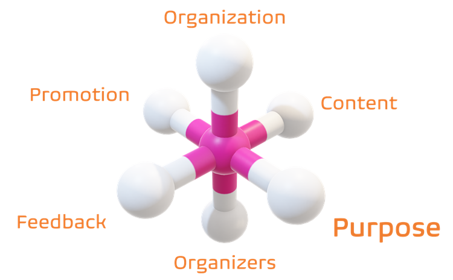

Title: Unleashing the Power of Teamwork: Key Takeaways from Collaboration Ceremonies and Events
Date: 2024-07-10
Category: Posts
Tags: ceremony, devops, posters
Slug: ceremony-learnings
Author: Willy-Peter Schaub
Summary: Fostering a culture of continuous improvement and innovation through events

We are invested in and stewarding a number of internal events, such as centers of enablement, communities of practice, dojos, working groups, and external events such as the [DevOps Vancouver Meetup](https://www.meetup.com/DevOps-Vancouver-BC-Canada/). 

> 

You can review [Ceremony Overview](/ceremony-overview.html) for more insight into the latter - in this post I will focus on thee takeaways from hosting public meetups.

# But first, why are these events pivotal?

Events such as technical meetups and communities of practice (CoP) are essential for:

- **Best Practices and Standards** - They aid in setting and spreading industry benchmarks. Our centers of enablement (CoE), for example, Provide guardrails (aka governance).

>
> **What is a guardrail?** 
> A guardrail is likened to the safety barriers on a bridge, serving as a metaphor to guide our engineers in safely and efficiently using our software development lifecycle (SDLC). It represents our commitment to setting standards and governance in a way that empowers rather than dictates. Our team promotes engineering practices and while engineers can disregard these 'guardrails,' doing so often leads to a higher chance of issues, with less support available.
>

- **Community Building** - They cultivate a sense of community and improve job satisfaction.
- **Feedback and Improvement** - Offers a chance for critique and improvement of work.
- **Innovation** - Exposure to diverse thoughts encourages innovative thinking.
- **Inspiration and Motivation** - Witnessing peers' achievements can stimulate personal drive.
- **Knowledge Sharing** - They promote ideas, experiences, and industry trends exchange.
- **Networking Opportunities** - They help build connections with colleagues and leaders.
- **Problem Solving** - They offer venues for tackling challenges collaboratively.
- **Skill Development** - Dojos, workshops and presentations facilitate learning and skill enhancement.
- **Visibility and Recognition** - Participation raises profile and might create leadership chances.

Our events contribute to continuous professional development, continuous learning, and collective progress.

# What is the catch?
  
> 

Although there are several challenges, typically the advantages of collaboration events surpass issues, such as:

- **Cost** - Event planning can incur high expenses, including venue rental, catering, advertising, and speaker honorariums.
- **Logistics** - Arranging the event specifics, such as location, date, time, can be intricate and time-consuming.
- **Low Attendance** - A successful event often depends on a high turnout for effective networking, promotion, and value for hosts and speakers.
- **Risk Management** - It is critical to plan for unexpected issues like cancellations, poor attendance, or emergencies.
- **The Inevitable One** - Handling that one attendee who comes just for the free food or to create continuous interruptions is a known challenge.

# Back to the core topic - our learnings!

TBD

> 

TBD

