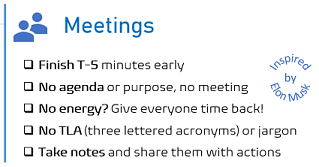
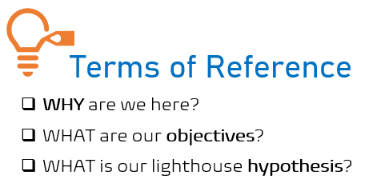

Title: An overview of our key collaboration ceremonies
Date: 2021-11-13 13:13
Category: Posts
Tags: ceremony, devops, posters
Slug: ceremony-overview
Author: Willy-Peter Schaub
Summary: Taking a step back and digesting this week's storm of ceremony posts.

During this week we launched a tsunami of blog posts focused on our [Center of Enablement](/ceremony-center-of-enablement.html) (CoE), [Dojo](/dojo-events.html), [Townhall](/townhall.html), [Working Group](../ceremony-working-group.html), and [Community of Practice](/ceremony-community-of-practice.html) (CoP) ceremonies. Behind the scenes we also launched our first CoE to dogfood (evaluate our own stuff) guardrails, posters, and working agreements we created.

In this post I will answer some of the questions we received to date. Plan is to update this post as we dog-food our ceremonies, with an intent to continuously improve them.

> 

The overview image highlights that the heart of our ceremonies is the CoE providing vision, direction, and governance. It also serves as the steward and source of laser focused working groups, dojos, and community of practice ceremonies. For details on each of ceremonies, refer to:
- [Center of Enablement](/ceremony-center-of-enablement.html) (CoE)
- [Community of Practice](/ceremony-community-of-practice.html) (CoP)
- [Dojo](/dojo-events.html)
- [Townhall](/townhall.html)
- [Working Group](../ceremony-working-group.html)

# Frequently asked questions

List of questions we will cover herein:

- How can I join a ceremony?
- What are the pre-requisites to initiate a ceremony?
- What are the outcomes of a ceremony?
- When and How to host a ceremony? 
- Who creates the CoE?
- Why is the CoE called Center of Enablement, not Excellence?
- Why do we have guardrails?
- Why do we insist on a Terms of Reference?

## How can I join a ceremony?

The [Center of Enablement](/ceremony-center-of-enablement.html) and [Working Group](../ceremony-working-group.html) are by invitation only for the active and core members. You can request to be invited to these events as a "fly on the wall" to observe, not interrupt.

The [Community of Practice](/ceremony-community-of-practice.html), [Dojo](/dojo-events.html), and [Townhall](/townhall.html) ceremonies are open to everyone. You should be engaged and committed to collaborate when joining these events and introduce yourself to the Sensei for Dojos out of respect. 

---

## What are the pre-requisites to initiate a ceremony?

- To initiate a [Center of Enablement](/ceremony-center-of-enablement.html) you need a sponsor - a director and/or manager who owns the area of focus. 
- To initiate a [Working Group](../ceremony-working-group.html), [Community of Practice](/ceremony-community-of-practice.html), or [Dojo](/dojo-events.html), you need a sponsoring [Center of Enablement](/ceremony-center-of-enablement.html) to ensure that the ceremonies are aligned with the vision, direction, and governance promoted by the CoE.

---

## What are the outcomes of a ceremony?

The following table summarizes the outcomes of the ceremonies.

| CEREMONY          | ~~ | OUTCOMES |
|-------------------|----|----------|
| **CoE**           |    | Vision, Direction, and Governance. |
| **CoP**           |    | Vibrant collaboration and continuous learning. |
| **Dojo**          |    | Vibrant collaboration and immersive learning. |
| **Working Group** |    | Process and Product Guardrails. (Dis)Proven Hypothesis. |

---

## When and how to host a ceremony? 

We recommend to start with **weekly** meetups, moving to **bi-weekly** and **monthly** when the members are laser focused and the ceremony picks up momentum. As with the ceremony overall, each meetup must have an agenda, a purpose, and survive on actions.

Ceremonies must be a psychologically safe place for all in attendance and dealing with failure as an opportunity to learn and innovate. Respect those more experienced, respect those less experienced, and do not force your ideas on others. It is all about collaboration!

---

## Who creates the CoE?

Anyone can collaborate and initiate a [Center of Enablement](/ceremony-center-of-enablement.html) and any of its related ceremonies. Our directors and managers are the **stewards** to ensure we have buy-in and that each CoE provides vision, direction, and governance to the organization. 

When you have buy-in, you can **announce** the new CoE. When you have the **Terms of Reference** and committed core members, you can launch the CoE. When the CoE is active, you can launch associated COP, Working Group, and Dojo ceremonies. Always monitor the **heart-beat** of all ceremonies and **terminate** them when the energy, value, or intent fades.

---

## Why is the CoE called Center of Enablement, not Excellence?

On one hand the term **Excellence** triggers the same alarm bells as **Best Practices**. More importantly our goal is to **enable** our common engineering stakeholders - therefore I LOVE our decision to pivot to **Enablement**. The CoE enables by providing vision, direction, and governance, as well as stewarding laser focused working groups, dojos, and community of practices.

---

## Why do we have guardrails?

Yes, the guardrails feel like we are ignoring the first value of the Agile manifesto: "_Individuals and interactions over processes and tools_." We decided to introduce lightweight guardrails through these blog posts and the referenced overview and working agreement posters to ensure that we promote **consistent** and **laser focused** collaboration, with measurable outcomes, and an opportunity to drive our dream to optimize our meetings.

---

## Why do we insist on a Terms of Reference?

We question the value of every ceremony and every meeting we plan or attend. The minimal expectations for the terms of reference identifies the purpose, the outcomes, and a measurable hypothesis. This promotes consistency and purpose!

---

Watch this space for more questions and posts by ceremony members sharing their experiences.

---

# Reference Information

## Quick Reference Posters

Download a copy of our ceremonies overview poster here:

> 
>
> DOWNLOAD >> [Ceremony Overview Poster PDF](/documents/working-agreement-ceremonies-overview.pdf)

Looking forward to your "vibrant" collaboration and feedback!

