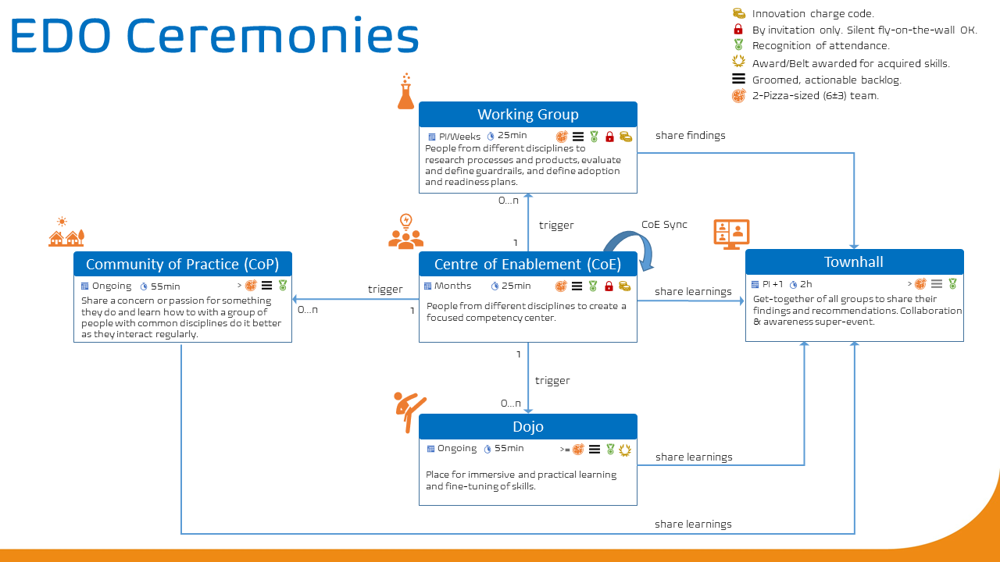

Title: An overview of our key collaboration ceremonies
Date: 2020-11-13 13:13
Category: Posts
Tags: agile, ceremony, devops, posters
Slug: ceremony-overview
Author: Willy-Peter Schaub
Summary: Taking a step back and digesting this weeks storm of ceremony posts.

During this week we launched a tsunami of blog posts focused on our [Community of Enablement](/images/coming-soon.png) (CoE), [Dojo](/images/coming-soon.png), [Townhall](/images/coming-soon.png), [Working Group](/images/coming-soon.png), and [Community of Practice](/images/coming-soon.png) (CoP) ceremonies. Behind the scenes we also launched our first CoE to dogfood (evaluate our own stuff) guardrails, posters, and working agreements we created.

In this post I will answer some of the questions we received to date.

> 

# Frequently asked questions

## Who creates the CoE?

TBD

## Why is the CoE called Center of Enablement, not Excellence?

TBD

## Why do we have guardrails?

TBD

## Why do we insist on a terms of reference?

TBD

---

Watch this space for more questions and posts by ceremony attendees to share their experiences.

---

# Reference Information

## Quick Reference Posters

Download a copy of our ceremonies overview poster here:

> 
>
> DOWNLOAD >> [Ceremony Overview Poster PDF](/documents/working-agreement-ceremonies-overview.pdf)

Looking forward to your "vibrant" collaboration and feedback!

