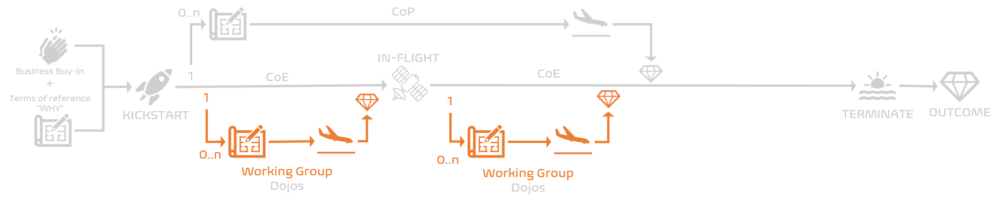

Title: What is our Working Group and WHY do we need it?
Date: 2020-10-28 13:13
Category: Posts
Tags: agile, devops, posters
Slug: ceremony-working-group
Author: Willy-Peter Schaub
Summary: Union of laser-focused experts collaborating to empower its parent Center of Enablement (CoE).

Working Groups are people from different disciplines, collaborating to solve a specific problem and/or (dis)prove a hypothesis. They are empowered to research processes and products, evaluate and recommend guardrails (governance), and propose adoption and readiness plans.  

We admit that there are many flavours and definitions of working groups. Within the context of this blog post we are referring to Working Groups that are triggered by and serve our [Centers of Enablement (CoE)](/images/coming-soon.png).

---

# WHY do we need our Working Group?

Looking through the lens of our common engineering ecosystem, we use our Working Group to bring together committed and appropriate subject matter experts from different areas within the organization to solve a specific problem and/or (dis)prove a hypothesis for its parent CoE. Subject matter experts from Architecture, Business, DevSecOps, Operations, Site Reliability Engineering, Innovations, and other stakeholders not only bring their tribal knowledge and experience to the table, but naturally erode organizational silos through vibrant collaboration.

Every CoE can trigger one or more focused Working Groups throughout its lifetime. 

In other words, every Working Group has a CoE parent, and every CoE can have one or more short-lived Working Groups.

---

# Lifetime

As shown below, the Center of Enablement (CoE) typically spawns one or more Working Groups, which have a short-term lifetime. Similar to a short-lived feature branch.

The Working Group starts with a terms of reference that outlines the "WHY" we need the Working Group, with an inherited buy-in from the CoE. We LAUNCH the Working Group and switch to IN-FLIGHT mode until the maximum lifetime, value or energy of the CoP starts diminishing. We then TERMINATE the Working Group and share the final outcomes, the value, with the CoE. 

 

No **flight plan** (terms of reference), no CoE launch!

---

# What is our secret sauce?

Here is a recipe for our Working Group ceremonies:

## Executive buy-in!

Every Working Group inherits the executive support to be empowered with a clear strategy, an innovation budget, and support where needed from its parent Centre of Enablement (CoE).

## Cross-discipline collaboration!

Working Groups rely on cross-discipline collaboration to research and resolve a specific problem or (dis)prove a hypothesis, as requested by its parent CoE.

## Consistency

Working Groups must monitor and incentivize their members to adhere to the Working Group guardrails, and use shared blueprints, working agreements, backlogs, processes, and products consistently. Consistency is pivotal to share and implement the Working Group outcomes through its parent CoE.

## Transparency 

Transparency of hypothesis, visions, goals, and outcomes are pivotal to avoid duplication of effort, creation of **WASTE**, and fuel the overall energy. The CoE-Sync and the **Townhall** event are two of the key ceremonies that enable the sharing of Working Group deliverables and outcomes.

## Consistent guardrails!

Working Groups require guardrails and a blueprint to standup and energize. Here are some of our guidelines, sorted alphabetically:

- 2-pizza sized team (3-9 members).
- Groomed and prioritized subset of the CoE backlog
- Innovation charge code for members to commit their time.
- Membership is by invitation only.
- Short-term lifetime ranging from iterations to a maximum of 2 program increments (10 iterations).
- Terminate if problem is solved, maximum lifetime is reached, there is no energy, or there is no value.
- **Terms of Reference** defining **WHY** we are here and **WHAT** are our objectives and hypothesist that defines the Working Group's existence and purpose.
- Triggered by CoE.
- Recognition of attendance.
- Weekly to bi-weekly cadence.

Also have a look at our Working Group working agreement poster for a crisp summary of these and other guidelines.

## All good things come to an end

When your Working Group reaches its maximum lifetime or it as resolved the problem, you must terminate your Working Group!

Also, every Working Group will go through the Forming-Storming-Norming-Performing stages, similar to [Tuckman's Stages of Group Development](https://en.wikipedia.org/wiki/Tuckman%27s_stages_of_group_development). When you find yourself in the Performing phase, it is important to continuously measure the passion, energy, and value (to members and stakeholders) of your event and members. 

Working GroupCommunity of Practice!

---

# What are our Working Group deliverables?

Working Groups are responsible to report back to its parent CoE with:  

- Report of outcomes.
- Guardrail proposals, as needed.
- Recording of all collaboration recordings.

---

# Reference Information

## Quick Reference Posters

Download a copy of our ceremonies overview and Working Group working agreement poster here:

> 
>
> DOWNLOAD >> [Ceremony Overview Poster PDF](/documents/working-agreement-ceremonies-overview.pdf)
>
> DOWNLOAD >> [Working Agreement - Centre of Enablement PDF](/documents/working-agreement-ceremony-working-group.pdf)

## Other ceremonies

Here are references to more information on ceremonies mentioned above:

- [Community of Enablement](/images/coming-soon.png)
- [Community of Practice](/images/coming-soon.png)
- [Dojo](/images/coming-soon.png)
- [Townhall](/images/coming-soon.png)

Looking forward to your "vibrant" collaboration and feedback!

