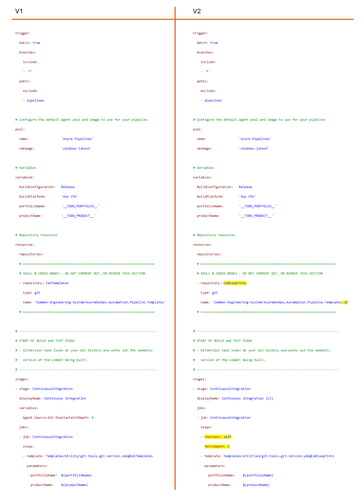

Title: Cheat sheet to migrate generic v1 templates to v2
Date: YYYY-MM-DD
Category: Posts
Tags: azure-devops, pipelines, engineering
Slug: cheat-sheet-to-migrate-generic-v1-templates-to-v2
Author: Willy-Peter Schaub
Summary: Questioning the recommended approach to upgrades and the use of generic templates.

We shared our [v2 CI/CD blueprints](https://github.com/WorkSafeBC-Common-Engineering/AzureDevOps.Automation.Pipeline.Templates.v2) for [Azure Pipelines](https://learn.microsoft.com/en-us/azure/devops/pipelines/?view=azure-devops) as open source, which include our generic templates that we created as a temporary solution to replace the classic Azure Build Pipelines for continuous integration (CI). They are helpful to begin with YAML-based build pipelines and link them with classic Azure Release Pipelines, but not our preferred approach. We will explain more about that later.

---

# v1 versus v2 generic template

First, let us answer our engineer's question of how to migrate from our v1 generic templates to the v2 versions. The image below compares v1 with v2, as at 2024-02-22. The only differences (all highlighted in yellow) are minor cleanups and:

- Repository reference name (**@CeBlueprints**) and repository name (***.v2**) reference the repository with the v2 templates and blueprints, aka [v2 CI/CD blueprints](https://github.com/WorkSafeBC-Common-Engineering/AzureDevOps.Automation.Pipeline.Templates.v2).
- The v2 template uses the **checkout: self**, before calling the git-tools-git-version.yml template. Checkout [Two ways to share your toolbox with your pipelines](https://wsbctechnicalblog.github.io/share-your-toolbox-with-pipelines.html) and [Checkout your git repos at the right time!](https://wsbctechnicalblog.github.io/checkout-at-the-right-time.html) for an explanation of why we moved to using **checkout**. 

> 

---

# Make the right choice!

Before you proceed with the migration, you need to determine **WHY** you should be using the generic template. Here is a simple checklist to help you with the decision:

1. **Is there a v2 CI/CD blueprint for your application type?** If yes, use the [v2 CI/CD blueprint](https://github.com/WorkSafeBC-Common-Engineering/AzureDevOps.Automation.Pipeline.Templates.v2). We are phasing out the **classic** Azure Pipelines and so should you.
2. Else, **Do you have to use a Classic Azure Release Pipeline?** If yes, use the [single-job v2 generic template](https://github.com/WorkSafeBC-Common-Engineering/AzureDevOps.Automation.Pipeline.Templates.v2/blob/master/blueprints/generic-single-job/azure-pipeline-generic-single-job-start.yml) for your CI/Build pipeline.
3. **Do you need the multi-job v2 generic template?** **NO**, we strongly recommend keeping it simple and only using the [single-job v2 generic template](https://github.com/WorkSafeBC-Common-Engineering/AzureDevOps.Automation.Pipeline.Templates.v2/blob/master/blueprints/generic-single-job/azure-pipeline-generic-single-job-start.yml). You should only use the [multi-job template](https://github.com/WorkSafeBC-Common-Engineering/AzureDevOps.Automation.Pipeline.Templates.v2/blob/master/blueprints/generic-multiple-jobs/azure-pipeline-generic-multiple-jobs-start.yml) in rare situations and try to avoid it as it makes things more complicated and can put pressure on your Azure DevOps agents. See [Part 5: Pipelines - Blueprints to fuel consistency and enablement](https://wsbctechnicalblog.github.io/yaml-pipelines-part5.html) for an explanation of the two types of generic templates.

---

# OK back to: How to migrate from v1 to v2 generic build-only template?

### Migrate v1 --> v2, option 1 – move your pipeline to v2 (recommended)

1. Create a new pipeline, using the [single-job v2 generic template](https://github.com/WorkSafeBC-Common-Engineering/AzureDevOps.Automation.Pipeline.Templates.v2/blob/master/blueprints/generic-single-job/azure-pipeline-generic-single-job-start.yml).
2. Look for **TODO** placeholders and migrate (copy-paste) the code from your v1 to your new v2-based Azure Pipeline.
3. Reconnect your classic Azure Release Pipeline to the new v2-based Azure Pipeline.
4. Validate the new pipeline.
5. Deprecate (delete) your old v1-based pipeline.

Simple!

### Migrate v1 --> v2, option 2 – upgrade your v1 pipeline

Using the comparison between v1 and v2 as per image above, update your v1 pipeline and upgrade it to the v2 pipeline format, following these basic steps:

1. Update template repo name from CeSTemplates to **CeBlueprints**.
2. Update template repo name, by appending **.v2**.
3. Remove variables section and add checkout logic under at the beginning of the stage definition.
4.	Rename /Templates/ to **templates/**.
5.	Use either **dotnet** or **other** for applicationType.
6.	Validate the updated pipeline.

Hope our internal "how to" discussions are interesting and add value to the open source [v2 CI/CD blueprints](https://github.com/WorkSafeBC-Common-Engineering/AzureDevOps.Automation.Pipeline.Templates.v2).

