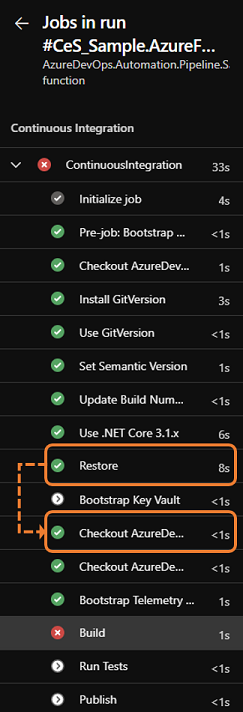

Title: Checkout your git repos at the right time!
Date: 2021-09-21
Category: Posts
Tags: learning, tips, version-control, eliminate-waste
Slug: checkout-at-the-right-time
Author: Willy-Peter Schaub
Summary: X

In [Two ways to share your toolbox with your pipelines](https://wsbctechnicalblog.github.io/share-your-toolbox-with-pipelines.html) we reviewed two strategies to share scripts and config files with your Azure (YAML) Pipelines. 

 

As discussed, the ```checkout: git://<AzDO-PROJECT>/<REPO-NAME> path: <PATH>``` gem gets a tick for **SIMPLICITY** and a tick for **PERFORMANCE**. But ... as always, there is a catch. 

> YES - There are other options, such as [PowerShell Gallery](https://www.powershellgallery.com/), but we intentionally only compared the two ```checkout:``` versus ```Universal Artifact``` options.

---

# Run pipeline blueprint regression tests

When I ran the regression tests my excitement grew as the generic-single-job and generic-multiple-jobs blueprints passed with flying colours. Next, the app-type Universal Artifact blueprint created the templates that triggered a continuous integration, followed by a continuous delivery to a development and production Universal Azure Artifact. 

Next, I ran the regression test for our app-type azure-function blueprint, which **failed** with the following error:

```
/opt/hostedtoolcache/dotnet/sdk/3.1.413/Sdks/Microsoft.NET.Sdk/targets/Microsoft.PackageDependencyResolution.targets(241,5): Error NETSDK1004: Assets file '/home/vsts/work/1/s/AzureDevOps.Automation.Pipeline.Sample.azure-function/Src/AzureFunction.Sample/AzureFunction.Sample/obj/project.assets.json' not found. Run a NuGet package restore to generate this file.
```

Which lights up as the following failure in the **build** step of the continuous integration pipeline.

 

# Said to the rescue!

My colleague Said, the author of the Azure Function Blueprint, was intrigued and vanished in his binary lab. After a brief pause, he was back with a smile.


_"The checkout runs after the restore step, which will override all the nuget packages/files needed by the build step. Hence, the missing project.assets.json. I will advise adding the checkout steps at the job level (first step of the job) and avoid nesting checkouts in other templates."_ - Said Akram

Looking at the continuous integration pipeline flow, as shown below, it is evident that the **Restore** step runs before the **[checkout](https://docs.microsoft.com/en-us/azure/devops/pipelines/yaml-schema?view=azure-devops&tabs=schema%2Cparameter-schema#checkout)** step that checks out source code of our Azure Function solution. 

In fact, we identified another bug - we checked out the source code at the start of the job and again after the restore.



Time to **FAIL-FAST**!

# Call checkout: at the right time!

What I **love** about pipeline-as-code, is that we were able to fix the issue by tweaking two templates, issuing a pull request, and waiting for the validation build to give us the "thumbs up."

As shown, the **Restore** now runs before the ```checkout```. 


To cut a long ~~story~~ post short. Make sure you run the ```checkout:self``` at the beginning of your pipeline, so that dependent tasks, such as **Restore**, can reference the solution source code. You can run the other ```checkout: git://<AzDO-PROJECT>/<REPO-NAME>``` to checkout your toolbox with scripts and/or configuration as needed.

Thanks for reading and thank you **Said** for the tip!

