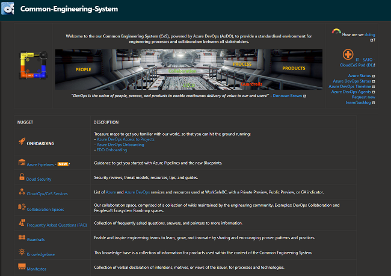

Title: Journal 1 - What is origin of our common engineering team?
Date: 2021-12-06 13:13
Category: Posts
Tags: learning, journal
Slug: common-engineering-journal-1
Author: Willy-Peter Schaub
Summary: Learning about the genesis of our EDO Common Engineering (EDO Ce) team

When I joined the Cloud Operations and Infrastructure team in 2018, I explored the variety of snowflakes decorating continuous integration and delivery pipelines, engineering practices, repositories, and solution architectures. While I agree with [Daniel Pink](https://en.wikipedia.org/wiki/Drive:_The_Surprising_Truth_About_What_Motivates_Us) that knowledge workers have a need for autonomy to self-direct and manage their own lives, it must thrive within the context of engineering guardrails and organizational governance.

>
> **Autonomy** - Works exceptionally well in an environment where an engineers owns a feature from ideation to deprecation. Healthy DevOps mindset!
> 
> **RED FLAG** - When ownership of a feature is transferred to a sustainment, maintenance, site reliability, or any other team it is pivotal to balance autonomy with consistency and standarization. NOT a healthy DevOps mindset!
>

I began to poke the hornet's nest in our architecture, development, operations, and security teams, which inspired guidance I contributed to the [Navigating DevOps through Waterfalls](https://www.tactec.ca/ndtw-resources/) book. I highlighted the risk of **autonomy without guardrails**, especially in an environment plagued by organizational silos that stifle collaboration and where ownership is transferred from team to team. We will be reflecting on this in future journals, as our common engineering team is promoting for engineers to own a feature from ideation to deprecation.  

On the 21st October 2019 I chose to consolidate the guidance, frequently asked questions and answers, knowledgebase, manifestos, and guardrails in an open wiki. The contents of the wiki is based on knowledge I gathered during collaboration, troubleshooting, breakfast and lunches, and informal meetups with fellow engineers in our atrium. 

To this date, the wiki remains to be our **go-to** place for engineering processes, security, standardization, collaboration, as well as the manifestos that started it all.

A few months ago I became aware that there were plans to promote our informal common engineering system, to a more strategic common engineering team.

---

# CeS Journal, entry #1

For our journal, let us fast-forward to 6th December 2021, which marks the 67th day of our EDO Ce team, which emerged from the informal and rebellious common engineering system like a mythical Phoenix.

The EDO Ce team was launched with a leadership mandate to empower every engineer by standardizing practices and products, and stewarding guardrails to promote engineering consistency, enablement, security, and simplicity. 

We agreed that our formal goals are to:

- Enable collaboration through active working groups, community of practices, and workshops.
- Steward guardrails (lightweight governance) to foster consistency, maintainability, security, and simplicity.
- Nurture the courage to experiment and fail, and breed a culture of continuous learning and innovation, and transparency.
- Empower engineering to embrace high DevOps performance.
- Foster the courage to tackle the status quo!

My personal leadership vision is to: 

- Encourage and enable everyone’s creativity, passion, purpose, and strengths!
- Declare war on WASTE, such as cycle time, excessive meetings, complexity, and manual processes.

While we are all inspired by the phenomenal pace of innovation with [SpaceX](https://www.spacex.com/), and [Elon Musk's](https://en.wikipedia.org/wiki/Elon_Musk) mantra to:

- Make requirements less dumb
- Try to delete part of the process
- Simplify or optimize
- Accelerate cycle time
- Automate

In the next journal update, I will explore _"why we need the common engineering team?"_ and how we navigate the endless friction between the demand by engineering for full autonomy and the quest to create a common (common == all of ours) engineering mindset.

See you next time!

