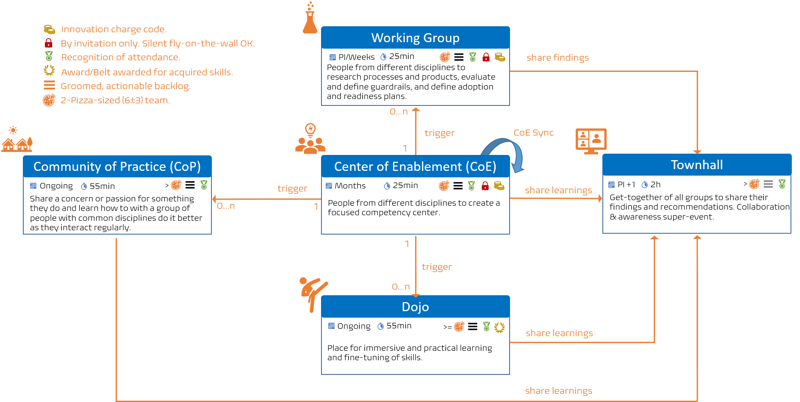
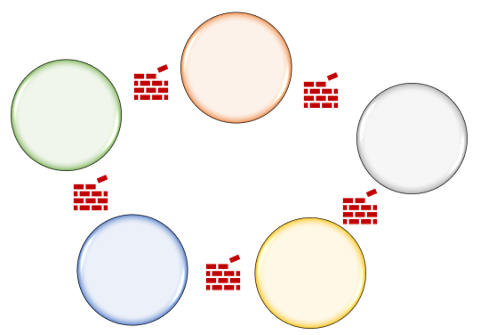
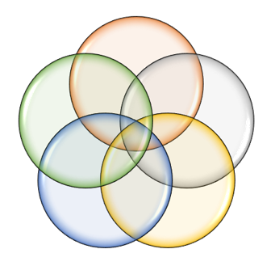

Title: Why do we need our common engineering team?
Date: 2021-12-13 13:13
Category: Posts
Tags: learning
Slug: common-engineering-journal-2
Author: Willy-Peter Schaub
Summary: Introducing the voice of reason and stewards of guardrails

We are T+74 calendar days into the journey of our EDO Common Engineering team and it is time to shared and update our team journal, post 2. 

> 

Changing the culture and mindset of engineers and business stakeholders of an organization based on stringent security policies, processes, and segregation of duties takes grit, tenacity, a thick skin, and lots of patience. It feels like trying to change course of a massive oil-tanker travelling through heavy seas at full speed. 

---

# WHY do we need our EDO Common Engineering Team?

We want everyone to embrace a healthy DevOps mindset to empower development and operations collaboration and enable us, as an organization, to “delight our end-users”, most importantly our BC employers and workers, our WorkSafeBC workers, and IT engineers. It is important the we shift the focus from creating technological marvels and snowflakes, to reducing waste, automate everything automable, and delivering value to our end-users.

>
> When you boarded your last cross-Atlantic flight, wre you interested in how the plane was assembled and which processes or products were used? I believe your response is "NO". What you cared about was the outcome, landing safe and on time at your destination.
>

Therefore, our goal is not just automation and enabling technology, but to deliver **value**.** Any innovation, transformation, or measured value is worthless, unless we can continuously deliver value to our end-users. It is important to understand that DevOps is not a silver bullet, nor is it a product we can buy and install. It is a mindset that enables people to **collaborate** and follow a known **process** enabled by **products** to deliver **value** to our end users.

Also, instead of starting with a focus on our burning platform, our team agreed to focus on establishing an efficient system of highways, roads and railroads that enable both our business and engineering teams to focus on outcomes that delight our end-users. Automated circuit-breakers and smoke detectors monitor the health of our ecosystem, while we continuously improving outcomes.

We need to empower engineers and products to integrate and shift-left security, create quality governance guardrails and documentation, leverage the Azure cloud to its fullest potential, encourage experimentation, and a tolerance for failure to fuel innovation.

Noble goals, but back to our core question: "_WHY do we need the EDO Common Engineering team?_ 

As mentioned in ["what is origin of our common engineering team"](https://wsbctechnicalblog.github.io/common-engineering-journal-1.html) we are the catalyst to:

- Encourage and enable everyone’s creativity, passion, purpose, and strengths!
- Empower all stakeholders to continuously deliver quality **value** to our **delighted end-users**, while stewarding our guardrails to promote **consistency**, **standardization**, and **security**.
- Declare war on WASTE, such as cycle time, excessive meetings, complexity, and manual processes.

---

# WHAT is the goal of our 90-day Roadmap?

When we lit the candle of our team's first stage, our goal for the first 90-days after launch was to lay the foundations and ensure that we have:

- A common and sound **vision**.
- Vibrant **collaboration**.
- An atmosphere encouraging **failure**, **learning**, and continuous **innovation**.
- A healthy **DevOps** mindset - "_DevOps is the union of people, process, and products to enable continuous delivery of value to our end users_", by [Donovan Brown](https://www.donovanbrown.com/post/what-is-devops).

Once we have a foundation, we plan to enable, foster, and steward **COLLABORATION**, engineering **PRACTICES**, and **QUALITY**.

---

# HOW have we fared after 74 days?

> 

The team took off like a [SpaceX Falcon Heavy](https://www.spacex.com/vehicles/falcon-heavy/) and it is extremely difficult to cherry-pick from our running list of achievements linked to our backlog of **culture**, **collaboration**, **innovation**, **practices**, and **kaizen** work. 

I will pick the top 3 on my personal favourites list and invite my colleagues to add another journal entry with their favourites.

## LITE Self-Service Automation

The first preview of our self-service automation prototype which creates an Azure Repo, inserts an application-type specific sample, an Azure Pipeline based on an application-type CI|CD YAML-based blueprint, and queues the pipeline ... in a mere 8 seconds! 

## EDO Ce Common Engineering Center of Enablement

> 

We launched the collaboration program to dog|cat-food our working agreements, checklists, and ceremony portal for the [Center of Enablement](/ceremony-center-of-enablement.html) (CoE), [Dojo](/dojo-events.html), [Townhall](/townhall.html), [Working Group](../ceremony-working-group.html), and [Community of Practice](/ceremony-community-of-practice.html) (CoP) ceremonies.

The EDO Ce Center of Enablement triggers the **Common Language**, **Containerization**, and **Crank-it-up-board v2** working groups, with a few more such as **Healthy mindest for continuous delivery and release on demand**, **Automate everything automatable for Azure DevOps governance printing** using [vinijmoura/Azure-DevOps](https://github.com/vinijmoura/Azure-DevOps), and **Application-type CICD blueprint** rolling onto the launch pad.

## WAR on Silos!

> 

When we started with the common engineering system in 2019, we experienced turbulence created by our culture and processes. 

> 

TBD

---

# WHAT are some of the failures and turbulence?

TBD 

---

That is is for today. Ping me on [twitter](https://www.twitter.com/wpschaub) if you have any questions. 

See you next journal update!

