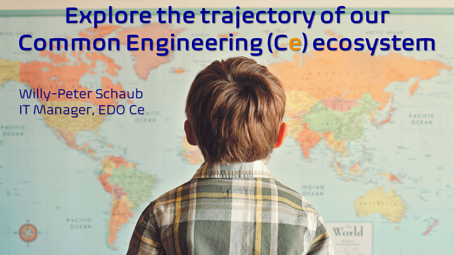
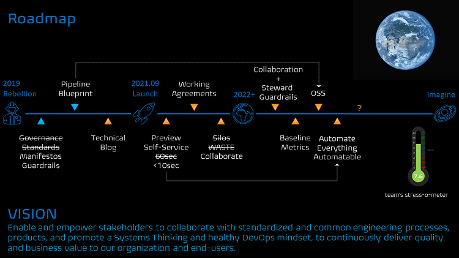
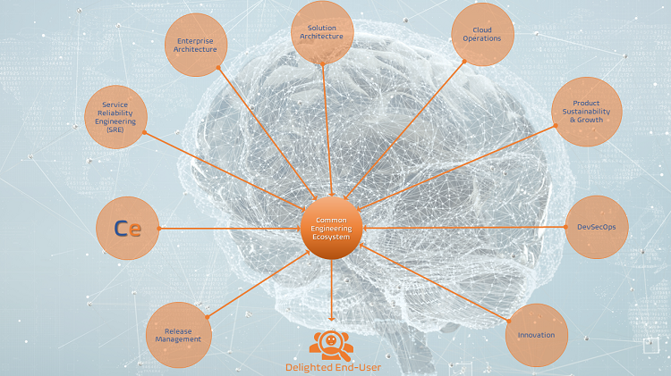
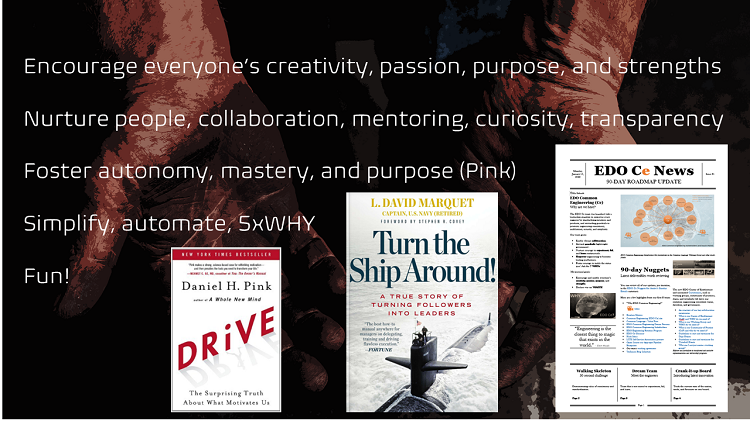
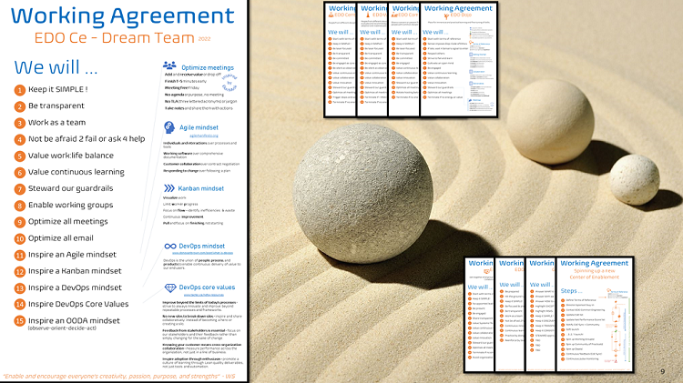

Title: Journal 3 - Explore the trajectory of our Common Engineering (Ce) ecosystem
Date: 2021-01-26 13:13
Category: Posts
Tags: learning, journal, event
Slug: common-engineering-journal-3
Author: Willy-Peter Schaub
Summary: Looking at our common engineering team through the management (leader) lens

This post is an informal journal to share our [DevOps Vancouver Meetup](https://www.meetup.com/DevOps-Vancouver-BC-Canada/) session, titled _"Explore the trajectory of our Common Engineering ecosystem"_, in which I spoke about my experience in setting up our new common engineering system team, which are related to the previous [Common Engineering System at WorkSafeBC](https://www.meetup.com/DevOps-Vancouver-BC-Canada/events/270150093) and [Why we should (not) care about Pipelines!?!](https://www.meetup.com/DevOps-Vancouver-BC-Canada/events/278727555) meetup talks.

> 

---

# Roadmap

It was a real pleasure to share an update on our efforts to establish a common engineering system to empower our engineering teams and strive for consistency, standardization, security, and continuous innovation at WorkSafeBC. 

> 

As shown, we have an ambitious vision to empower every engineer by standardizing our engineering practices and tools and enable continuous delivery of value to delight end-users. 

From early 2019 we operated like the Rebel Alliance on the ice planet Hoth, focusing on creating manifestos and guardrails that enabled engineering to build consistent, secure, and simple solutions. We innovated our continuous integration and delivery pipelines, as discussed at the meetup in [June 2021](https://www.meetup.com/DevOps-Vancouver-BC-Canada/events/278727555), and released our [WorkSafeBC Technical blog](https://wsbctechnicalblog.github.io/index.html) allowing us to share all our failures, learnings, and innovation with the community.  

Everything changed in September 2021 when I got the opportunity to launch an official common engineering team, with a leadership mandate to empower every engineer by standardizing practices and products, and stewarding guardrails to promote engineering consistency, enablement, security, and simplicity.

For the first 90-days we focused on establishing an efficient system of highways that enable both our business and engineering and ensure that our common engineering ecosystem has a common and sound vision, vibrant collaboration, and an atmosphere that encourages failure, learning, and continuous innovation. We achieved three major milestones:

- **Self-service automation**, often referred to as the “walking skeleton”, which creates an Azure Repo, injects an app-type sample, configures, and injects a YAML-based Azure Pipeline, and queues the pipeline as a final validation of the setup … in less than 10 seconds!
- **Working agreements** to guide how to work together to create positive, productive processes.
- Started a war on **WASTE** and **Silos**, by fostering collaboration through centers of enablement, working groups, dojos, and community of practices. See our technical blog for details.

For the next 90-days we plan to switch to implementation mode. We will:
- Enable, foster, steward **guardrails** and **collaboration**
- Monitor and learn from **baseline metrics**
- **Open-source** our application-type YAML-based pipeline blueprints
- **Automate** everything automatable.

Thereafter let your imagination soar, for example **chaos engineering**.

---

# No more silos! Collaborate!

Here is a snapshot of the extend of collaboration we achieved during the first 90-days. 

> 

The variety of teams, the vibrance of collaboration, and the focus on outcomes give me reassurance that we are on the right track and hope that we can achieve the unthinkable as an organization.

Erasing the silos, avoiding them to regrow like weeds, establishing **TRUST**, and getting all the stakeholders to collaborate was one of the big tests to date. 

---

# Challenges

Which brings me to the challenge of launching such a team, especially when you are, like I, a software engineer at heart and want to remain involved “hands-on” with the continuous experimentation, learning, and innovation.

> 

Apart from the people management, dealing with rigid and time-consuming processes, a lack of resources in the local market … our team has existing operational support, and quality assurance responsibilities. Balancing these with our quest for bold change and continuous innovation, has challenging. Creating a harmonious team, where everyone takes responsibility for their actions, where we have a work:life balance, and where everyone is a leader is not ea walk in the park.

Another anomaly that keeps me awake at night, is how to ensure that everyone has an innovation mindset, the time, and the grit to take a chance. I find that many engineers can spend hours talking about a problem, but often have no time to make changes. Hopefully you can give me guidance here.

My personal mission statement, which I stare at every morning, is to “**encourage everyone’s creativity, passion, purpose, and strengths**.”

I am experimenting with a variety of guidance from David Marquet, carrying around his book – Turn the ship around – wherever I go.

I always remind myself to foster autonomy, mastery, and purpose, as discussed by Daniel Pink.

Inspired by Elon Musk and SpaceX’s phenomenal innovation, I encourage my team to simplify everything, automate everything automatable, and question all processes, often provoking colleagues when I ask the five WHYs and rip parts out of an inefficient process.

Last, but not least, I remember everyone to have FUN to combat today’s stressful days of isolated and remote engineering, and to remind us of the need to balance work and life. A reason our most recent quarterly update looked more like a newspaper than a formal report.

---

# FAILURE is good!

I work hard to create a mindset to continuously experiment, embrace FAILURE as an opportunity to learn, and innovate.

> 

You will soon see the round red sticker appearing on our laptops to encourage everyone else to follow suit.

---

# Dream Team

To be successful you need a DREAM TEAM …

> 

... here is our EDO Common Engineering DREAM TEAM, focused on operational support, quality assurance, and innovation.

> 

---

# Working Agreement

> 

We live and breathe by our [working agreement](https://wsbctechnicalblog.github.io/dream-team-working-agreement-poster.html), with an emphasis on optimizing meetings … another Elon Musk inspiration … and inspire an Agile, Kanban, and DevOps mindset, as well as DevOps core values.
Our working agreement has triggered a range of other working agreements, such as starting a center of enablement or rotating through our common engineering team.

--- 

# THANK YOU

... for reading (listening)!

> 

Catch me on [Twitter](https://www.twitter.com/wpschaub) or [LinkedIn](https://www.linkedin.com/in/wpschaub) to discuss the session.

---

# REFERENCES

- [Collaboration - Centers of Enablement](https://wsbctechnicalblog.github.io/ceremony-overview.html)
- [DevOps Core Values](ttps://www.tactec.ca/devops-core-values)
- [DevOps Vancouver Meetup - January 2022](https://www.meetup.com/DevOps-Vancouver-BC-Canada/events/283168484/)
- [DevOps Vancouver Meetup - January 2022 Recording](X)
- [Elon Musk’s 6 productivity rules](https://www.cnbc.com/2018/04/18/elon-musks-productivity-rules-according-to-tesla-email.html)
- [Meetup - Common Engineering System at WorkSafeBC](https://www.meetup.com/DevOps-Vancouver-BC-Canada/events/270150093) 
- [Meetup - Why we should (not) care about Pipelines!?!](https://www.meetup.com/DevOps-Vancouver-BC-Canada/events/278727555) 
- [Turn the Ship Around](https://www.amazon.ca/Around-Story-Turning-Followers-Leaders/dp/1591846404)
- [What is DevOps?](https://devblogs.microsoft.com/devops/what-is-devops-donovan) 
- [Willy-Peter Schaub LinkedIn](https://www.linkedin.com/in/wpschaub)
- [Willy-Peter Schaub Publications](https://www.linkedin.com/pulse/summary-some-my-publications-willy-peter-schaub) 
- [Willy-Peter Schaub Twitter](https://www.twitter.com/wpschaub)
- [WSBC Technical Blog](https://wsbctechnicalblog.github.io/index.html)

