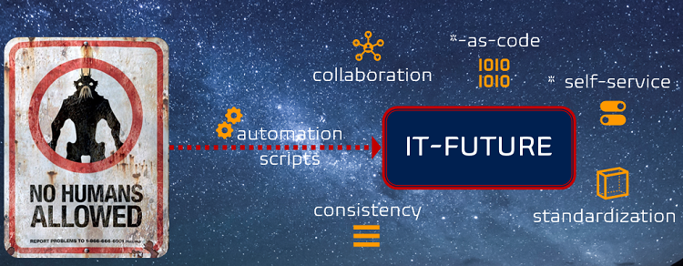

Title: Why are we a (the) place to work for? 
Date: 2022-04-22
Category: Posts
Tags: agile, devops, journal
Slug: common-engineering-journal-4
Author: Willy-Peter Schaub
Summary: Safe and healthy workplaces. Compassionate and responsive service.

I could take a shortcut and refer you to the [WorkSafeBC Top Employer 2022](https://reviews.canadastop100.com/top-employer-worksafebc) article. It showcases why WorkSafeBC was voted as a top employer in 2022, during the challenging Covid pandemic.

Instead, I will emphasize the humbling mission that fuels me with energy every day - "_Prevent workplace injury, illness, and death, and support injured workers through fair compensation and effective rehabilitation._" - and introduce WorkSafeBC through the lens of our vibrant [EDO Common Engineering](/common-engineering-journal-2.html) team.

---

## Through the lens of the common engineering team

**WIIFM**? First, you will be part of a team that is curious but despises TLAs (three-lettered acronyms). We prefer the question "_what is in it for me_" instead of "_WIIFM_" - it is clear and avoids confusion, awkward pauses, and Google'ing. See [Why I loathe when engineers use TLAs, such as CD vs CD!](/why-i-hate-tlas.html) for details.

**We are a diverse family of engineers**, working in one or more of three functional roles. **Pathfinders** are engineers that are part of shared services we rotate through software engineering teams to share their experience and bring real-world learnings back to our team. These rotations can last from hours to months, fostering **curiosity** and [T-shaped](https://medium.com/making-meetup/t-shaped-engineering-on-meetup-pro-1e0a38df7f5b) engineering. 

Benefits?

- Collaboration (SILO antidote)
- Continuous learning
- Faster delivery
- Productivity

Other functional roles include the delivery of exceptional **Operations** support and continuous innovation and improvement of our common engineering ecosystem by **Platform Advancement**. All three functional roles are equally important - 
without a balance, we cannot continuously deliver value!

**Our team is based on leadership at every level** of the functional role and every member of our crew, encouraged to self-organize and self-manage. We value **autonomy**, **transparency**, and **simplicity.** For example, every engineer is empowered to question a process and experiment by removing steps that appear to add no value. One of our main pillars is **TRUST** - we trust each other and what we do!

Benefits?

- Decentralized management (Micro-management antidote)
- Resilience allowing team to withstand adversities, such as the Covid pandemic.
- Shorter lead and cycle times.
- Simple solutions are easier and cheaper to maintain - engineers can go home earlier and experience less annoying [2-AM](https://opensource.com/article/18/12/blueprint-team-devops-mindset) calls.

**WorkSafeBC presents a technology heaven for engineers**. The diverse world of **processes** and **products**, ranging from the classic to bleeding edge technology, ensures that every engineer is continuously learning and pushing the boundaries of integration. 

Here are some of the exciting **process** and **product** adventures planned for 2022 as part of the common engineering ecosystem, sorted from most to least exciting (through my lens):

- Automate everything automatable and empower with Self-Service Automation.
- [Azure DevOps](https://azure.microsoft.com/en-ca/services/devops/) environment that is based on self-service automation, config- and pipeline-as-code.
- [Second generation Yet Another Markup Language (YAML)-based Application-Type Continuous Integration (CI)/Continuous Delivery (CD) Pipeline Blueprints](./moving-hundreds-of-pipeline-snowflakes-part10.html).
- Hypothesis driven development and embrace failure as an opportunity to innovate.
- Embrace cloud native computing (watch this space for a related article by my colleague Sergiy), containerization and orchestration for the right workloads.
- [Azure Services](https://azure.microsoft.com/en-ca/) and Service Fabric Orchestrator as a development platform.
- More QUALITY, less WASTE!
  - Continuous experimentation, viewing failures as an opportunity to learn.
  - Behaviour Driven Development (BDD).
  - Domain Driven Design (DDD).
  - Test-driven Development (TDD).
  - Reducing waste and [optimizing meeting](/stop-the-meeting-hell.html).
- SHIFT <...>
  - << Left, empowering delivery teams and performing validation scans, such as security, quality, and guardrails, as early as possible.
  - Right >>, using configuration-as-code and committing to delivery configuration as late as possible.
- People first mindset.
- Vibrant collaboration, creating invaluable bridges and busting SILOs.
- Using animated whiteboard software to create crisp, informative, and fun process and product awareness videos.
- Application Programming Interface (API), Mobile, Performance, and User Interface testing.

- Flutter-based mobile apps.

When you rotate into the role of **Platform Advancement** you are not only automating everything automatable, running continuous experiments, but also spending a lot of time with **forward** and **long-term** thinking. 

Crafting tomorrow's world is often a daunting task - however, there is no better feeling to see your idea being launched and creating a smile on every stakeholder's face. 

Last, but not least, we have an ambitious vision to empower all engineers and to practice and promote the mindset of **continuous experimentation** where failure is viewed as a positive opportunity to learn and innovate.

You will find this and other Elon's quotes all over our blogs, presentations, portals, and documentation:

> "_Failure is an option here. If things are not failing, you are not innovating enough._" - Elon Musk

I hope that this has given you a sneak peek into our team and the world of engineering in our group at WorkSafeBC.

## We are looking for flexible and passionate engineers

Interested in our world? If yes, we currently have position in our **Platform Advancement** area for an **Software Engineering Practices Lead** and **Quality Assurance Lead**. In both cases you would enable our common engineering ecosystem, to shift across multiple disciplines to create a place where the highest standards are maintained, and provide vision, direction, and guardrails (governance). 

Keep an eye on my [Twitter](https://twitter.com/wpschaub) and [LinkedIn](https://www.linkedin.com/in/wpschaub) channels for posts such as [this](https://www.linkedin.com/posts/wpschaub_azuredevops-devops-mindset-activity-6889783742718722048-xXaa) for more details on the opportunity. 

Ping me any time - I would love to **collaborate** with you!

