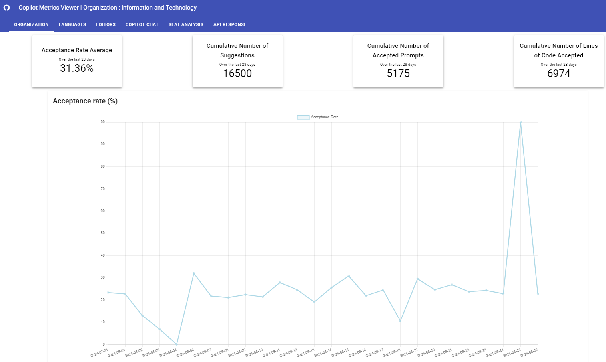
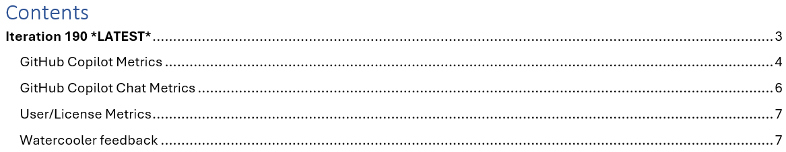
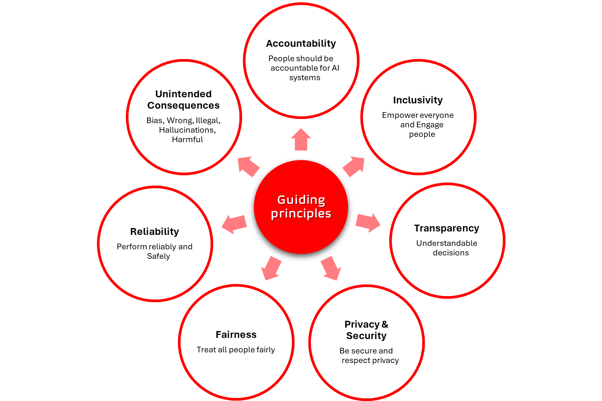

Title: Journal 5 - Unlocking the Potential of Generative AI
Date: 2024-08-30
Category: Posts
Tags: agile, ai, devops, journal
Slug: common-engineering-journal-5
Author: Willy-Peter Schaub
Summary: Explore GitHub Copilot's potential to revolutionize code quality, collaboration, and productivity.

Generative Artificial Intelligence (AI) systems create new content like text, images, music, or code by learning from existing data. Unlike traditional AI that analyzes data or automates tasks, generative AI is creative and can produce original outputs. Embracing this technology is essential as it fosters innovation, boosts productivity, and transforms industries with personalized experiences, efficient content creation, and advanced problem-solving. Adopting generative models will give a competitive advantage in a digital world.

# Step 1 - Introduce the product

This journal is focused on GitHub Copilot, developed with OpenAI, is an AI coding assistant that suggests code snippets, functions, and algorithms within your IDE. Trained on public code, it offers context-aware suggestions to speed up coding and minimize repetitive tasks. Its adaptability to different programming languages makes it useful for both experienced developers and beginners, enhancing productivity and promoting efficient software development.

>
> **WHY** - are we doing this? 
>
> 
>

Our mission centers on the belief that technology should **empower**, not replace, our engineers. GitHub Copilot serves as an assistant or wingman, enhancing **productivity** and relieving engineers of repetitive tasks. This enables them to concentrate on the more **enjoyable**, **creative**, and **valuable** parts of their work.

# Step 2 - Create a community around the product

>
> **WHAT** - can we achieve?
>
> 
>

We recognized the importance of collaborating with our developer community of practice (CoP) and launched a focused GitHub Copilot CoP. Building a strong community fosters continuous **improvement**, **trust**, and **teamwork** among engineers to share insights, troubleshoot, and find solutions. Benefits include:

- **Sharing** insights, tips, and best practices to improve Copilot use.
- **Trust** and **adoption** through successful user experiences.
- Providing ongoing **feedback** for Copilot's stakeholders.
- Enhancing **collaboration** for problem-solving and new use cases.
- Supporting newcomers to ease **learning** and **onboarding**.
- Discussing optimal integration of Copilot into workflows and **cultures**.

>
> **WHAT** - is in it for me?
>
> 
>

As [Common Engineering](/common-engineering-journal-1.html), we promote the following core GitHub Copilot benefits:

- **Mentorship**: offers code suggestions, auto-completions, and can generate entire functions from natural language comments and past code.
- **Documentation**: analyses, explains, and documents, particularly helpful for maintaining older code.
- **Productivity & Creativity**: speeds up coding, handles repetitive tasks, and frees engineers for complex problem-solving and innovation.
- **Reduced Cognitive Load**: minimizes context-switching and mental strain, allowing focus on design and logic.
- **Error Reduction**: provides real-time suggestions to catch errors early, enhancing code reliability.

# Step 3 - Evaluate the use and value of the product

>
> **HOW** - can we add value?
>
> 
>

Our evaluation is continuing. We are monitoring the product's adoption and usage over 20 two-week iterations, spanning two planning intervals. For this, we employ the open-source [GitHub Copilot Metrics Viewer](https://github.com/github-copilot-resources/copilot-metrics-viewer), conduct regular feedback polls, and interview individual teams and engineers.

The interviews and polls provide us with engineers' feedback, while the viewer offers deep and real-time insights into Copilot's impact and adoption.

>
> Real-time GitHub Copilot insights
>
> 
>

At the end of each iteration, we compile a report summarizing the review and share it with all stakeholders to ensure **transparency**.

>
> Report index, per iteration.
>
> 
>

That is everything for today, everyone!

---

Feel free to contact me at any time. I am eager to share insights that will aid us all in understanding the rapidly evolving AI landscape, its impact, and the importance of maintaining **guiding principles** like safety and security. 

> 

References:
- [Journal 1 - What is origin of our common engineering team?](/common-engineering-journal-1.html)
- [Journal 2 - Why do we need our common engineering team?](/common-engineering-journal-2.html)
- [Journal 3 - Explore the trajectory of our Common Engineering (Ce) ecosystem](/common-engineering-journal-3.html)
- [Journal 4 - Why are we a (the) place to work for? ](/common-engineering-journal-4.html)

