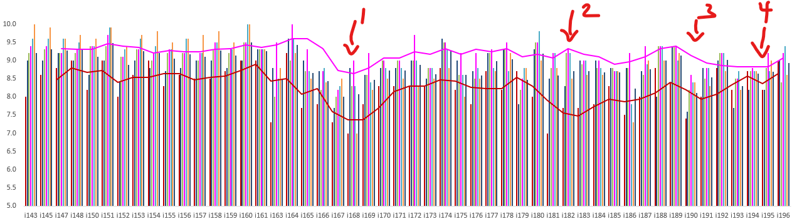
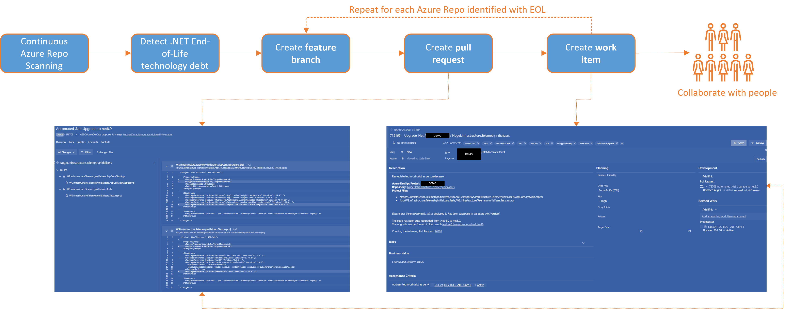

Title: Journal 6 - Empowerment through automation and artificial intelligence
Date: 2024-11-22
Category: Posts
Tags: agile, ai, devops, journal
Slug: common-engineering-journal-6
Author: Willy-Peter Schaub
Summary: Reshaping the way we work, creating new opportunities to empower engineers by reducing repetitive tasks, enhancing productivity, and enabling focus on high-value activities.

> Optimus Prime, journal entry dated November 11, 2024, written on Remembrance Day.

During 2024, our common engineering team has made significant progress despite facing various challenges, including legacy processes and products, as well as addressing issues related to government agency innovation - [can-government-agencies-be-innovative](/can-government-agencies-be-innovative.html). By integrating automation and artificial intelligence into our engineering tools, we are not only improving operations but also promoting a culture of innovation, skill development, and deeper engagement. These technologies equip our engineers, enabling them to effectively address the needs of a dynamic technology industry within the constraints of the insurance sector. In this update we will cover the three DevOps Ps - People, Process, and Products.

# Team Health

We have been utilizing the [Retrospective](https://marketplace.visualstudio.com/items?itemName=ms-devlabs.team-retrospectives) extension, by Microsoft devLabs, to effectively manage our iteration retrospectives and monitor our team's health through its team assessment feature. This tool provides a straightforward, quick, and efficient method for these tasks. 

>
> Team Assessment - _legend for series entries intentionally omitted!_
>
> 
>

The visual chart and trendline reveal that **reorganizations**, as indicated by points 1, 2, and 3, along with **leadership changes** shown by point 4, are causing dips in metrics such as clarity, energy, psychological safety, and work-life balance. Conversely, it is evident that the engineering team is becoming increasingly resilient to change. In my opinion, this resilience can be attributed to each team member being empowered to lead within their specific area of expertise and experience.

We encourage you to try the [Retrospective](https://marketplace.visualstudio.com/items?itemName=ms-devlabs.team-retrospectives) extension. In our next discussion, we will explore automation and artificial intelligence, revisiting aspects related to people as we shift our focus towards processes and products.

---

# Automation

The team has achieved notable advancements and enhancements in this area by introducing automation for a variety of tasks. These include maintaining and supporting Azure DevOps operations, as well as upgrading applications to the latest version of .NET 8 using the [.NET Upgrade Assistant](  https://devblogs.microsoft.com/dotnet/upgrade-assistant-general-availability/).

>
> .NET Upgrade Automation
>
> 
>

The **process** involves creating a feature branch in each Azure Repo to identify end-of-life (EOF) .NET code, running the upgrade assistant on this branch, generating a pull request, and creating a technical debt work item to consolidate all actions. While automation significantly reduces the upgrade time from days to seconds, it requires **people** to embrace the automation, action the pull requests, and conduct **automated** testing to validate changes both before and after merging. Our initial focus was overly centered on automation, leading us to realize through experience that **people** involvement is crucial for successful adoption.

Other notable automation processes include **configuration-as-code** validations, such as ensuring that Azure Pipelines are configured according to the last known configuration, and automatically reversing unknown manual changes. 

**Self-service** automation aims to enable engineers to provision infrastructure, repositories, pipelines, and introduce sample code based on reference architectures as required, with the click of a button. Watch the space, this **process** will receive a ton of attention next year.

---

# Artificial Intelligence

In [Journal 5](https://wsbctechnicalblog.github.io/common-engineering-journal-5.html), we evaluated GitHub Copilot, which has since become an essential tool in our engineering toolkit. Given that we operate on Azure DevOps rather than GitHub Enterprise, many of the latest innovations are currently irrelevant to us. This has prompted us to explore alternative products and innovative ideas to develop our own copilot system and integrate it into a powerful suite of tools – watch the space for exciting updates. Additionally, we have implemented an instance of Stack Overflow to manage our internal queries, articles, and collaboration.

As with any initiative, ensuring user adoption is crucial for the success of these products and the processes they affect. Here are some considerations as you embark on your own custom automation and artificial intelligence projects:

- Ensure each improvement has a clear **objective** and that users understand the **WHY** (rationale) behind every innovation.
- Design each improvement to act as an "**engineer’s wingman**," not a replacement, to empower users and foster a productive, engaging experience.
- Ensure each innovation understands the user’s **context**.
- Most importantly, engage with users and provide comprehensive onboarding experience and access to support resources, and **learn and improve** from user feedback
- Improvements must follow regulatory and organizational guidelines and help users do the same.

My team has been encouraged to complete the [Microsoft Certified: Azure AI Fundamentals](https://learn.microsoft.com/en-us/credentials/certifications/azure-ai-fundamentals/?practice-assessment-type=certification) self-paced training, resulting in collaboration and creating artifacts like the [AI-900 cheat sheet](/ai-fundamentals-ai900-poster.html).

---

Our objectives for product is identical to process innovations:
- **Consistency**
- **Standardization**
- **Simplicity**
- **Security**
- **Empowerment**

For more information on our Copilot evaluation or future innovations, contact us below to start a discussion.

---

So, to summarize, I am very proud of what the team has achieved in 2024 and excited about what is coming in 2025. 

What do you think and what is cooking in your engineering kitchen?
