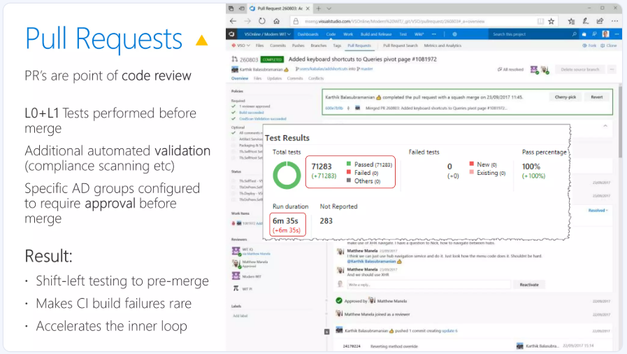
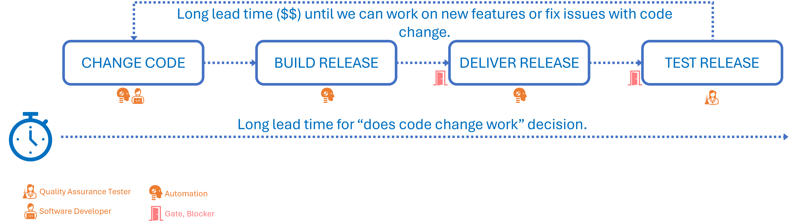
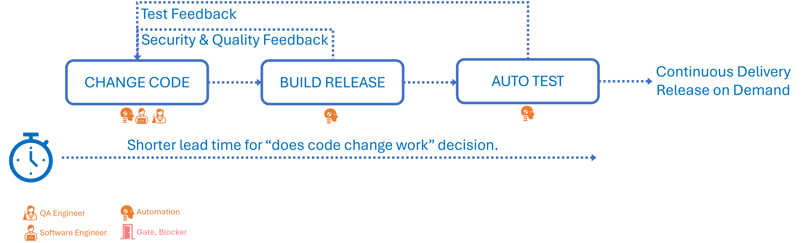

Title: Journal 7 - Embracing a New Mindset for Empowerment!
Date: 2024-11-29
Category: Posts 
Tags: azure-devops, automation, engineering
Slug: common-engineering-journal-7
Author: Willy-Peter Schaub
Summary: Exploring innovative automation strategies to empower engineers with the right tools and support, exactly when they need them.

**I have a dream!** A software development lifecycle (SDLC) that encourages innovation, continuous experimentation, and quality excellence can delight end-users. Automation frees engineers from repetitive tasks, allowing them to focus on meaningful work. This leads to cost-effective solutions, frequent feature updates, and a better work-life balance.

 

We aim to blend technical excellence with human-centric goals:

- **Automation** to increase efficiency and free engineers for creative tasks.
- **Holistic Outcomes** that move us beyond speed and cost to user satisfaction and adaptability.
- **Continuous Innovation** to evolve with industry, policies, and user expectations.
- **Balance Personal and Business Impacts** to ensure well-being and operational success.
- **Adaptability and Resilience** by staying agile with continuous delivery.

The goal is to enhance **operational efficiency** and create a sustainable, **fulfilling engineering environment**, making our organization a leader in innovation and employee satisfaction.

 ... you may say.

>  

I would like to respectfully disagree and reference a slide, as above, I presented in 2018 regarding our successful transition of [75,000]( https://www.slideshare.net/slideshow/moving-75000-microsofties-to-devops-with-visual-studio-team-services/98844997). It demonstrates a pull request that executed 71,283 unit tests in 6 minutes and 35 seconds with a 100% pass rate as part of the automated validation build - rapid feedback, while developing. This accomplishment underscores the potential of achieving such outcomes with an effective software development lifecycle, appropriate processes, products, and people.

---

# Doing it the hard way!

>  

<TBD>

>  

<TBD>

---

# Embracing new ways!

>  

<TBD>

>  

<TBD>

---

# Our 2025 Plan!

<TBD>

---

<CLOSE - SUMMARY >

