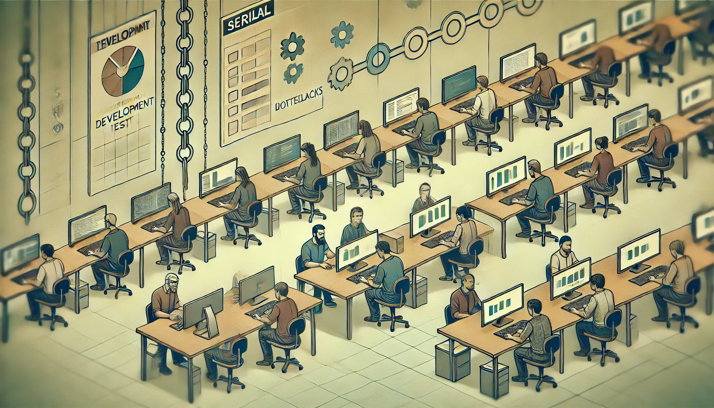

Title: Journal 7 - Embracing a New Mindset for Empowerment!
Date: 2024-11-29
Category: Posts 
Tags: azure-devops, automation, engineering
Slug: common-engineering-journal-7
Author: Willy-Peter Schaub
Summary: Exploring innovative automation strategies to empower engineers with the right tools and support, exactly when they need them.

**I have a dream!** A software development lifecycle (SDLC) that encourages innovation, continuous experimentation, and quality excellence can delight end-users. Automation frees engineers from repetitive tasks, allowing them to focus on meaningful work. This leads to cost-effective solutions, frequent feature updates, and a better work-life balance.

 

We aim to blend technical excellence with human-centric goals:

- **Automation** to increase efficiency and free engineers for creative tasks.
- **Holistic Outcomes** that move us beyond speed and cost to user satisfaction and adaptability.
- **Continuous Innovation** to evolve with industry, policies, and user expectations.
- **Balance Personal and Business Impacts** to ensure well-being and operational success.
- **Adaptability and Resilience** by staying agile with continuous delivery.

The goal is to enhance **operational efficiency** and create a sustainable, **fulfilling engineering environment**, making our organization a leader in innovation and employee satisfaction.

 ... you may say.

>  

I would like to respectfully disagree and reference a slide, as above, I presented in 2018 regarding our successful transition of [75,000]( https://www.slideshare.net/slideshow/moving-75000-microsofties-to-devops-with-visual-studio-team-services/98844997). It demonstrates a pull request that executed 71,283 unit tests in 6 minutes and 35 seconds with a 100% pass rate as part of the automated validation build - rapid feedback, while developing. This accomplishment underscores the potential of achieving such outcomes with an effective software development lifecycle, appropriate processes, products, and people.

---

# Doing it the hard way!

>  

In the traditional approach to software development, developers focus on writing new feature code. At a certain point, the team builds the code, deploys the release to one or more pre-installed environments, and hands it over to quality assurance (QA) testers. These testers then validate the software using a structured test plan comprised of test suites and cases.

Most of this testing was manual because QA testers possessed the specialized business knowledge and understanding of intricate dependencies necessary to validate the system. Consequently, they executed the same test plan repeatedly, cycle after cycle.

>  

What stands out, as illustrated in the workflow, is that the building and deployment processes have been automated for years—decades, in fact. After all, are you still manually compiling, linking, and copying files using a command prompt? Probably not.

 

Why has build and deployment automation become standard, while manual QA testing persists? This paradox warrants reconsideration for greater efficiency and innovation.

We must minimize **repetitive tasks** and **shorten feedback** loops. **Quick feedback** on changes, whether automated or manual, is essential. Delayed feedback makes it harder and costlier to fix issues as the solution drifts from our goals.

---

# Embracing new ways!

>  

The image above depicts a contemporary work environment where individuals collaborate, extensively utilize automation, and visualize feedback on automation processes, changes, quality, and progress. The atmosphere is one of active engagement, as well as continuous and transparent activity - just like in my dream.

Before detailing our vision, it's crucial to understand that this journey will be challenging and time-consuming. Success requires everyone's commitment. Without unified support, we risk an unsuccessful and costly transformation.

We foresee a major mindset shift in the roles of QA Engineers and Software Engineers. Any engineer, contributor, or automation tool can make code changes. The v2 CI/CD blueprint will automatically trigger continuous integration within pull requests as part of build validation checks.

>  

This process initiates automated security and quality validations along with automated tests. The potential for enhancement relies on advancements in service virtualization, on-demand environment provisioning, and synthetic test data creation using artificial intelligence—a concept from one of our latest InnoFest/Hackathon teams.

Overall, the lead time to validate code changes is reduced, enabling faster and more efficient responses to issues or new features.

In this envisioned future, automated technology debt remediation systems would autonomously verify test results and determine whether human validation is required or if the changes can be directly committed to the main/master branch.


 

- Engineers delegate repetitive tasks like upgrades to automation, freeing them to develop new features, explore ideas, learn skills, or take a break.
- Consistency and standardization contribute to secure, high-quality, and reliable solutions. 
- Additionally, this approach can lead to cost savings, time efficiency, reduced capacity stress, and an improved work environment.

---

This is our chance to redefine work, innovate, and excel as engineers. By adopting this vision, we improve processes and empower ourselves to focus on creating impactful solutions, exploring new ideas, and building features that delight users. Automation, supported by Artificial Intelligence, will relieve us of tedious tasks, letting us concentrate on meaningful, challenging work.

Instead of setting goals to merely ```empower engineers to reduce technical debt,``` we should strive for the more ambitious objective of ```eliminating technical debt entirely```, thus relieving engineers from the concern of it altogether.

---

Thoughts?

