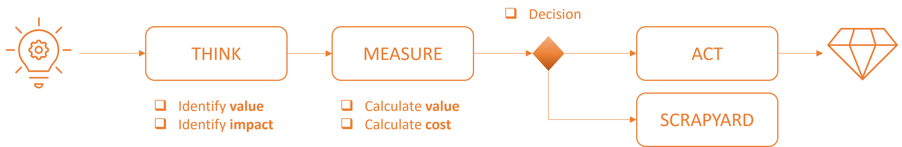
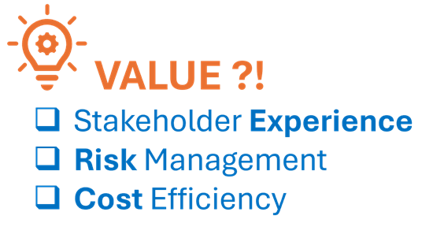

Title: Journal 8 - What is the value?
Date: 2024-12-13
Category: Posts 
Tags: azure-devops, automation, engineering, learning
Slug: common-engineering-journal-8
Author: Willy-Peter Schaub
Summary: The real question is not about the tech-cool factor or simplicity; it is all about uncovering the true value.

Our engineering team has undergone numerous shifts in mindset, embracing continuous learning, valuing work-life harmony, and championing simplicity. As we look ahead to 2025, we are spicing things up by adding "one thing at a time" and constantly asking ourselves, "what is the value?" to our toolkit.

## One thing at a time

To truly excel, we must tackle one task at a time, avoiding the chaos of constant context switching. Though life rarely allows us to focus on just one thing, we need to zero in on our most significant goal (big rock) amidst the hustle and bustle of our engineering routines. If we finish countless small tasks but neglect our main objective (big rock), the day cannot be deemed a success.
## What is the value?

Picture this: A colleague suggests renaming your Azure DevOps (AzDO) Iteration Paths from ```<AzDO Project>/PI <n>/Iteration <n>``` to ```<AzDO Project>/PI <n>/<n>```, reasoning that the word “iteration” is redundant. **Brilliant idea!** 

The iteration path field already has ```iteration``` in its label, so seeing ```my-demo-project/PI 13/13``` keeps things sleek and just as clear as ```my-demo-project/PI 13/Iteration 13```. Plus, it spares you from the eyesore of ```my-demo-project/PI 13/...``` when Azure DevOps truncates names in some fields and dropdown lists.

In other words, it is a **cool** tweak, adding **meaningfulness,** and technically, it is a breeze to pull off. But what is the true value? Beyond better readability for users, think ```user productivity boost``` minus the ```cost of implementing the change``` and deducting the ```cost of any unforeseen consequences```.

Implementing the change involves investing time in revamping our automation to produce future iterations in the fresh format, crafting new automation to rename current iterations for consistency, and executing these automated processes. Ultimately, we would end up with **delighted users** and a rewarding value.

 

But alas, we have overlooked our party-poopers! The unforeseen ripple effects on processes, products, and documentation - like software development lifecycle automation scans still clinging to the old naming conventions, PowerBI reports weaving analytics from Azure DevOps work items, and countless documents persisting in the old format, baffling readers. Suddenly, we are caught in a whirlwind of unexpected costs (negative value) swirling around us that we never saw coming. 

At this point we usually wonder where all the initiative's supporters have vanished to? Apologies to operations and common engineering, it is time to straighten out this mess.

 

Therefore, going forward, we will assess the value of everything we consider cool, are asked to do, and add to our 2025 MUST and SHOULD deliverables. Ask yourself:

-	Would I do this if I had to pay for or invest in it?
-	Can I track the cost and define the value?

> If the answer is **no**, run if you can, or add it to your backlog of future ideas (referred to as scrapyard on our backlog).

In other words, we are taking a no-nonsense route by urging our engineers to **THINK**, **ANALYZE**, and then decide whether to **ACT** or toss the idea into the **SCRAPYARD**. This approach helps us dodge surprises, cut costs, and keep our software development cycle humming smoothly.

 

1. **THINK** - First, ponder the business value and user experience benefits. How will this idea affect our current and future solutions? Collaborate with your team, challenge assumptions, and prototype where possible to see the potential unfold.
2. **ANALYZE** - Next, weigh the potential value, factoring in user experience, business outcomes, and cost savings. Consider the implementation costs, possible impact mitigation, and long-term viability. Then ask yourself: Is the value worth the cost?
3. **ACT** - If the answer is yes, ACT on the idea, implementing it while keeping an eye on its evolving value and cost. If not, add it to the backlog for another da, or nudge it to the legendary SCRAPYARD if it is truly unworkable.

Simple, no?

> 
> We are even creating a temporary tattoo to remind us in future.
>
> 
> 

---

 

As this may be my final post for some time, I would like to take this opportunity to extend my best wishes for a joyous festive season and a prosperous New Year. Please stay safe, cherish time with your family, and enjoy the cookies in moderation. I look forward to reconnecting with you all in 2025.  

