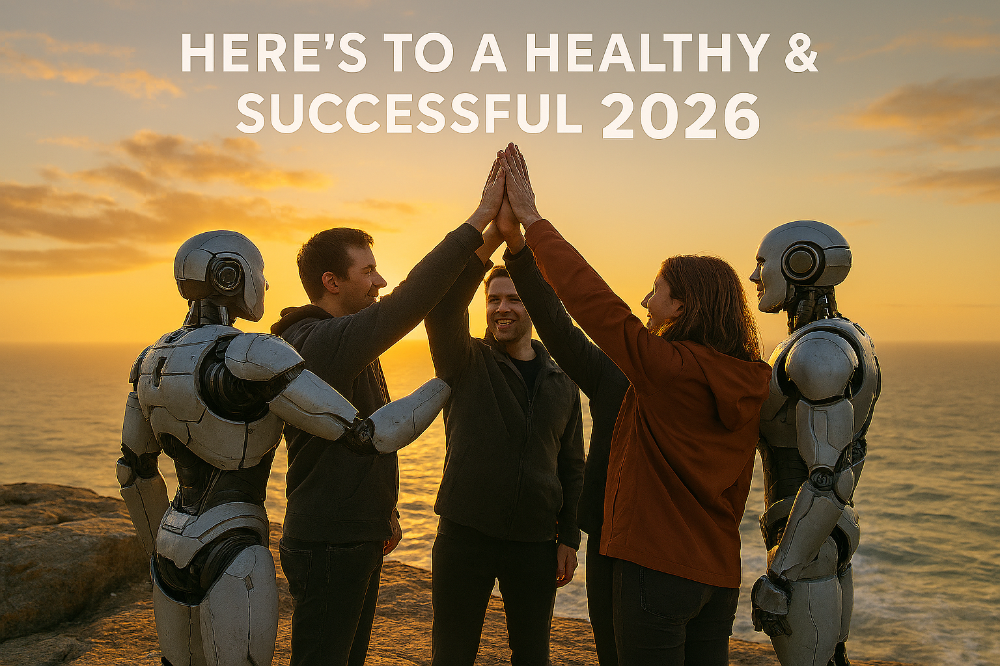

Title: 2026, Here We Come: Self‑Service, Paved Roads, and Engineering Without the Drama
Date: 2026-01-02
Category: Posts 
Tags: azure-devops, automation, engineering, learning
Slug: common-engineering-journal-9
Author: Willy-Peter Schaub
Summary: A bold look at how our next chapter blends pipeline‑as‑code and IaC into a single, powerful experience.

Looking back over the last five years, it is a bit like standing atop Table Mountain in Cape Town, gazing down at the winding paths we have travelled together. Some routes were smooth, others rocky, and some made us wonder how we even made it through. Every step nudged us closer to a cleaner, faster, and more reliable world.

 

The big theme? We stopped mopping up yesterday’s mess. We started building the right things, at the right time, every time.

# Automate Everything Automatable

Manual processes eventually felt off, like using a hand drill when you have got a power tool. Whenever a task cropped up more than once, we automated it.

- Human error vanished from risky steps.
- Engineers got freed from tedious, repetitive work.
- Consistency now scales across teams, portfolios, and products.
- Delivery sped up without sacrificing quality.

That foundation set the stage for everything that followed.

# Azure DevOps Operational Support as Code

Support once felt like battling bush fires, but we moved away from that scramble.

- Audits, checks, and validations now run automatically.
- Gates, approvals, and policies are updated with precision.
- Guardrails stretch across thousands of pipelines.
- Our environments are stable and predictable.
- Support transformed into a proactive discipline, no longer reactive chaos.

# Configuration-as-Code

Configuration was once tucked away in the minds of a handful of engineers, or hidden in obscure screens. We put it where it belongs. Version controlled in a Git repository, and out in the open.

- Change became democratic—anyone could contribute.
- No more reliance on privileged access.
- Every modification tracked by pull requests, with full clarity.
- We move forward confidently, not afraid of rollback.
- Hidden risks and tribal knowledge became a thing of the past.

Our engineering ecosystem became transparent, and healthier for it.

# Pipeline-as-Code

The day we adopted YAML fully, our pipelines surged ahead.
- Reuse took over from reinvention.
- Templates replaced one-off, fragile solutions.
- Logic adapts at runtime.
- Predictability at scale.
- Security checks and quality gates are built-in, not tacked on.

This approach brought discipline to CI and CD, far beyond what classic pipelines could deliver.

# Migration from Classic Azure Pipelines to the v2 Blueprint Ecosystem

Classic pipelines, expensive, prone to drift, were tough to maintain. The v2 blueprint architecture changed all that.

- Consistent pipeline engine, no matter the product.
- Standardised stages and naming conventions.
- Support and governance are now easy.
- Fast onboarding through self-service.
- A library of reusable building blocks.
- One template change benefits every team.

Our [CI/CD Cookbook](https://wsbctechnicalblog.github.io/announcement-ci-cd-cookbook.html) became our guide, and the v2 blueprints paved our roads. We left brittle legacy pipelines behind, making maintenance simple and innovation routine.

# Infrastructure-as-Code with Terraform

Application pipelines are only half of the story. Powered by Cloud Platform and Andrii's vision, terraform brought the discipline and structure we needed.

- IaC aligned with our pipeline ecosystem.
- Environments became predictable and repeatable.
- Security and consistency were built into provisioning.
- Manual steps disappeared.
- Product teams can now spin up a full environment confidently, with no fuss.

This is the backbone for our future Paved Roads work.

# From Snowflakes to Consistency

We do not live in the bits and bytes jungle anymore. We built paved roads. We stopped reacting to yesterday’s problems, and we did it together.

This past year, 2025, a year of growth, leadership, and grit, marked a turning point. We took Paved Roads and Bricks to the next level. 

Common Engineering engineers felt more empowered than ever. Even when two medical emergencies rocked us, the team stood strong. That is resilience in action.

We modernised with purpose, listened, brought people together, tackled our technical debt head-on, communicated clearly and openly, and ensured that every voice was heard. No, this is not a marketing poster, this is how we work, each day.

>
> **Crossing the Most Difficult Part of `Almost Done`**
>
> Although the foundational building blocks are firmly in place, we still need that final, but very tricky, ten percent of consistent adoption and disciplined application to truly bring everything together in 2026.
>

# 2026: The Year We Bring It All Together

Now we stand on the brink of an exciting year. In 2026, we will bring assemble the final puzzle pieces and build a self-service engineering kiosk, pulling together:

- The v2 pipeline-as-code ecosystem
- Paved Roads and Bricks
- Terraform-based IaC
- Standardised reference architectures
- Governance built into templates
- Automation from idea to production

Picture this ... an engineer chooses the application type, picks the architecture and environment model, then hits one button. The result? A working environment, from repositories, pipelines, and infrastructure, to reality.

We are proud of how far we have come, but we are not done yet. In 2026, we will move from `better` to `brilliant.` 

 

I want to wish each of you a safe and uplifting leap into 2026. May the new year bring you strong health, meaningful success, and the courage to chase what inspires you. Let us continue building, supporting, and celebrating one another as we step boldly into the year ahead. Here is to a vibrant, fulfilling, and successful 2026!

