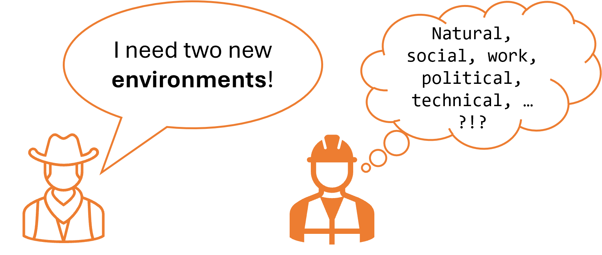

Title: Stop the Confusing Language Madness in IT!
Date: <2023-09-22>
Category: Posts 
Tags: 101, eliminate-waste
Slug: stop-the-confusing-language-madness-in-it
Author: Willy-Peter Schaub
Summary: Using a common language in IT helps avoid misunderstandings, conserves time, and enhances teamwork.

We pickup from the [Why I loathe when engineers use TLAs, such as CD vs CD!](./why-i-hate-tlas.html) and switch gears to the need for a common language. Establishing a shared terminology (common language) for technical terms in an IT environment is key to avoiding miscommunication, saving time, and ensuring teams work together effectively on complex projects. One of our first [Center of Enablement (CoE)](./ceremony-center-of-enablement.html) [working groups](./ceremony-working-group.html) aimed to create a glossary of common TLAs, business terms, and technical terms to clarify our written and verbal communications.

One of our first [Center of Enablement (CoE)](./ceremony-center-of-enablement.html) focused [working groups](./ceremony-working-group.html) was focused on creating a glossary of common three/four-lettered acronyms (TLAs), business, and technical terms to ensure we all know what we are talking about in written and verbal communications. Naturally, its effectiveness relies on people being able to find and use it.

In combinatio with the common language, our suggested wat to communicate is to use the format: ```WHAT``` ASK ```WHY```. For instance, rather than saying "_Delete my repo XYZ_", say "_Delete my Azure DevOps (AzDO) repo XYZ, <URL>, because we are decommissioning our proof of concept._" 

The latter question will result in less back-and-forth communication, confusion, and dramatically reduce both frustration and lead times, because the communication:

- Is **clear** and **precise**, minimizing mistakes, confusion, and delays.
- Provides **context** to explain WHY we are undertaking certain actions.
- Enhances **accountability** by clearly documenting the WHAT and WHY.
- Helps with **prioritization** with cues like decommissioning.
- Is **ACTIONABLE**, avoiding unnecessary clarification steps.

Let us explore three examples from our operational support bucket to highlight the issue.

---

# Help, my PROJECT is broken!

>  

<TBD>

---

# SOLUTION down?

>  

<TBD>

---

# ```--- ... ---``` My ENVIRONMENT needs rescue!

>  

Azure is integral to our daily operations, and Azure DevOps anchors our software development lifecycle. When considering just these two environments – do not get me started with the name "Azure DevOps" – expecting two environments can mean various things.

- **Azure DevOps (AzDO) environment** covers the infrastructure and services which support the entire software development lifecycle (SDLC), including boards, repositories, pipelines, test plans, and artifacts. 
- **Azure DevOps (AzDO) Pipeline environment** enables you to define and manage resources across various environments (development, staging, production) with enhanced traceability and control over deployments.
- **Build and Test Environments**, where Azure DevOps oversees the CI process by constructing the application and executing unit, integration, and automated tests.
- **Development Environment**, equipped with resources like virtual machines, containers, and services (e.g., Azure App Service, Azure SQL Database), is set up for developers to create and test their code.
- **Infrastructure as Code (IaC) environments**, such as Terraform or ARM templates, facilitate the management of environments through code.
- **Lower/Upper Environments** that delineate different stages of readiness.
- **Production Environment**, where the application operates and serves its users.
- **Sandbox Environment**, a controlled setting for experimentation, learning, and testing without impacting production or other environments.
- **Staging Environment**, which replicates the production setup.
- **Testing/QA Environment**, used for validating code changes through both automated and manual tests.

As previously mentioned, had the user requested using our ```WHAT``` ASK ```WHY``` approach, like "_I need two Azure DevOps Pipeline environments for our infrastructure-as-code environments_," the engineer would have needed fewer follow-up questions, reducing frustration and shortening lead times. In this scenario, Azure environments play a crucial role in our operations, with Azure DevOps environments central to our software development process. Requesting two environments without clarity can be ambiguous.

This recent real-world example involved three days of back-and-forth communication, made worse by the fact that two users made similar requests for different **environments**, engaging at least five engineers. This situation clearly demonstrates a significant amount of **WASTE**!

> The choice is yours ...
>
>  

---

Are you facing similar confusion and miscommunication within your IT environment? If so, how are you managing it?

