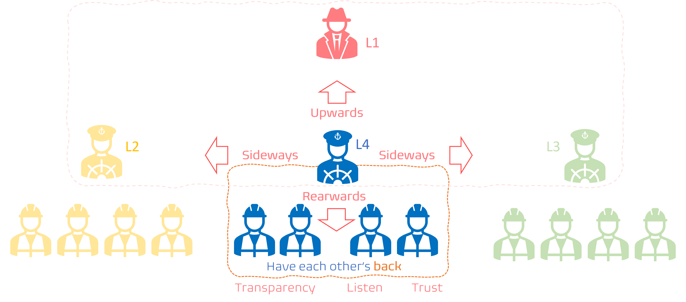
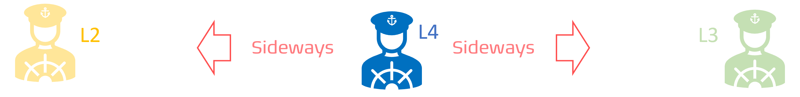
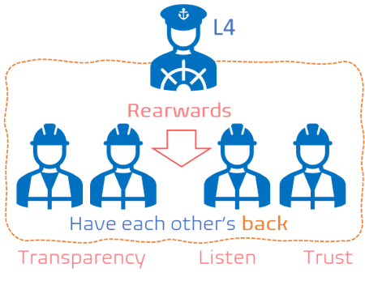

Title: Communication Guidance Sideways (Part 2)
Date: 2023-03-17
Tags: learning
Slug: communication-guidance-sideways
Author: Willy-Peter Schaub
Summary: "Not to be missed after you depart." - L.David Marquet

We pickup from [Communication Guidance Upwards](/communication-guidance-upwards), where we discussed how to communicate upwards to executive domain. In this post I will share my thoughts on communicating ```sideways```, with my peer managers, and ```rearwards```, with my team.

> 

The proposed value and outcome format, as proposed in the upwards communication can be re-used for sideways and rearwards communication.

```
    We want to <WHAT>.
        I recommend that <HOW,WHAT>. 
        There are several benefits:
            First, <CORE VALUE>. 
            Also, <OTHER VALUE>. 
            Finally, <OTHER VALUE>.
    Imagine, if <WHAT>, we will <VALUE>.
```

Before we peek into sideways communication, I must highlight an important epiphany I had. In the illustration, as above, you will notice my team in the center, with me (L4) communicating upwards, as discussed in [Communication Guidance Upwards](/communication-guidance-upwards), sideways, and rearwards. The epiphany is that what we are about to discuss as sideways and rearwards communication exists twice - #1 is my team and I, #2 are my peer managers and my leader L1. 

---

# Communicating sideways with per managers

As the L1, L2, L3, and L4 team we must collaborate, actively listen, co-operate, partner to work to meet common and organizational goals, and most importantly **TRUST** each other. For example, if I have a problem or am struggling with an unknown or challenging process, I need to be able to rely on my peers, reach out for help, and know that we will confront any challenge and follow-through until we have a solution.  The same can be said for my team of engineers, who themselves are a cluster of collaborative peers.

> 

To improve the sideways communication and collaboration, I recommend that you:

- **Be respectful**, caring, and never talk down to them.
- **Practice Active listening**, to understand your peers as humanoids and their unique needs. Silence is an effective ally!
- **Use clear and concise language**, no TLAs (two/three lettered acronyms), technical jargon, and as my Geography teacher always said no "waffling." Keep it simple, short, concise, and clear. Do not forget to follow up to ensure that your peers are clear on expectations and next steps.
- **Be pro-active**, create a communication matrix and regularly reach out to your peers to build a strong and trusting relationship.
- **Focus on solutions** over placing blame or critique. As I always tell my team - "we will burn up or succeed as a team."


> Some leadership anti-patterns you may recognize, for future discussion:
>
> - Knights in shining armour.
> - Blasphemous dictators.
> - Zero trust, omnipresent, micro-managers.
>

---

# Communicating rearwards with my team

For me, the most important part on the illustration is my team and I. It is my responsibility to lead them, protect them, and empower them. As quoted by L. David Marquet in [Turn the Ship Around](https://davidmarquet.com/turn-the-ship-around-book/), we "give our team control over WHAT they work on and HOW they work", creating a team of leaders and allowing you "not to be missed after you depart."

> 

To improve reward communication, I recommend that you:

- **Establish transparency** empowering everyone to be informed, pro-active and supportive.
- **Establish open and safe communication** encouraging everyone to share their ideas, concerns, thoughts, and even feel safe to **vent** as needed.
- **Be respectful**, as discussed.
- **Practice Active listening**, as discussed.
- **Use clear and concise language**, as discussed.
- **Provide regular and candid feedback** on goals, performance, and opportunities to continuously improve.
- **Be approachable** and available to your team, which brings me to a few more leadership anti-patterns you may recognize:

>
> - "Always behind closed doors office hermit."
> - "Secretive and vanishing Houdini."
> - "Command and control dictator."
>

Lastly, why do I refer to rearward communication. Well, something I learnt in my military days was to always lead by example and in the front, which means my team is not only behind me, but also **has my back**. 

---

Remember, less is more! Know your audience and make every word count!

