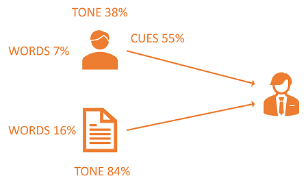
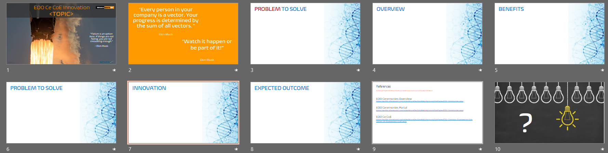
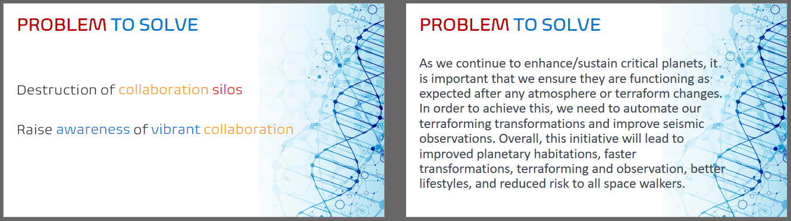

Title: Communication Guidance Upwards
Date: 2023-03-01
Tags: learning
Slug: communication-guidance-upwards
Author: Willy-Peter Schaub
Summary: Before you ask for anything, get clarity on the five WHYs!

I am working on my communication and collaboration skills. Although these posts will not be of a technical nature, they will benefit us all. I learn by doing and sharing and I love getting candid feedback from you, as well as from my manager and mentor.

In recent courses I learnt that the impact of communication is made up of 7% words, 38% tone, and 55% cues. 

> 

That is for interactive communication! For written communication we lose the cues, making the words and tone even more important.

---

# Communicating upwards to executive domain

Our leaders are typically driven by **goals**, focused on the **bottom line**, and push for progress at a **rapid** pace. If our communication and proposals are too complex, they quickly become overburdened with the complexities, and are more likely to become dismissive.

We must paint a picture of success, clearly describe the **WHY**, and **HOW** we will affect the goals and bottom line. Communicate your idea/plan/request directly and objectively - no fillers, no waffling, no noise, and no redundant nouns.

If you are a **dreamer** like I am, you must balance your **dream** with **reality** or be viewed as overly optimistic and disruptive. 

I created a basic template to help me document initiatives when I need stakeholder advice, buy-in, and support. I am encouraging my team to use the same template when they have an idea, or if I ask them to create a plan.

Hope the template will help you as well.

---

# Proposal Template

Here is the template I created.

> 

- Slides 1 (cover), 2 (quotes), 9 (references), and 10 (Q&A) are intended for presentations.
- Slide 3: **PROBLEM TO SOLVE** - Before you commit your **problem** to paper, investigate the root cause. The five (5) WHYs technique is an effective way for you to do **root** cause analysis and to find the root cause of any problem. It is also an effective way for your audience to test your **problem definition**.

> “_The basis of Toyota’s scientific approach is to ask why five times whenever we find a problem … By repeating why five times, the nature of the problem as well as its solution becomes clear._“ Taiichi Ohno

- Slide 4: **OVERVIEW** - A crisp overview of the proposal - **WHAT** is it all about.
- Slide 5: **BENEFITS** - Outline the benefits of investing in the proposal - **WHAT** is the value.
- Slide 6: **PROBLEM TO SOLVE** - If proposal is focused on a problem, describe the problem to be resolved.  
- Slide 7: **INNOVATION** - If the proposal is focused on an innovation, describe the innovation to invest in.
- Slide 8: **EXPECTED OUTCOME** - This is the most important part, which describes the outcome and value proposition in the following format:

```
    We want to <WHAT>.
        I recommend that <HOW,WHAT>. 
        There are several benefits:
            First, <CORE VALUE>. 
            Also, <OTHER VALUE>. 
            Finally, <OTHER VALUE>.
    Imagine, if <WHAT>, we will <VALUE>.
```

Remember to keep your communication crisp. The left sample is focused on the salient points and keeping the details (verbiage) in the speaker notes for reference. Avoid the slide on the right - you will lose your audience!

> 

Hope this helps you with your next communication.

---

Remember, less is more! Know your audience and make every word count!

