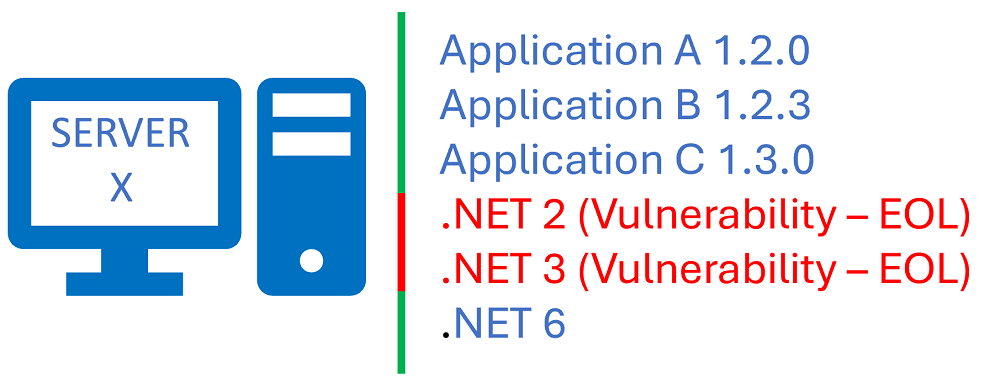
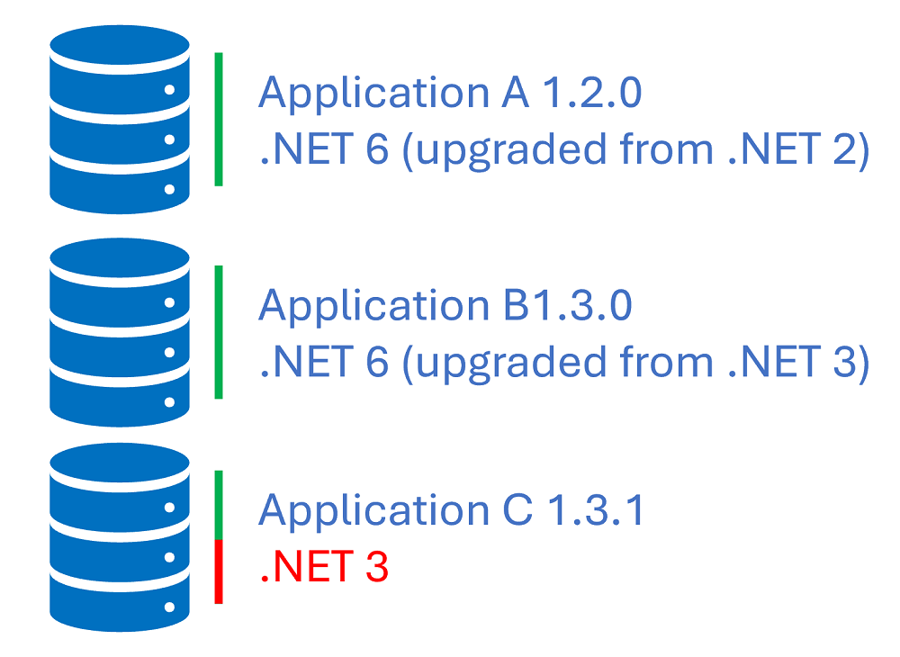
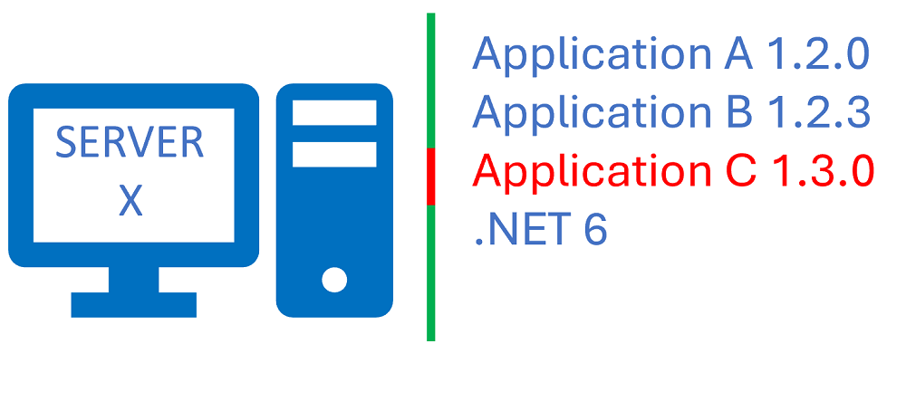
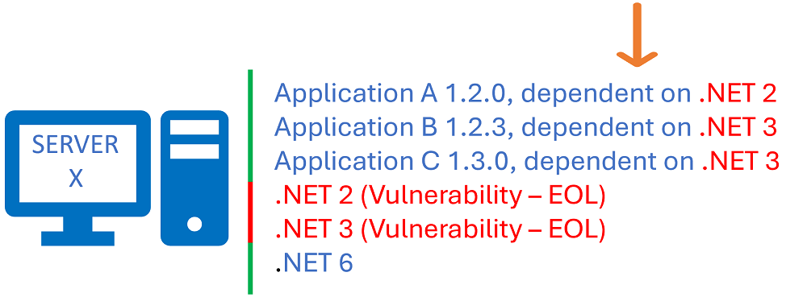

Title: Configuration and/or Dependency Management
Date: 2023-05-26
Category: Posts 
Tags: engineering
Slug: configuration-and-or-dependency-management
Author: Willy-Peter Schaub
Summary: What am I missing? Is this not a common dependency challenge?

I do not have experience in this area and am slowly, but surely, losing my marbles as no-one seems to have an answer.

---

# System Center Configuration Manager to the rescue ... or not?

Yes, we are using Microsoft System Center Configuration Manager, to report on the health of our virtual servers, installed products, and missed patches. In essence, we know exactly WHAT is installed and WHAT is vulnerable - that is a goo thing, no?

>  

> In the above example, we know we are running application A, B, and C, as well as dependencies .NET 2, 3, and 6. We alerted that .NET 2 and .NET 3 are end-of-life (EOL) and therefore a vulnerability.

# Team Framework Monitor

We have also developed a tool, called Team Framework Monitor (TFM), which we recently open-sourced. See [BCIT Computer Systems Technology Industry Sponsored Student Project.html](/bcit-computer-systems-technology-industry-sponsored-student-project.html) for details. 

Using the tool, we regularly scan all our [Azure DevOps](https://azure.microsoft.com/en-us/products/devops/repos/) repositories to produce a report of applications, their dependencies, and whether any of their dependencies are end-of-live (EOL) - another precious gem, no?

>  

> In the above example, we know we have upgraded application A and B to use .NET 6. We have addressed two vulnerabilities in two of our applications in the codebase. 

# Dependency Management Dilemma

And here is my dilemma. 

1. We diligently address the vulnerabilities on the server by removing .NET 2 and .NET 3.
2. We trigger continuous delivery which deploys the latest versions of application A, B, and C.
3. We smile, go home, and relax.
4. At 2-AM in the morning, our phones ring off the hook - application C is down. Production incident.
5. Root cause analysis determines that application C is still dependent on .NET 3.

Sound familiar?

> 

Neither System Center Configuration Manager, nor any of the other expensive products we use can **pro-actively** warn us and avoid the 2AM call by generating a report such as this:

> 

Obviously, we can spend manual effort to create yet another Excel workbook, with Pivot Tables that will help us figure our that we cannot remove .NET 3 yet. But ... there must be a smarter, more automated strategy?!?

---

How are YOU solving this challenge? Do you have any case studies of organizations that have mastered this challenge?

Comment below and let us start an interesting discussion!

