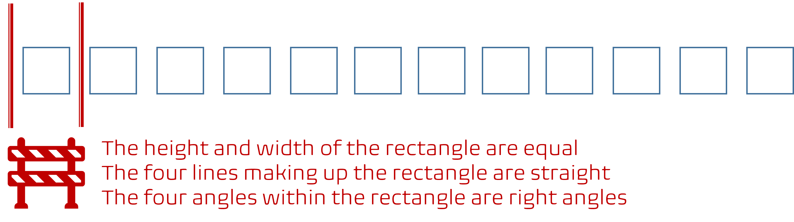

Title: WHY are we pushing consistency and standardization?
Date: 2022-03-25
Category: Posts
Tags: eliminate-waste, technical-excellence
Slug: consistency-standardization
Author: Willy-Peter Schaub
Summary: Balancing autonomy with consistency and standardization.

**WHY** do we keep mentioning **consistency** and **standardization** like a broken record in [Journal 1 - What is origin of our common engineering team?](/common-engineering-journal-1.html) and many other posts? 

Before we explore the answer, let us explore our understanding of consistency and standardization.

---

# Consistency

**Consistency** is coherence, a key pillar in engineering. It empowers a unified whole, such as a common engineering system or a complex solution that is maintainable and extensible.

 

The previous illustration shows twelve **consistent** squares that have the same height, width, and colouring. A great example of consistency is [LEGO](https://www.lego.com/) which offers us an assortment of consistent building blocks, with which we can follow directions or experiment in creating simple or complex objects, based on consistent building blocks.

--- 

# Standardization

**Standardization** is another pillar of engineering. It is the process of observing guidance, guardrail, standard, or governance.

 

In the illustration, above, we have defined a guardrail that the height and width of the rectangle must be equal and that all lines are straight and parallel - a recipe to create a rectangle, also known as a square.

Standardization is pivotal with designs, producing **consistent** interfaces, solutions, and uniformity that empowers people to be more effective.

---

# Back to the question ... why do we promote consistency and standardization?

Why we love consistency and standardization:

- **Consistency improves adoption** - Once we become familiar with a process or product, resistance to explore and embrace others will evaporate. For example, if you know how to use Office 365 Word, you can navigate yourself around Office 365 Excel or PowerPoint with familiarity and without friction.

- **Consistency reduces cost and time** - Usability and learnability improves with consistency, which empowers engineering to deliver value quicker and continuously. Reducing time and anomalies, reduces cost - a favourable side-effect for investors and researchers.

- **Consistency empowers automation** - We frequently say that "_if you do something twice or thrice, consider automation!_" While this is solid guidance, automation becomes a lot easier if you have a consistent process and products at your disposal.

- **Standardization reduces cost and time** - By adopting industry standards we improve upgrades, maintenance, migrations, security, and scalability of our solutions. By standardizing **processes** and **products**, we improve clarity and productivity, because engineers can focus on delivering value in a predefined way without the need to master a platter of variations.  As with consistency, a reduction in cost with a rise in quality, repeatability, and security is a well-received side effect.

- **Standardization promotes consistency** - As shown in the previous example of drawing rectangles based on a standard, we can produce consistent squares and Lego can continue to produce a treasure chest of building blocks.

For example, once we have a **standardized** process to produce rectangles with equal sides, aka squares, we can hand it to a machine to automate, and repeat to create **consistent** squares continuously.

 

The reason we want to **automate** these types of mind-numbing tasks is that they are well suited for machines. If we ask a humanoid to repeat the same **standardized** process we will end up with inconsistent squares, as shown.

> **MY 2-CENTS**
>
> - Humans are not suited for mind-numbing and repetitive work. Context switching, distractions, and mental fatique will affect quality **sooner** than later. 
> - Machines, on the other hands, thrive on repetitive work and deliver continuously and consistently, as long as there is power.

 

Although it appears like a trivial issue, when we aggregate the process into a more complex solution that expects **consistent** squares, the **failure rate** for the manually created squares will be much higher than the squares created through automation. In fact, although both sets of objects look like squares, we will observe a 100% versus 25% pass rate for the automated and manual processes respectively. In this sample example, this implies a 75% WASTE!

 

Last, but not least, we acknowledge that autonomy, mastery, and purpose is the secret sauce that drives information workers (See [Pink](https://youtu.be/u6XAPnuFjJc) for details). It is important that we balance **consistency** and **standardization** with **autonomy**. 

> **MY 2 CENTS**
> 
> - The smaller your organization the more you can pivot to autonomy.
> - The greater your organization and rotation of engineers, the more you can pivot to consistency and standardization. 

We, for example, empower our engineers to contribute to our common engineering system and our supporting (not enforcing) guardrails through [centers of enablement and associated working groups](/ceremony-overview.html), to empower all engineers to do end-to-end tasks more efficiently, while nurturing their mastery and purpose. A win:win!

