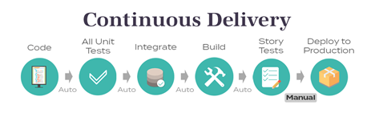

Title: Continuous Delivery in the enterprise
Date: 2022-03-04
Category: Posts
Tags: continuous-delivery, delivery-on-demand
Slug: continuous-delivery-in-the-enterprise
Author: Shay Vannery
Summary: Continuous Delivery is no silver bullet and requires persistence, discipline and effort.

Businesses have been adopting a Digital-first approach to interact with their customers since the advent of the internet. The global pandemic of 2019 further accelerated this trend. Today, it has become more important than ever before for a service-based organization to have a robust web presence. Customer expectations are at all-time highs; and organizations are expected to be highly-available; highly-accessible; and provide an online experience comparable to high-tech ecommerce & content streaming companies. This requires organizations to make quick, seamless transitions when faced with security concerns & changing business priorities.

The answer is **Continuous Delivery**.

> 

---
 
# What is Continuous Delivery anyway?

In his book on Continuous Delivery, author Martin Fowler defines Continuous Delivery as “a software development discipline where you build software in such a way that the software can be released to production at any time”.

In layperson’s terms; Continuous Delivery is the ability to get changes of all types into the hands of end-users, quickly, safely & seamlessly; thereby making production releases routine non-events. 

I like to think of continuous delivery as replacing components of an airplane while it is in-flight and full of passengers. Or performing an organ transplant on an athlete while she is running a marathon. 

Amusing metaphors aside, Continuous Delivery makes it possible to continuously make changes to software as required by the end-user or the business.

---

# Why do WE need this?

Traditional organizations with legacy footprints often make the mistake of ignoring cutting edge software engineering methodologies; thinking of it as unnecessary or overkill. However, the benefits of Continuous Delivery can be observed & measured quickly in organizations of all sizes, in all industry verticals. Some of these benefits are as follows:

1.	**Minimized risk** – Smaller, more frequent releases reduce risk. The chances of bugs creeping into production, or features not functioning as intended are far lower. It also becomes possible to quickly identify & remediate any errors without outages or degraded performance.

2.	**Improved Quality**– When cross-functional teams work together, leverage automation, test and integrate changes frequently; overall quality improves. Teams are able to avoid re-work and focus on delivering value to the customer. They can also get quicker, timely feedback and focus on building a better, more relevant product.

3.	**Improved Predictability** – By following a predictable & standardized sequence of activities (sometimes known as deployment pipeline) teams can avoid surprises caused by human error, code, integration or environmental issues. 

4.	**Lowered Costs** – Automating repeatable & manual tasks can lead to significant cost savings. In theory, teams can avoid working over-time after business hours. As releases become non-events, teams can move away from war-rooms, incident mitigation protocols and the massive amount of coordination effort these require. 

5.	**Improved work-life balance** – Less panic, less fire-fighting, leads to a more fruitful employee experience, free of blame and unnecessary stress caused by fear of the unknown and looming deadlines. 

Admittedly, Continuous Delivery is no silver bullet. Just like diet, exercise and meditation; Continuous Delivery requires persistence, discipline and effort. It is imperative for all organizations today to examine the way they perform work, where they invest time and effort, and make data-driven investments in their delivery pipeline; so they may continue to be relevant in our rapidly changing world.  

