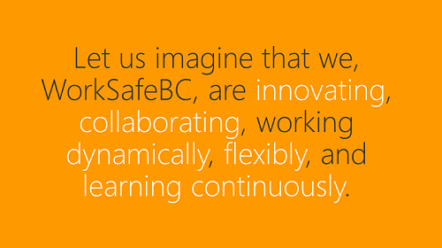
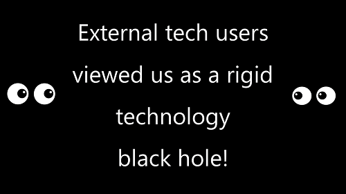
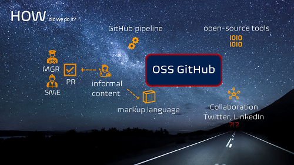

Title: The WHY, HOW, and WHAT of our technical blog
Date: 2022-06-22
Category: Events
Tags: event,learning
Slug: demo-technical-blog-1
Author: Willy Schaub
Summary: Creating a demo pull request and post for our technical blog demo.

I have been invited to share our insights into how we are experimenting and present our WorkSafeBC technical blog. To show how we moved from ideation to action, gather feedback, and connect with the audience I decided to create a pull request - which will be turned into an actual blog post by the time you read this. 

---

# WHY did we create this blog?

This blog is based on an initiative that started as an idea at our March 2021 InnoFest to explore how we can enter the open-source world, collaborate, and share our cutting-edge engineering practices, products, and innovation such as our application-type CI/CD pipeline blueprints, and show the rest of the world that WorkSafeBC is a phenomenal place for engineers to work for.

We introduced the idea with the following slide (pulled from the original InnoFest 2-min pitch) ...

... and suggested that users unfamiliar with WorkSafeBC often wonder if a [government agency can be innovative](/can-government-agencies-be-innovative.html). Our innovation may as well have been hiding in a black hole - the community ( YOU ) had no insight into the exciting stuff we were dabbling with.
 

For example, we have shared all our insights and learnings of Azure Pipelines in the detailed [tag:pipelines](https://wsbctechnicalblog.github.io/tag/pipelines.html) posts.

---

# HOW did we create this blog?

We opted to host the project on GitHub as an open-source project using open-source tools, such as [Bricks based on Zurb Foundation](https://get.foundation/) and the [Bricks by Sam Hocevar](https://bricks.stackexchange.com/users/311/sam-hocevar) and 

The blog is based on informal-style technical content, using engineering-friendly markup language, and relying on the pull request workflow for collaboration, review, and revisions.

- Each pull request is reviewed by at least two reviewers, typically a subject matter expert and a manager. 
- Once reviewed, the pull request is approved, which triggers the GitHub actions to publish to the live blog.

The result is a collaboration channel that has demonstrated to the rest of the world that WorkSafeBC is an innovative and cool company to work for.  

We have been mentioned in the **Top Stories** by the [Microsoft DevOps](https://devblogs.microsoft.com/devops/) channel a few times and have been approached by engineers from around the world through our personal Twitter and LinkedIn channels.

---

# WHAT is next?

What the demo highlights is that what started as a simple idea, using simple tooling, requires more tender loving care and an investment to make it an attractive and successful platform. 

We must **enable comments** to encourage collaboration and capture feedback, and **enable telemetry** so that we can track overall traffic and analyze popular content.

Lastly, a branding guidance and alignment tweak would not only improve your user experience but align our blog with the rest of our organization in terms of the look-and-feel.

Hope you enjoyed the demo. Thank you for listening / reading.

