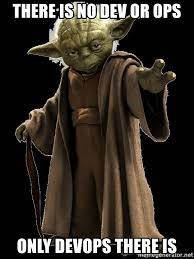

Title: DevOps value proposition
Date: 2021-12-30
Category: Posts
Tags: quality, technical-excellence, eliminate-waste, devops
Slug: devops-value-proposition
Author: Alex Bunardzic
Summary: DevOps introduces simultaneous focus on expectations, architecture, design, testing, building, releasing, and running the system

Software engineering consists of four distinct activities:

1. Envisioning software
1. Creating software
1. Releasing software
1. Running software

Traditionally, those four activities were compartmentalized into four distinct divisions/departments/teams. There are departments and teams that work on envisioning/hypothesizing and gathering the requirements. There is a hand-off from those upstream departments to the downstream software creation departments (consisting of software architects, modelers, designers, coders, and testers).

There is a hand-off from those upstream software creation departments to downstream software release departments. Those departments consist of release engineers who are concerned with mitigating risks via proper change control processes.

There is a hand-off from those upstream software release departments to downstream sustainment and reliability departments. Those teams are responsible for running the released software and keeping the lights on.

The above arrangement has proven inefficient when it comes to competing on the mainstream market. Any change necessary for improving the quality of the service takes way too long, due to the gated phases and asynchronous “take a number” approach to attending to the process. Value stream delivery tends to be very choppy and unpredictable following the traditional software engineering model.

## There is room for improvement

The proposed improvement arrived in the form of Extreme Programming, Agile Manifesto, and DevOps. In a nutshell, the proposed change starts with the suggestion to remove the above four silos and to combine all four distinct activities (envisioning, creating, releasing, and running) into a single activity. DevOps is a discipline that is based on doing all those four activities simultaneously. DevOps teams engage in envisioning, creating, releasing, and running software as part of their daily activities.

What would be the advantages of this newfangled approach? The constraints of being expected to perform all four activities at once forces organizations to focus on reducing the average batch sizes and limiting the number of items being worked on at the same time (limited Work in Progress).

As a result, it gets easier to ensure technical excellence and overall quality of the value delivered to the paying customers, because issues and errors caught tend to be small, with a very limited blast radius.