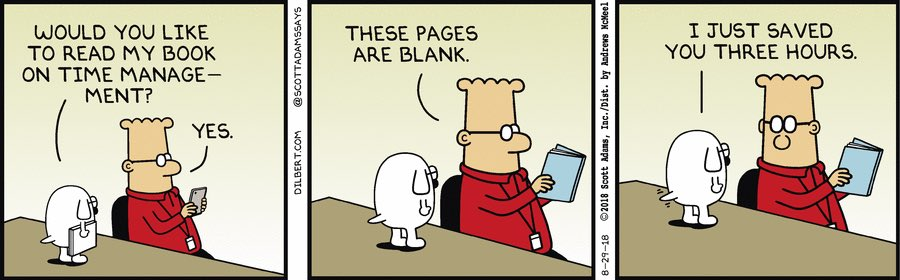
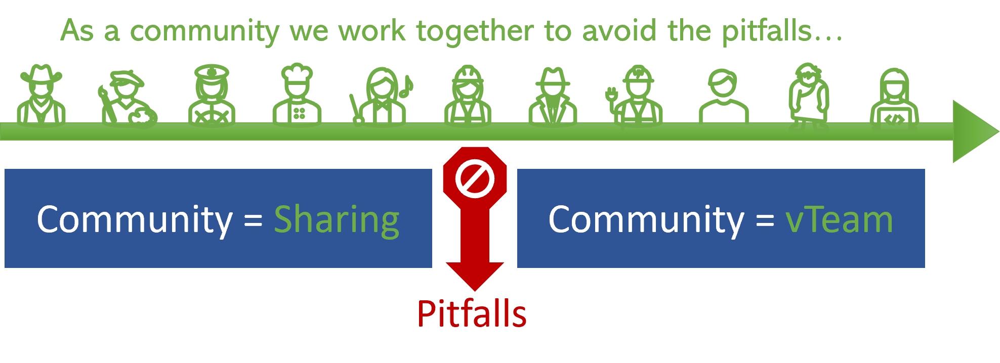

Title: DevOps Vancouver Meetup Learnings
Date: 2024-10-04
Category: Posts 
Tags: event, learning
Slug: devops-vancouver-meetup-learnings
Author: Willy-Peter Schaub
Summary: Insights gained from hosting six community meetups this year: the positives, negatives, and challenges.

We have been running the DevOps Vancouver meetup for years, enduring fantastic and tough sessions as well as the Covid pandemic. This year, we emerged from the pandemic and shifted from virtual-only meetings to a mix of virtual, hybrid, and in-person events. In this brief post, I will share insights from a busy first half of 2024, a summer break, and upcoming events.

One major realization I have made this year is that DevOps has matured, and the engineering community now embraces the mindset. We have progressed from basic DevOps to sharing innovations in the synergy of people, process, and products - there remains little interest in the fundamentals of DevOps. Additionally, Artificial Intelligence (AI)'s impact on DevOps is significant, and we are beginning to struggle with maintaining focus as AI overlaps with other areas, leading to conflicts with other meetups and duplication of events/focus.

# Negatives and Challenges

>  

I will start by discussing the challenges of hosting meetups that meet both community needs and sponsor expectations. These are just my personal candid observations! Please be patient; we will get to the positives, because meetups are certainly valuable!

- **Meetups have hidden costs** - While free, meetups demand significant personal and business time (cost), venues, refreshments, equipment, and promotion (cost), and above all, effort to provide engaging content for diverse attendees (cost). Without these investments, the content might become niche or irrelevant, leading to decreased interest.

- **Keeping momentum is tough** - When content loses relevance, community interest drops. To maintain engagement, we need to frequently remind the community of the meetup’s purpose and host regular meetups. For instance, out of 2882 meetup members, only 3.5% attend.

- **25-50% of RSVPs are unreliable** - Comparing actual meetup attendance with RSVPs (Répondez s'il vous plaît") shows many people do not show up due to other plans or commitments like family dinners. This makes planning venues and catering difficult and risky.

- **<20% Poll Response Rate** - Achieving an adequate response rate for online surveys is always challenging. Given that we are engaging with a part-time community, the typical 20-30% response rate decreases to 5-10% of active participants, on a good day. This limited feedback complicates efforts to enhance meetups or determine which topics to schedule.

- **Hybrid meetups are a nightmare** - during the pandemic, we switched from in-person to virtual. This year, we tried hybrid meetups with both in-person and virtual attendance but concluded we will either host fully virtual or in-person events going forward. Firstly, in-person events see less drop-off as attendees who travel are more engaged. Secondly, online attendees often get distracted by multiple monitors. Thirdly, time is wasted due to communication issues or unprepared users online. Therefore, our preference now is for recorded in-person meetups, sharing recordings a month later. 

Thank you for reading this far. Let us context switch to the positives.

---

# Positives

>  

Next, I focus on the benefits, which undeniably surpass the disadvantages, though we might feel differently during hectic periods.

- **Collaboration is energizing** - One key lesson from my army days is that we can overcome any challenge together, whether it is trekking 50km through the Alps with gear, running 5km, or facing life's hurdles. As a community, we can collaborate, share knowledge, support one another, and avoid common pitfalls and redundant efforts in a tech environment. During meetups, I prefer to observe from the back and explore the hallways during breaks to meet new engineers, each bringing unique challenges, insights, and skills to share with the DevOps Vancouver community.

- **In-person rocks** - While I appreciate remote work, I prefer in-person meetings for certain situations. They help me connect with new community members without distractions from multiple screens and constant chat notifications. During in-person meetups, it is not acceptable to be sidetracked by emails or chats, ensuring everyone stays focused.

>
> 
> 1. X
> 2. X
>

!!! Demos help!
!!! Short, related sessions work best.
!!! Mentimeter works well.

---

>
> **Top 7 Tips when (co-)hosting a meetup!**
>
> 
> 1. Make sure there is a **break** between sessions to allow attendees to **relax** and **network**. Make sure to have a colleague with you to manage the potential influx of questions from multiple attendees – remember that you will also need occasional breaks.
> 2. TBD
> 3. TBD
> 4. TBD
> 5. TBD
> 6. TBD
> 7. TBD

---

What ```meetup``` **learnings** can you share?

