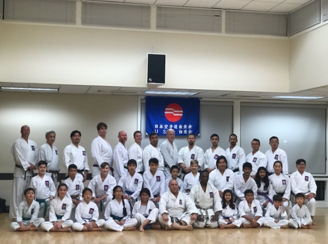

Title: Guidelines to start and terminate the Dojo Events
Date: 2021-11-03
Category: Events
Tags: dojo, quality, events
Slug: dojo-events
Author: Alex Bunardzic
Summary: Instructions on how to start, run and terminate Dojos

 

## Terms of reference 

Continuous improvement is not possible without cultivating desirable hands-on skills. Acquisition and efficient retention of hands-on skills is best accomplished by attending immersive bootcamps, labs, and Dojos. 

The objective of starting a series of Dojo events is to provide an opportunity for the teams to raise the bar in terms of desired hands-on skills. 

By proposing to start a series of Dojo events, we hypothesize that the outcome will materialize as an improved consistency of the alignment with the business priorities and the delivery of desired business value. 

To avoid potential waste, we also hypothesize that any established Dojo must be terminated in case the anticipated desired outcomes fail to materialize. 

## Getting started 

During the working sessions in one of the Centers of Enablement, a need for improving the competency of the teams may get identified. Participants in the competency center begin to chart the hypothesis that proposes to elevate the level of desired competence. The Dojo gets named and the Teams channel dedicated to the Dojo gets created. 

The Dojo events get scheduled and the targeted audience gets notified. 
Similarly, it may so happen that during one of the Community of Practice sessions a need for a Dojo gets identified. The same approach as the above holds true for Dojos sparked by the Communities of Practice. 

## Projected trajectory for success 

Each Dojo must contain a clearly defined projected trajectory for success. Following the traditional approach, each Dojo must have an appointed _sensei_ (a teacher and facilitator), and one or more _senpais_ (senior practitioners who assist the _sensei_). _Sensei_, with the help of _senpais_, leads the _kohais_ (i.e., students) toward the mastery of the desired hands-on skills. 

At the outset, all Dojo students enter the inaugural Dojo session by holding the white belt degree. After a series of introductory sessions, some white belt students may qualify to take the yellow belt kata (exam). The initial goal of the Dojo is to quickly ramp up all team members to the yellow belt level. 

Following successful graduation from the white to the yellow belt level, the Dojo works toward training the students to graduate from the yellow belt level to the orange belt level. After that, the intention is to graduate from the orange belt level to the green belt level, and so on, all the way up to the black belt level – the mastery of the hands-on skills. 

## Preferred mode of working 

It is important not to get stuck at the level of [Expert Beginner](https://wsbctechnicalblog.github.io/dont-become-expert-beginner.html).

At all times, the Dojo must be a psychologically safe place for all in attendance. To ensure smooth and effective progress, the _sensei_ imposes the _Dojo Code of Ethics_:

1. Respect those more experienced. Do not force your ideas on others.  
1. Respect those less experienced. Do not force your ideas on others.  
1. If you understand the technique and are working with someone who does not, lead them according to your understanding. Do not attempt to verbally correct or instruct others unless _sensei_ appoints you in that role.  
1. Upon entering the Dojo, strive to cultivate an open mind that expects to be instructed on skill. No other concerns or discussions should be on the practitioner's mind for the duration of the session.  
1. _Sensei_ and _senpais_ always enter the Dojo with undivided respect and gratitude to students who are ready to receive instructions.  
1. It is important to be on time for practice. If you arrive late, please wait for _sensei_ to give you the signal to enter the session, so as not to disturb the flow.  
1. _Kohais_ (students) may find themselves disagreeing with the instructor. While asking questions is part of the training session, it is important to keep in mind that not all the details of the technique have been fully presented at the moment when confusion arises in the student's understanding. Patience is a virtue, and often what appears contradictory or incoherent becomes clearer as the training session continues. 

## Deliverables 

After each Dojo session sensei will tally up the attendees and provide the report to the Dojo stakeholders/sponsors. 

Periodically (i.e., once per PI), _sensei_ will prepare the report outlining the status of the Dojo: how many students have graduated since the last report; how many students are lagging; approximate estimate as to how many more sessions may be needed to elevate all students to the next level. 

_Sensei_ will organize (with the help of _senpais_) periodical graduation ceremonies. _Sensei_ will collaborate with the Dojo stakeholders/sponsors to procure some form of modest awards for the recipients of the higher-level belts. 

_Sensei_ will be responsible for maintaining the Dojo wiki and for collaborating on the Dojo Team channels. _Sensei_ will be responsible for recording each Dojo session and for publishing the recordings. 

## Responsibilities 

_Sensei_ will be responsible for preparing the training material for all Dojo sessions. In addition, _sensei_ will be responsible for preparing kata challenges, per desired belt level of skills. _Sensei_ may request help from _senpais_ while preparing the training/exam material. 

_Kohais_ (students) are responsible for the effective utilization of the time spent in the Dojo, as well as the time spent preparing for the kata exams. Students are expected to demonstrate brisk and sustained progress in the Dojo. Students’ progress will primarily be measured by their advancement from the white belt to the yellow belt to the orange belt to the green belt and beyond. 

If the Dojo demonstrates effective progress (i.e., students are swiftly graduating from lower-level belts to higher-level belts), _sensei_ will be given allowances to demand more time that the students should dedicate to improving the desired skills. 

## Terminating the Dojo 

Everything good and nice must eventually end. The Dojo should not be forever; its goal is to swiftly elevate the skill levels to the desired status. Ideally, once all Dojo students graduate to the black belt level, the Dojo can be closed. 

In a case where the pace of progress is not as brisk as expected, _sensei_ and Dojo stakeholders/sponsors should meet and discuss whether it makes sense to continue with the Dojo events. Sometimes the best course of action is to cut our losses and move on. If the Dojo reaches that undesirable state, _sensei_’s duty is to close it.