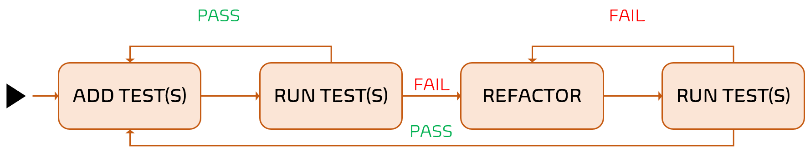
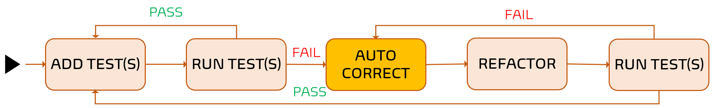

Title: Sensei Alex "fakes it until he makes it" in our Test-driven Development (TDD) dojo
Date: 2021-07-31
Category: Events
Tags: code, quality, testing, tdd, events
Slug: dojo-tdd-getting-started-demo
Author: Willy-Peter Schaub
Summary: Exploring the advantages of Test-driven Development and the concept of self-healing code

In a recent TDD Dojo, our Sensei [Alex](https://twitter.com/alexbunardzic) reiterated the main advantages of embracing Test-driven Development (TDD), such as:

- Creating an up-to-date armour of automated tests your or your pipeline friends can rerun at will.
- Fine-tuned code that is functional, maintainable, and plagued by fewer bugs.
- Less need for and time spent debugging code.
- Less friction and hesitance to make code changes.

Also known as "Test First Development", TDD is a continuous loop of writing tests, adding, and refactoring code, as shown below.

 

What followed in the Dojo seemed trivial but made my head spin for a while. Alex introduced the concept of "fake it until you make it" and self-healing code, which literally erased code changes tht break the test(s). 

 

Self-healing code is definitely not for the faint hearted and will take nerves of steel to adopt. However, it forces you to continuously make and test small autonomous code changes.

Seeing is believing. Enjoy the following Dojo demo recording and share your thoughts with me on [@wpschaub](https://twitter.com/wpschaub).

