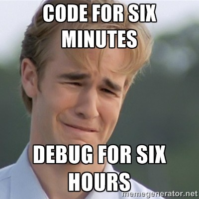

Title: Don’t debug; do TDD instead
Date: 2021-12-02
Category: Posts
Tags: quality, technical-excellence
Slug: dont-debug
Author: Alex Bunardzic
Summary: Avoid wasteful debugging activities by creating automated tests using TDD technique

When creating software, we often realize that the solution we’ve created does not behave the way we expect it to behave. We move into creating software with certain intentions (I call those intentions expectations). We materialize those expectations by writing code. If we are not careful when writing code, the code we wrote may end up having a few bugs. Hopefully, those bugs get identified before we release our changes to the customers. Unfortunately, that’s not always the case and sometime bugs get discovered in production, by the end users.

Now we need to fix the bugs. And how do we do that? We debug. The debugging process is a technique for identifying bugs in the code.

There are three different ways we debug code:

1. We debug the code we wrote
1. We debug the code someone else wrote and we have the source code
1. We debug the code we wrote that uses the code someone else wrote but we don’t have their source code

In each of the above three cases, we aim at _slowing down_ the program execution. If we are not debugging, we activate the code by running the app (the program) and observing how the app behaves. If the app crashes, we have a serious defect somewhere. If the app doesn’t crash but behaves erratically (for example, displays incorrect information or takes us to an incorrect part of the app, or sends incorrect information to some other systems), we have detected that there is a bug somewhere (but we don’t know where). Now’s the time to hunt for that bug (or bugs). We typically hunt for it by slowing down the execution of the program.

How do we slow down the execution? There are basically two ways to do that:
​​​​​​​
1. We add new lines of code that print some values to the output (a console, or a printer)
1. We add a breakpoint at some line of the code

Either of these tricks are intrusive; they make the cut into the body of the code so that the troubleshooting engineers could pry into the innards of the system.

Furthermore, not only are debugging activities intrusive, but they are also wasteful. Nothing useful gets produced after spending some time debugging. The best we can hope for after a successful debugging session is to gain a better understanding of how the system works. But that understanding was achievable even without debugging, by simply reading the source code carefully.

The worst part of any debugging activity is that it is 100% manual. We manually add new lines of code that output some values, or we manually add breakpoints to the code. When the program execution reaches the breakpoint, we then manually step through the code and manually inspect the produced values. Extremely tedious and error prone.

As if that activity was not inefficient enough, an even worse part is that we cannot record the debugging session and reuse it later. If sometimes later the same or very similar bug returns, we need to repeat the same tedious manual process of debugging. Very wasteful, to say the least. Add to that the fact that it is literally impossible to estimate how long will any debugging session last (we are fishing for results, basically), and we get an extremely non-productive way of working (I’ve seen situations where teams sometimes waste days debugging).

## How to avoid wasting time with debugging activities?

Any time we discover a bug, we realize that our expectation hasn’t been met but the running code. Rather than rolling up our sleeves and wasting time by getting immersed in tedious debugging activities (as described above), we should strive to work smarter, not harder.

A much more productive approach to removing any bugs is to first formulate our expectation. If we do not take the time to formulate our expectation, we analyze program’s execution while keeping our expectation in our heads. It is of very little use being kept there. Instead, we should always insist to write our expectation down.

When creating software, the best way to write our expectation down is to craft a test. A test is much simpler and easier to write than the implementation code. If done properly, a written test cannot contain any bugs (by ‘properly’ I mean the test must never contain any processing logic).

Because we know exactly what we expect from the code when it runs, the test we wrote will fail (the bug in the implemented code will cause the program to fail to satisfy the expectation written in the test, which makes the test fail). Now we have the evidence that something is broken. And now is the time to work on fixing the breakage.

## Why is this approach better than debugging?

To begin, notice how we did not have to make any incision into the implemented code. No need to add any output statements, nor do we have to enforce any breakpoints in the code.

Secondly, we have explicitly expressed our expectation. This is useful not only in guiding our own thinking, but also facilitates successful teamwork. We can interrupt our programming session and let other team members pick up the slack and continue exactly from where ewe stopped, because they will be guided by the test we wrote.

Thirdly, we did not have to slow the program execution down. We did not interrupt the flow. The test runs and executes the program and does not expect the program to run slower so that the automated test could examine it. That is a huge time saver and a big productivity boost.

And lastly, our tests are recorded, and are repeatable to our hearts content. If later the same or a similar bug reenters the system, we don’t have to start from square one. We just let tests detect the breakage (fail early) and then use the tests to guide the process of fixing it. That way, we are safeguarded from allowing the breakage to bleed through into production.

Writing tests to replace any debugging time wasters is the best strategy to safely grow our products. Everything we write must be fully testable. That way, bugs will be prevented from ever entering our codebase.