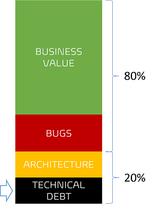

Title: Embedding a Quality-Driven Engineering Mindset in Our DNA
Date: 2023-10-03
Category: Posts 
Tags: engineering, eliminate-waste, quality
Slug:embedding-a-quality-driven-engineering-mindset-in-our-dna
Author: Willy-Peter Schaub
Summary: An engineering mindset that prioritizes quality is crucial for producing robust and reliable solutions.

Having a **quality-first** and **quality-driven engineering** mindset ensures that **QUALITY** is not treated as an afterthought, but rather ingrained in the design, development, and operational processes from the outset. It encourages proactive measures such as thorough testing, code reviews, experimentation, and an appetite for guiding guardrails, ultimately leading to a higher standard of work. It promotes a culture of excellence and continuous improvement within the engineering team - and most importantly, delighted **end-users**.

Choosing the alternative means embracing a lifestyle of constant **context-switching**, 2 AM incident calls, and a perpetually **reactive** approach. This path leads to frustration, burnout, and increased operational costs. Engineers will find themselves caught in the continuous hamster wheel, struggling to balance firefighting with delivering value. The result? Unhappy end-users, potentially tarnishing your reputation in the long run.

Fortunately we all have a choice.

---

Here are several recommended strategies that you should consider exploring if you choose to adopt a QUALITY mindset.

# Technical Debt rusts Quality!

The accrual of technical debt can significantly degrade the overall quality of a system over time. It is essential to proactively manage and address technical debt to maintain a high level of quality in software development. In other words, pro-actively avoid the following:

- **Inconsistent or overly complicated code** - code should be recognisable and readable by all engineers.
- **Design shortcuts** - align with your architecture, operations, and development patterns and guardrails. 
- **Skipped or insufficient testing** - if you are strapped into your seat, atop a Falcon Heavy rocket using your software, you should feel comfortable to click the launch button.
- **Outdated or end-of-life products** - proactively monitor and deprecate outdated dependencies.
- **Incomplete or no documentation** - code should be self-explanatory, complemented by documentation that makes it easy to get the context,  overview, and flow. 

Stop supporting the notion of "quick experiment", "proof-of-concept", or "throw-away" code. I have watched too many instances of this code ending up in production solutions and becoming the weakest link. Use common guidelines, guardrails, and peer-review workflows (such as pull request with policies) to avoid your solution starting to rust and its quality to deteriorate over time.

# Think team!

We are accountable for QUALITY as a team and as a group of teams - in other words, we "are one" when it comes to quality and taking responsibility for how we design, build, test, and maintain the solutions we build. As **software development engineer** our specialty is "developing code" and as **quality assurance engineer** our specialty is "testing code”. 

>  

However, this does not imply that developers are only tasked with writing code. They also shoulder responsibilities such as creating unit tests, executing test automation, performing code vulnerability scans, and in some cases, conducting manual tests to enhance the overall quality of our work. As engineers, we hold a stewardship role in our domain of expertise, enforcing associated guardrails, and mentoring others within our team, group, organization, or community. But, when it comes to quality, it is a collective team responsibility!

Gone are the days of simply tossing tasks over the wall to different roles like content editors, developers, testers, admins, and so forth. The only boundary we acknowledge are the faintly dotted lines that delineate teams and groups of teams within our organization. Beyond that, we operate and own QUALITY as one unified entity.

# Think product team!

When you operate with a healthy [DevOps](https://www.donovanbrown.com/post/what-is-devopss) mindset, you will also be familiar with the "product mindset", which implies that we, as a team, are accountable for our solution from ideation to deprecation. Until we switch off the solution lights, we own the accountability for QUALITY!

Switch to [Shift from project to product thinking](/shift-from-project-to-product-thinking.html) for more insight into the product mindset.

Alternatively as per GPT: "_Thinking like a product team encourages a mindset that prioritizes the value delivered to end-users. This perspective helps ensure that the software being developed is aligned with the needs and expectations of the users, leading to more successful and impactful products. It also fosters a sense of ownership and **accountability for the quality** and functionality of the software, which ultimately leads to higher-quality solutions. Thinking like a product team also encourages collaboration, innovation, and a focus on continuous improvement, which are all essential elements for building successful software products._"

# Embrace guardrails for a safer journey

Guardrails are important to keep us within a safe zone to cross a bridge or in software engineering to create a safety net to promote consistency, standardization, and security. They allow us to thrive, create, and innovate in a structured and secure environment, while mitigating risks and ensuring long-term quality.

> 

Outcomes of guardrails, all of which support **quality** include things such as:

- **Risk Mitigation**, such as security vulnerabilities, system failures, and end-of life issues.
- **Consistency and Standardization** making solutions easier to maintain and troubleshoot.
- **Compliance**, such as industry standards and organizational policies.
- **Collaboration** fostered when everyone has an understanding of what and how we are building our solution.
Scalability: Guardrails facilitate scaling efforts by ensuring that new code and practices align with established standards. This makes it easier to onboard new team members and integrate new features or services.
- **Confidence** created when everyone follows set of guidelines to follow, enciuraging creative problem-solving and innovation.
- **Cost-Efficiency** by avoiding previous mistakes, saving time, and money.
- **Forward-thinking** promoted by promoting practices that are known, proven, and sustainable. This benefits the maintenance and evolution of solutions over time.

There are many more examples, but I need to touch on my 80:20 rule and then stop venting.

# 80:20 planning rule

Lastly, it is important to discuss how we plan and allocate our time. If we aim to fill every minute of our schedule, we are setting ourselves up to work beyond our capacity. This leaves us scrambling to address unexpected issues, bugs, and the lingering technical debt that tends to resurface repeatedly. I know it, you know it - it is time to smarter and more efficiently. We must move away from burnout and start embracing a healthier work:life balance.  

>  

I encourage my team to allocate 80% of our capacity for delivering business value and addressing bug fixes. 

The remaining 20% is set aside for adapting to architecture changes, handling unexpected events, supporting disruptions, attending meetings, fostering innovation, engaging in continuous learning, and, most importantly, consistently reducing our technical debt. This approach empowers us to maintain the highest standard of quality in our work and a healthy work:life balance.

If all else fails, learn to say "**NO**".

---

In my opinion, being an "engineer" entails embodying traits like forward-thinking, accountability, a commitment to quality, and an unwavering passion for technology. These qualities should be embedded in the DNA of my engineering identity.

How are you fostering an Engineering Mindset for Quality?

