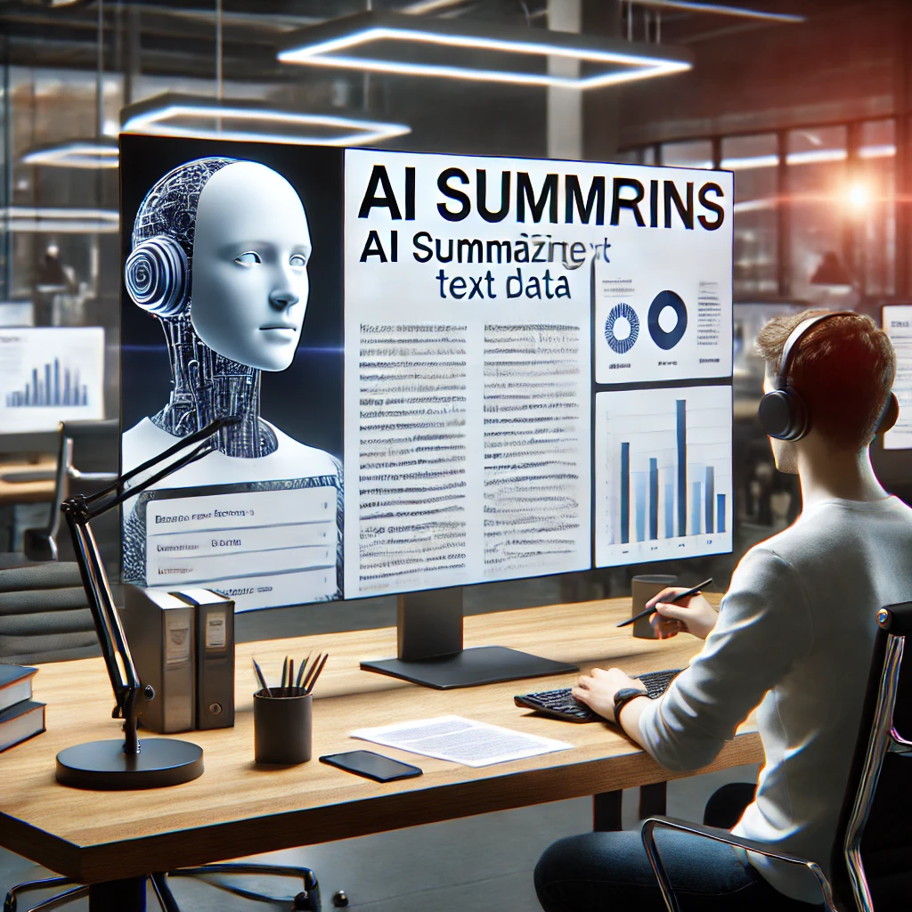

Title: Engineering Practice Engineering Interviews
Date: 2025-01-03
Category: Posts 
Tags: engineering, technical-excellence
Slug: engineering-practice-engineering-interviews
Author: Martin M. Lacey
Summary: Engineering Interviews – Breaking Barriers with Generative AI

# Engineering Interviews – Breaking Barriers with Generative AI

## What’s Working Well and What’s Not for EDO Engineers

In today’s post, I want to take you on a journey through a new initiative we’ve embarked on to break barriers and foster better connections within our engineering team. I’ll cover why we did this, how we approached it, the results we achieved, and the technical process behind it. This experiment combined the deeply human aspect of authentic conversations with the power of Generative Artificial Intelligence (Gen AI). It’s a unique blend of the personal and the technological, and I’m excited to share how it all came together.

---

## Setting the Stage
>
> 
>

Our EDO engineering team at wsbc is vast: over 330 engineers working across disciplines to ideate, design, develop, test, secure, deploy, and maintain more than 220 business applications. These applications serve both internal and external stakeholders, and we follow Agile (SAFe) principles to ensure smooth delivery of value. 

However, at this scale—especially in the aftermath of the pandemic—our engineers often work in silos, gradually losing connection with one another. To counteract this drift, we launched a bold initiative: reconnecting and re-establishing awareness of not just what we do but who we are as individuals.

---

## The Idea: Reconnecting Through Interviews

The idea of interviewing team members was initially met with some skepticism. Why interviews? What was the purpose? What would be the value? Fortunately, we had a small group of adventurous volunteers willing to help us define the process and messaging.

Before kicking off, we introduced the concept in our Developer Community of Practice. This allowed us to gather initial feedback, gauge interest, and recruit volunteers. We crafted a set of questions that blended professional topics—like work responsibilities and ways to improve our Software Development Life Cycle (SDLC)—with personal ones about hobbies and work-life balance. Sticking to a consistent question set was key to ensuring the interviews felt predictable, open, and friendly.

---

## The Interview Process

Each interview started with the “Why.” We explained the purpose of the initiative, the outcomes we hoped for, and the interviewee’s role in the process. Once that was clear, we turned on the recording—but only for audio transcripts, avoiding video to put participants at ease.

The transcripts were the foundation of the process. Using Generative AI, we summarized these into two levels of detail: a concise summary and a detailed summary. We then fed these into another AI system to generate podcasts and an additional summary of that generated conversation. The idea was ambitious, and we were all curious to see how it would turn out.

---

## The Results: Human Connections Enhanced by AI
>
> 
>


The results? Simply put: WOW. The feedback from engineers was overwhelmingly positive. Comments like “That made me sound really interesting” and “Very impressive” showcased the impact of the initiative. The blend of personal stories and professional insights made the interviews feel authentic and relatable.

### What Worked:
- **Using Transcripts**: Starting with text transcripts helped mask speech hesitations and language barriers, giving participants more confidence.
- **Predefined Questions**: A consistent question set created a comfortable, predictable tone for the interviews.
- **AI Summaries**: Generating detailed summaries added value by preserving the richness of the original conversations.

### What Didn’t Work:
- **Speech-to-Text Errors**: AI isn’t perfect, and transcription errors sometimes distorted the meaning. Cleaning the transcript manually was essential.
- **AI Hallucinations**: Without clear instructions, AI occasionally introduced unrelated content, leading to amusing (but inaccurate) results.

---

## Lessons Learned and Next Steps

To generate high-quality summaries and podcasts, grounding the AI in the context of the interview was critical. For example, I explicitly instructed the model to rely only on the transcript and provided the original question set to maintain focus. Despite this, hallucinations were more common in summaries than in transcripts, which reinforced the need for careful review.

The podcasts were a particular highlight. Engineers loved hearing themselves represented in a polished, professional way—though the occasional AI-generated quirks provided plenty of laughs. Overall, podcasts based on cleaned transcripts were the most accurate and best represented the individuals.

---

## Moving Forward

This initiative has proven to be a great Phase I Proof of Concept. The next step? Rinse, repeat, and scale. By promoting this approach, we can continue to foster connections among team members, helping us stay connected as individuals, not just as engineers. Imagine listening to these interviews as you transition from work to home life, maintaining that balance while strengthening the bonds with your team.

Breaking barriers, one conversation at a time—with a little help from AI.

---
``` 

Let me know if you'd like any adjustments or additional sections!