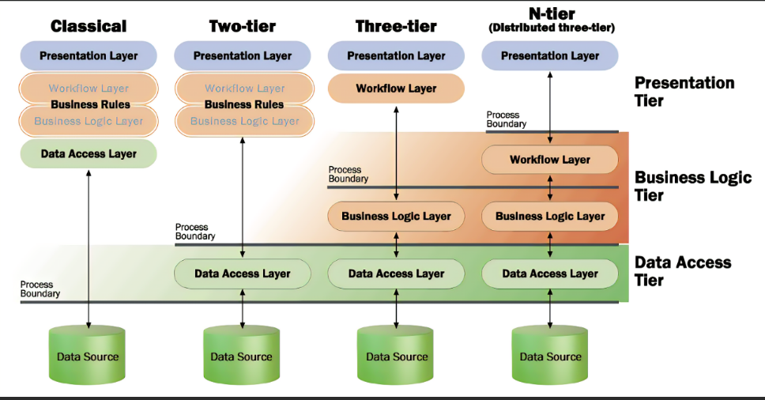

Title: Engineering Practice Layering
Date: 2023-03-15
Category: Posts 
Tags: code, code-quality, engineering, technical-excellence
Slug: engineering-practice-layering
Author: Martin M. Lacey
Summary: Application Layering - Separation of Concerns Architecture Principle

# What is layering?

Layering is a common construct for identifying discreet areas of interest within an undertaking, so that work can be done in a focused way in each of 
those areas as well as to highlight the interconnections between each layer.  Typically, each layer has its own specialists that work on the specific
technology involved in any given layer and collaborate with other specialists where the layers interface.

This is most easily understood when you look at the physical world - lets take construction for example.  To create a building, first an architectural drawing is created that identifies each aspect of construction as a layered endeavor.  Once the design is signed-off, a hole is dug, a frame and rebar are placed within and the concrete is poured into the frame - this is the foundation layer.  Next - layer 2 - the wall frames are built for the first floor, the ceiling, the 2nd floor foundation and its' walls; and so on up one floor in the 
building at a time.  

After each floor has its wall frames in place, layer 3 begins with electrical and plumbing specialists routing their work through the wall frames and up through each level
of the building.  The 4th layer of work involves completing the walls with drywall and plaster, and installing the windows.  This continues to the final, finishing layer where the 
fixtures and appliances are installed, switches installed and connected, paint applied, and carpet or hardwood flooring is installed.

This is no different in software - except the layers are logical, containing only code that address a particular area of interest.  But because it is code, each layer can be ommitted or subverted by the unwary.  Let's examine this more closely next.

---

# Why is Layering Important?

In Software, *Layering* is a fundamental design principle enabling us to create lasting code of highest quality - and maintainability & testability.  When we layer our software, we
are acknowledging the different focal points that we need to be concerned with - and possibly employ different specialists to work on each layer independently. 
This creates a technology stack and loosely coupled interfaces between the layers that promote consistency at the communication channels between layers (re: public interfaces), and independence of each layer itself.  Each layer
can also be tested and verified independently when we employ additional architectural principles such as Dependency Inversion and Encapsulation.

Like the construction 
example above, this layering represents technology and purpose boundaries, that, when respected, create a modular and consistent design pattern enabling components to be reused and 
more easily understood.  Indeed, this understanding leads to abstraction of fundamental behaviours that can organized the code into hierarchies and promote non-duplication of function.

When we layer, we are more prepared for evolving the software as independent pieces in an Agile workflow and able to embrace CI/CD and microservice architecture more readily.

---

# Separation of Concerns Principle

Layering is the result of following the *Separation of Concerns* design principle, which states that software should be separated based on the kind
of work it performs.  When viewed from this lens, we can clearly see what should be in the User Interface collection of code - the code that deals
with artifacts used to collect or format data for display, and what code performs and enforces business rules and procedures, versus the code used to store and
retrieve data from a database or file system. 

---

# What are the Layers in Software Architecture
 
Architecturally, software applications should be logically constructed following the separation of concerns principle which identifies the application layers.  By separating core business 
rules and validation logic from user-interface and back-end (data service) infrastructure.  

- **User Interface** - The layer the end-user interacts with, a page or form or visual element such as tables, buttons, charts and graphs, input fields and layout.
- **Business Logic** - The layer containing the business rules and logical processes, workflows, and validation rules.
- **Data Access** - The layer is concerned with the storage and retrieval of data and other artifacts used by the application to perform its function.

Each of these layers is focused on a separate logical area of concern, uses different tools and has a different purpose.  Each of
these logical layers should be created in separate physical projects within the application solution, which helps enforce the separation of concerns principle, improves modularity and testability.  

Ideally, The Business Rules and Logic should not depend on any other projects in the application.

---

# Different Layering Scenarios

As mentioned above, there are logically 3 layers which can be placed into 3 or more physical Tiers enabled by following this software architecture design pattern.  These layers can then be 
organized into four distinct scenarios, shown here.

- **Classic** - All logical layers are combined into one, making direct access to the underlaying data source from within the single code layer.  This was a common implementation years ago and can still be found, but easily leads to *Boundary Bleed* and messy spaghetti code.

- **Two-Tier** - In this scenario, the data access layer is distinctly separated from all other code, which resides in the main project for the application.  This represents an understanding that data access and the object-relation-mapping (ORM) is a distinct aspect of a software application and requires specialized knowledge.

- **Three-Tier** - This is a further refinement and maturation of the software architecture, uniquely placing the business rules (requirements) and logic (processes) within a distinct layer free from presentation and data access specialized coding needs.

- **N-Tier** - This is the holy-grail, where workflow is separated from the Presentation layer, and accesses the business services layer which uses the data services layer for storage and retrieval; all layers can be distributed across CPU and machine boundaries to achieve scale and reach.  

---

# What is Boundary Bleed 

Boundary Bleed occurs when you violate the separate of concerns principle and allow non-built-in types to be exposed through multiple layers.  For example, if you
create a class in your data service layer, and return it to your business service layer, and that in turn returns that same class to the presentation layer; you've
passed a class through 2 layers and inadvertently coupled the presentation layer with the data service layer.  This makes your code more brittle and harder to test, where changes
can have unexpected side-effects.  This is *Boundary Bleed*, and it should be avoided and considered as an anti-pattern.

---
