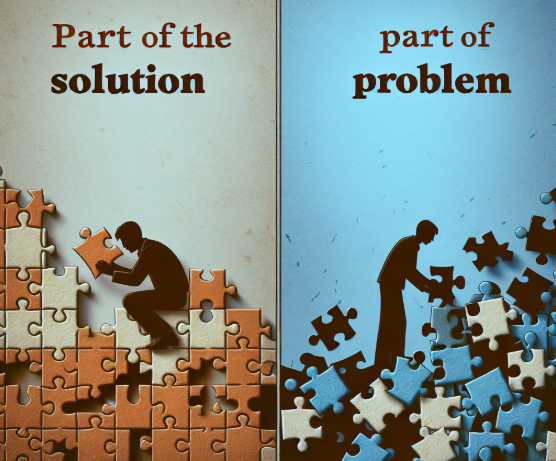

Title: Are you part of The Solution or part of the Problem
Date: 2023-06-14
Category: Posts 
Tags: code, code-quality, engineering, technical-excellence
Slug: engineering-practice-part-of-the-solution
Author: Martin M. Lacey
Summary: Software Engineering Behavior

# Are You Part of the Solution or Part of the Problem?

> 
This is a harsh reality.

My father, an electrical engineer by education and regional sales manager by practice at the end of his career (for Hewlett Packard), used to ask me this very question from childhood. It always gave me pause.

In our fast-paced world, and especially in the technology and software engineering landscape, things are changing rapidly. From advancements in AI, computational power (hello, [Moore’s Law](https://en.wikipedia.org/wiki/Moore%27s_law)), quantum computing, and the work environment duality introduced during the pandemic, we continue to evolve our development and coding standards, processes, and engineering viewpoints. Heck, even society is shifting in perspective and discourse. 

With all the distractions and noise, it’s much easier to take a passive position and just try to ride it out—but that is **not in our DNA**.

Having this question asked of you—*Are you part of the solution or part of the problem?*—sure makes you consider which side of the fence you’re on. Are you:  
- Working with those that want to fix the problem, invent a new paradigm/process/widget, or  
- Lamenting with those that would rather reiterate and regurgitate the issue ad nauseam?  

When I was asked, the answer was usually (at least at first) that I was in the second camp. It’s truly a mindset shift to become a member of the first camp. The transition from hapless participant to actively evaluating and defining what the solutions could be is empowering, exciting, and, honestly, a bit scary.

## So, how do you take the bull by the horns and ride the tiger?
> 

In a business environment, the answer always starts with **engagement**—participate in discussions concerning areas that impact you, your team, and your ability to deliver quality and value to your customers and stakeholders. Seeking out those you can ideate with is a key aspect of getting the ball rolling. It moves you into a position where you can clearly articulate the problem space and the scope you are able to address.

Oh, about that—**Scope.** It’s *critical* to manage scope. We use the term *“don’t boil the ocean”* to remind us that, in order to move the needle, we must make smaller, incremental steps (keeping it Agile). If you haven’t recognized it, this is the [KISS principle](https://en.wikipedia.org/wiki/KISS_principle) in action. Derived by the US Navy in the 1960s, it’s a design objective: *“Keep it simple, stupid”* (and other less aggressive interpretations).  

## Welcome to the First Camp

My hope is that this little nudge will inspire more folks to move into the realm of being part of the brave new world. Stay relevant, and help to make tomorrow a better place. Welcome to the first camp!

