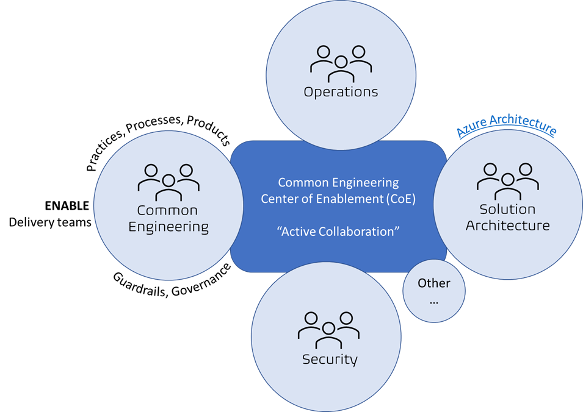

Title: Engineering Practice & Processes
Date: 2023-02-17
Category: Posts 
Tags: code, code-quality, engineering, technical-excellence
Slug: engineering-practice-practices-processes
Author: Martin M. Lacey
Summary: Software Engineering Practices & Process 

# The Software Engineering Landscape

When thinking of software engineering, we need to have a clear vision and utility of practices we employ and the processes we follow.  Firstly, software and software engineering does not exist in a vacuum; it exists to provide a service and solution to a customer facing problem – to create a viable product that not only meets the need but embraces the problem space to become a beacon of hope and vision in the domain of the end-user.  What we build has a purpose and a life of service to provide, to enhance and embrace changes that meet an evolving domain.  This is the fundamental viewpoint for a product focused software engineering practice – and the drive to efficiency, quality, and best practices is seen from that lens.

# The Software Factory

When I think about software engineering, I think of a modern digital factory where humans are the creativity engines working along and within a well-defined and open, interconnected set of processes that not only guide the engineers but enhance their effectiveness and creativity while not wavering on quality.  To get this right, we need to have the right kind of infrastructure to support the product engineering mindset.  In fact, the infrastructure is itself software and a set of process and is the internal facing product to be consumed by our other software engineering teams in pursuit of the product deliveries; you can see the fractal nature of this.

# Inner Workings & Collaboration

Our Common Engineering team is responsible for the inner workings of this software engineering factory, as their product to extend and improve – and automate everywhere possible.  There have been great strides in the past 10 years in the thinking and implementation of the managed software environment which has led to automation and streamlining of the process.  Our Ce team has embraced this mindset with continuous improvement and new implementations in automation of our Continuous Integration (CI) build pipelines including Continuous Deployment (CD) and On-Demand Delivery.  From the perspective of the infrastructure as a service, the Ce team continues to apply software engineering practices – adopting Infrastructure-as-Code (IaC) and Configuration-as-Code (CaC) using version control repositories to manage and track changes.  Lessons and best practices also apply here, and bite when they are not fully embraced; naming conventions and standard practices enable automation, and we are seeing the benefits of that software engineering mindset.
>
> 
>
>
> Figure – Active Collaboration to create “one” view, “one” team. See https://wsbctechnicalblog.github.io/ceremony-overview.html for details on CoE.
>

# Enginerring Mission

Engineering a software application starts with a mission – and that mission is articulated by our Solution Architecture team in concert with other business groups (their customers).  This is an exciting point of collaboration between our Ce and Architecture groups as well; we can help them to discover and implement their deliverables in an Agile, evolving product and business landscape; to work together to find the best solutions to keeping the software factory running smoothly.  To communicate and apply lessons we’ve learned in standardization, integration, creating blueprints, and automation collaboratively.

# Inception

The primary deliverable from the SA team is the Architecture Definition Document (ADD); a broadly scoped and multi-layered specification that covers a breadth technical and functional viewpoint.  The SA’s should build from a reference to the Azure Architecture and together with the Center of Enablement (CoE) create a library of organizational architecture patterns to be adopted or extended during ADD creation.   In an evolving (Agile / SAFe) product life cycle, the ADD needs to be iterative in nature as some viewpoints get more clarity and detail with time.  Some viewpoints have significant impact when altered, others can evolve without too much risk; these areas and work-flows need to be defined and documents to add clarity to the process, which can lead to process improvements and automation.  Currently the mechanics for crafting an ADD (word, Visio, draw.io, AzDO wiki), where it is stored, and its structural contents are not easily understood or consistent applied.  The content of the ADD’s should be based upon reusable design patterns that are referenced and possibly extended to avoid duplication of effort lack of consistent implementation across products.

# Ideation

The Design Review Group (DRG) is the multi-disciplinary group including senior members from Common Engineering, Architecture, Security, and Cloud Operation areas whose task is to review and ensure the integrity of each product ADD.  As the ADD needs to evolve with the Agile products it is intended to describe and support, so too does the cadence, process and mechanics of the DRG.  Common Engineering is committed to assisting the Architecture team define the processes needed to support the needs of product design definition and review, creating the needed artifact to support and possibly automate the workflow where possible and practical.  Currently the DRG uses an Azure board to track the process of ADD creation and approval.  

# Technology Adoption

When and how the Technology Adoption Process (TAP) gets triggered is another area that Common Engineering and the Architecture Groups can collaborate.  We have automated the inflow of requests to make the initial request for new technology at WSBC so that it sends a confirmation email to the requesting individual and add an entry into the TAP Azure boards setup to track processing of adoption requests through the TAP process.  Once a product has been approved for adoption, it should become an entry on the Product Catalog; this is another area of automation Ce team can help provide.  The TAP process needs to be supported by Common Engineering to help govern the landscape of technology we can reasonably consume and use consistently across products, product lines, and ARTs.

# Lifecycle Support

The Common Engineering team supports the entire Software Product Engineering lifecycle from ideation to deprecation & decommissioning, working collaboratively with other teams to ensure our processes and practices are visible and well defined.  In doing so, we expose opportunities for improvement, further collaboration and automation.
 

