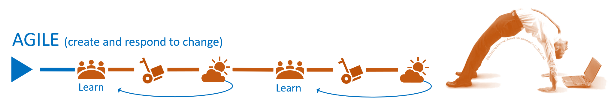

Title: Engineering Practices Overview
Date: 2023.01.13
Category: Posts 
Tags: engineering, azure-devops
Slug: engineering-practices-overview
Author: Martin Lacey
Summary: Make your YAML pipelines more versatile with conditional expressions.

bla, bla, bla.

---

# Martin

## Lacey

>  

Table X:

| HEADING 2 |##| HEADING 2 |##| HEADING 3 |
|-----------|--|:---------:|--|----------:|
| Left      |  | Centered  |  | Right     |

---

<CLOSE - SUMMARY >

