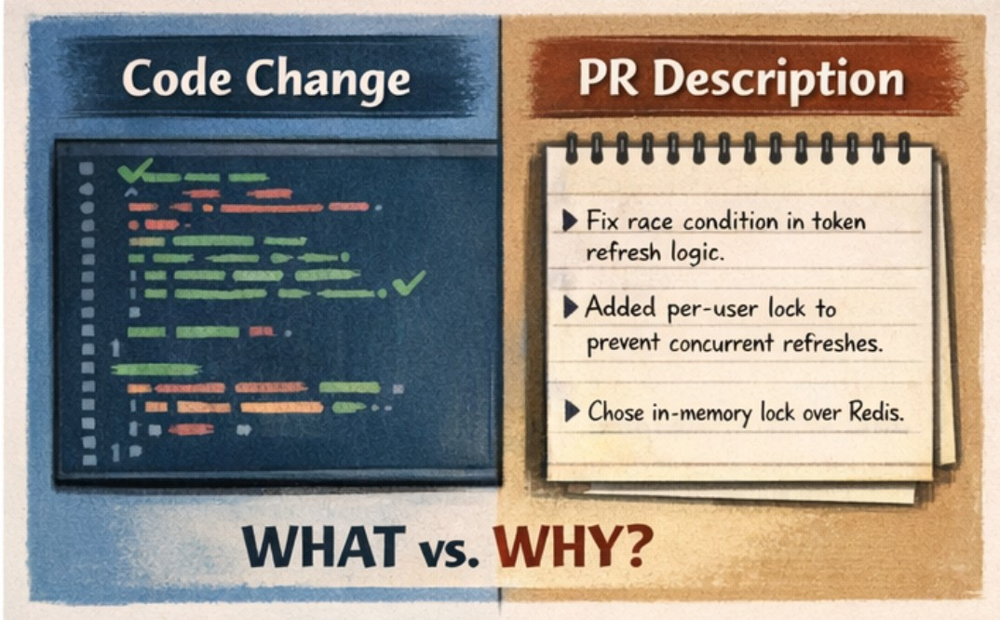
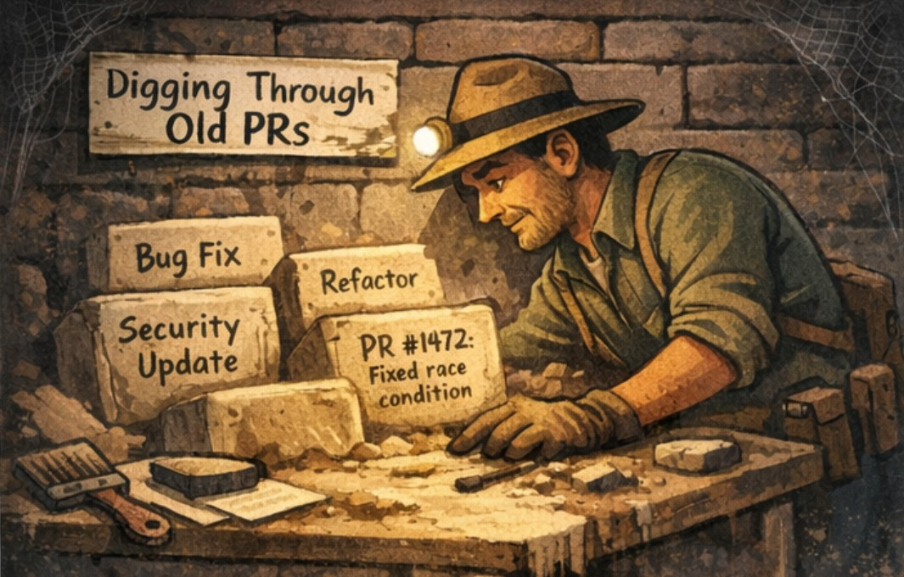
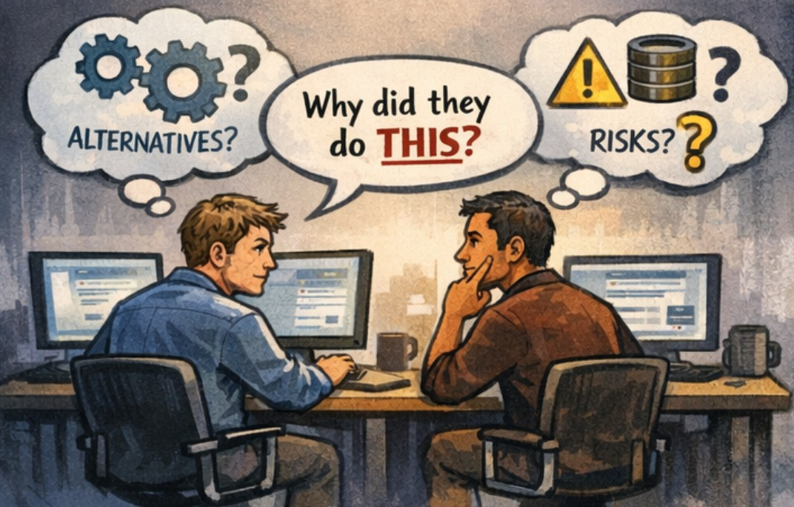
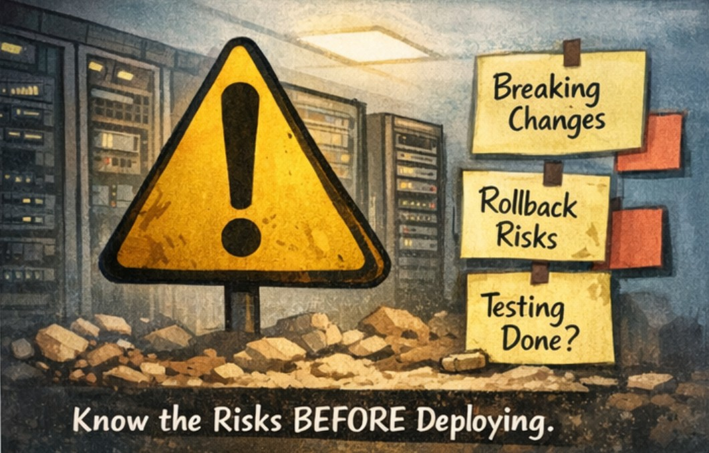

Title: WHY we need pull request descriptions, and HOW to craft them
Date: 2025-12-29
Category: Posts 
Tags: azure-devops, tips, engineering, code-quality, automation
Slug: pull-request-descriptions-empowered-by-engineering-practices
Author: Martin M. Lacey
Summary: Pull Requests (PR) descriptions enable us improve built-in quality and engineering practices, through understand the context of Why the code has changed. 

# Why Pull-Request Descriptions Matter

After 40+ years of writing software, one thing is consistent:
**code outlives context**.

>  

The code may be clean, well-factored, and tested—but without a pull-request (PR) description, the reason it exists disappears almost immediately. PR descriptions aren’t ceremony; they’re how we transfer understanding from one point in time to the next.

A diff shows ***what changed***.

A PR description explains ***why it changed and why it looks the way it does.***

That distinction matters, I’ll explain.

## The importance of **Why**

It is not just a matter of describing what the code does – and in fact an AI Agent can analyze your code change(s) and easily summarize what it encompasses in well-structured prose.  Furthermore, an AI Agent may be able to deduce the ***Why*** from the story behind the Work Item necessitating the change.  However, getting AI to do it right and in a deterministic manner is a blog post on its’ own – and requires a solid understanding of Prompt Engineering.

Imagine a scenario where the code changes, then changes back to its original state, then changes again subtly or in significant functionality.  Why?  Was it wrong, or did the business objective change – or was the algorithm flawed?  Not knowing the why can lead to unnecessary churn, redoing work already deemed wrong, and potentially additional maintenance effort and cycles.

# What PR descriptions actually do

>  

## 📌 They preserve intent

When someone encounters a piece of code six months—or six years—later, they don’t need to reverse-engineer the thinking behind it. 

The PR description captures:

- the problem being solved

- the constraints in play

- the decisions that shaped the solution

This is how knowledge survives beyond the original author, thus preserving context.

## 💡 They enable real code reviews

A good review isn’t about syntax or style—it’s about **correctness, risk, and design fit.**

A PR description:

- tells reviewers what to focus on
- avoids rehashing decisions that were already considered
- keeps reviews efficient and meaningful

Without it, reviewers are forced to guess, and guessing leads to either missed issues or unnecessary churn.

## 🔥 They reduce future rework

Most “mysterious” code isn’t bad code—it’s undocumented intent.

PR descriptions answer questions like:

- Why didn’t we just do the obvious thing?
- Why is this check here?
- Why does this only partially solve the problem?

That context prevents well-intentioned developers from “fixing” something that was deliberate.

## 🚀 They support safe change at scale

As systems grow and teams rotate:

- not everyone was in the original discussion
- not everyone reviews every change

PR descriptions become a lightweight design record—especially important for security-sensitive, high-risk, or operationally critical changes.

# How to craft a well written PR Description

>  

A good PR description is concise, structured, and honest. It doesn’t narrate the diff—it explains the reasoning.

## 1. Start with the problem

Clearly state what’s broken, missing, or limiting.  Why was this change made, for example:

- This change addresses a race condition in token refresh that could invalidate active sessions under load.

If you can’t explain the problem clearly, the solution probably isn’t clear either.

## 2. Explain the solution at a high level

Describe the approach, not the mechanics.
The fix centralizes token issuance and introduces a per-user refresh lock to prevent concurrent refresh attempts.
The code already shows how—this explains what and why.

## 3. Call out important decisions and tradeoffs

This is the most valuable part.
An in-memory lock was chosen over a distributed lock because refresh operations are node-affined and short-lived.
This prevents future engineers from re-debating solved problems.

## 4. Be explicit about impact and risk

If a change is risky, say so.
This touches authentication and session handling. Deployment should ensure caches are cleared.
Experienced engineers don’t hide risk—they surface it.

## 5. Say how it was tested

“Tested locally” is not information.
Added unit tests for concurrent refresh scenarios and manually validated login/logout flows.
This builds confidence and accountability.

## 6. Acknowledge limits or follow-ups

Good engineering is iterative.
This does not address cross-device token revocation; that will be handled separately.
Honesty beats false completeness.

# 📢 Final thought

Pull-request descriptions are how we write **software that can be understood by people who weren’t there**—including our future selves.

Good code is important.

***Transferable understanding is what makes it last.***

>  

