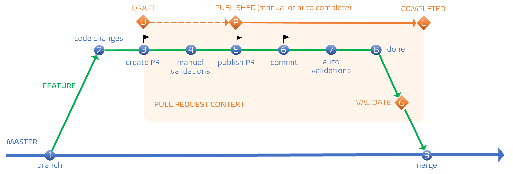

Title: Mastering Software Development: A Deep Dive into Trunk-Based Pull Request Workflow
Date: 2023-12-04
Category: Posts 
Tags: azure-devops, tips, engineering, code-quality, automation
Slug: engineering-practices-pull-request-v2
Author: Martin Lacey
Summary: How to implement a pull request workflow within the context of a trunk-based development.

In the ever-evolving landscape of software development, choosing the right development workflow is crucial for ensuring efficiency, collaboration, and code quality. One such strategy gaining prominence is the Trunk-Based Development (T-B-Dev) strategy, and in this blog post, we will explore how to implement a pull request workflow within the context of T-B-Dev.

# Understanding Trunk-Based Development

Trunk-Based Development is a version control strategy that promotes continuous integration by encouraging developers to commit their changes directly to the main branch (often referred to as the "trunk"). This strategy stands in contrast to feature branching workflows, where developers create long-lived branches for each feature.  

Long-lived branches are at every increasing risk of “Merge-Hell” – wasted energy resolving merge conflicts with other developers and their commits to the main branch and are not the recommended approach.

# Key Principles of Trunk-Based Development

Short-Lived Branches: In T-B-Dev, developers create short-lived branches that are quickly merged back into the main trunk. This minimizes the risk of integration issues and promotes a continuous flow of code.

Continuous Integration: T-B-Dev relies heavily on continuous integration practices, ensuring that changes are regularly integrated into the main branch. Automated tests play a crucial role in maintaining code quality.

Feature Toggles: Feature toggles allow developers to hide incomplete or experimental features behind a toggle, enabling them to merge code into the main branch without affecting the user experience.

Code Reviews: Despite the direct commits to the main branch, code reviews remain an integral part of the T-B-Dev workflow. Developers can still submit pull requests for their changes, allowing for a thorough review process.

**Small and Atomic Commits**: Developers should make small, atomic commits to the main branch, focusing on one logical change at a time. This makes it easier to understand and review changes during the pull request process.

**Automated Testing**: Automated tests, including unit tests, integration tests, and any other relevant checks, should be an integral part of the pull request process. This ensures that changes do not introduce regressions and maintain the overall stability of the codebase.

**Collaboration and Communication**: Pull requests in T-B-Dev serve as a means of communication among team members. Developers can discuss changes, provide feedback, and address concerns within the context of the pull request.

**Feature Flags and Rollouts**: Utilize feature flags to control the release of new features. This allows for gradual rollouts and easy rollback in case of unexpected issues.

**The Pull-Request Workflow Process**: The Pull-Request workflow is best illustrated with the following diagram:

>  
   
Let’s review this diagram in detail and examine each step in the process of building your code-feature branch and committing back to the main (trunk).

1. **Branching Best Practices**: Before creating a short-lived feature branch, ensure your local repository is up to date at branch initiation. This step is crucial in preventing merge complications, emphasizing the significance of minimizing the branch's lifespan. Opt for pulling more frequently than less to sidestep potential issues.
2. **Code Development and Testing**: Develop your code changes comprehensively, incorporating both Unit and Integration tests to ensure robust functionality and reliability.
3. **Initiating Collaboration**: Initiate collaboration by creating a Draft Pull Request (PR). This serves as the starting point for collaboration among team developers. The Draft PR fosters dynamic collaboration without triggering Branch Policies, validations, or notifying PR reviewers.
4. **Manual Validation Steps**: Manually trigger branch policy validations, such as the validation build, as required. Confirm that your code successfully passes validations, iterating on code changes if necessary.
5. **PR Publishing and Mandatory Policies**: When ready to merge code changes into the main branch, publish the PR. PR publication notifies reviewers, and branch policies become mandatory. PR completion can be set to manual or automatic, with the latter triggered upon the verification of all policies.
6. **Commit Impact on PR**: Any committed code changes within a published PR reset all reviewer approvals, triggering notifications according to our branch policies.
7. **Automatic Re-validation on Commit**: With each commit, all policies are automatically re-validated, ensuring continuous compliance throughout the development process.
8. **Code Changes Completion**: Declare code changes as ready to merge. The PR acts as a gatekeeper, ensuring all policies are met before proceeding.
9. **Mandatory Policy Compliance for PR Completion**: Manual or automatic completion of the PR is contingent upon meeting all branch policies. Once achieved, the code seamlessly merges into the main (trunk). Note that users with elevated permissions can force complete the PR, overriding validation states. Following the merge, the continuous integration (CI) pipeline is triggered from the source branch.  

# Conclusion

In conclusion, adopting a pull request workflow within the Trunk-Based Development strategy offers a balance between the advantages of continuous integration and the collaborative nature of code reviews. By following the key principles and best practices outlined in this blog post, development teams can seamlessly integrate changes into the main branch while ensuring code quality, collaboration, and overall project success.

Remember, the essence of Trunk-Based Development lies in its simplicity and focus on delivering value continuously. Embrace this workflow, tailor it to your team's needs, and witness the positive impact it can have on your software development lifecycle.

>
> MYTH BUSTER: And no, the pull request is not a gated process! Apart from the invaluable collaboration, you can fully automate the branch policy and build validations, as well as other validations, such as checking the state of a ServiceNow change request. 
>

