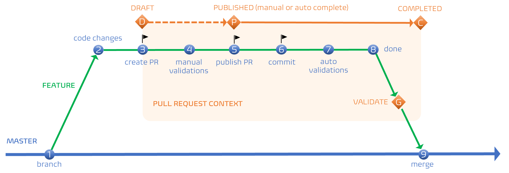

Title: Pull Request empowered by engineering practices
Date: 2023-01-13
Category: Posts 
Tags: azure-devops, tips, engineering, code-quality
Slug: pull-request-empowered-by-engineering-practices
Author: Willy-Peter Schaub
Summary: Pull Requests (PR) enable us improve built-in quality, engineering practices, and streamline our continuous integration pipelines. 

Let us take a look at our latest pull request workflow and hopefully spark a few discussions that will empower all of us to embrace the pull request (PR) feature effectively.  

---

# What is a pull request (PR)?

Pull Requests (PR) enable us to change, review, and merge code. We can add policies to your PRs to enable code quality in key branches using policies, validation builds, code-quality, and security scans. We all want to protect key branches such as trunk, master, or main, which should always be stable and deployable – the single source of truth.
 
>
> **MYTH**  - Pull-requests slow down your continuous integration value stream! A pull request takes as long as you and your process allow it to sit in a corner to gather dust. We encourage our engineers to track the lead and cycle times of pull requests using the [Pull Request Completion Report](https://marketplace.visualstudio.com/items?itemName=OneLuckiDev.prApprovalReport) and to collaborate with their peers to ensure that pull requests do not go stale. Also, the more you SHIFT-LEFT and present the evidence to the Pull Request validations, the more you can automate and thereby eradicate expensive human reviews and associated cycle times.
>

---

# What is the pull request (PR) workflow?

There are many pull request (PR) strategies. Here is the one we recommend for our common engineering ecosystem, based on our [trunk-based](/branching-trunk-based.html) branching strategy.

>  

| LEGEND |~~| DESCRIPTION |
|--------|--|-------------|
| 1	|  | Create a feature branch from the trunk/master/main branch, representing a unique feature, bug, or hotfix. |
| 2	|  | Make code changes to implement the associated feature or fix. |
| 3	|  | When ready to start collaboration, create a DRAFT PR to merge your feature branch to the trunk/master/main branch. |
| D	|  | DRAFT PR allow vibrant collaboration, without triggering Branch Policies, page 53, validations or notifying PR reviewers.  |
| 4	|  | Manually trigger branch policy validations, such as the validation build. |
| 5	|  | When ready to merge code changes to the trunk/master/main branch, publish the PR. |
| P	|  | When a PR is published, reviewers are notified and Branch Policies become mandatory. Set the PR completion to manual or automatically, whereby automatic completion is triggered when all Branch Policies are validated. |
| 6	|  | When a code change is committed within a published PR, all reviewer approvals are reset, and reviewers are duly notified. |
| 7	|  | With every commit, all Branch Policies are automatically re-validated. |
| 8	|  | Ready to merge changes – done with code changes. |
| G	|  | The PR verifies that all Branch Policies are met.  |
|   |  | The PR will not complete manually or automatically until all validations are met. |
|   |  | Users with elevated permissions can force complete the PR, irrespective of the state of validations. |
| 9	|  | Code changes are merged to the source branch, which in turn triggers the continuous integration (CI) pipeline. |

>
> **MYTH** - Pull-requests are manual interventions. With a high-TRUST team, we can define mandatory [Branch Policies](https://learn.microsoft.com/en-us/azure/devops/repos/git/branch-policies-overview?view=azure-devops) and **optional** approvals. That way collaboration is encouraged, but the PR will auto-complete as soon as all Branch Policies, are validated. No manual blocks, just validated  built-in quality.
>

---

# What is our accountability as PR reviewers?

Which brings us to an important topic – the **responsibility** and **accountability** of PR reviewers.

If you are included in a pull request as an optional reviewer, you can review and collaborate within the context of the pull request. If you are included as a required reviewer, you must review and approve the PR so that the Branch Policies are met.

While collaboration, continuous learning, information exchange, and guidance are important aspects of the pull request workflow, every reviewer, whether optional or required, is accountable to keep an eye on the following when reviewing a PR:

- Bad coding practices.
- Deviations and breach of security practices.
- Deviations and breach of engineering practices.
- Deviations and breach of repository, pipeline, or quality guardrails.

As we automate the validations, the accountability and need to review PRs manually diminishes for our engineers.

---

# References

- [Our road to OSS Blueprints - Suppress CD when pipeline runs within Pull Request](/yaml-pipelines-part11.html)
- [Pipeline-as-code wrapped with Pull Requests](/pipelines-as-code-pr.html)
- [Pull requests](https://learn.microsoft.com/en-us/rest/api/azure/devops/git/pull-requests)
- [Pull Request is your friend not foe!](/pull-requests-friend.html)
- [Why we use pull requests with our trunk-based branching strategies](/branching-pull-request.html)

