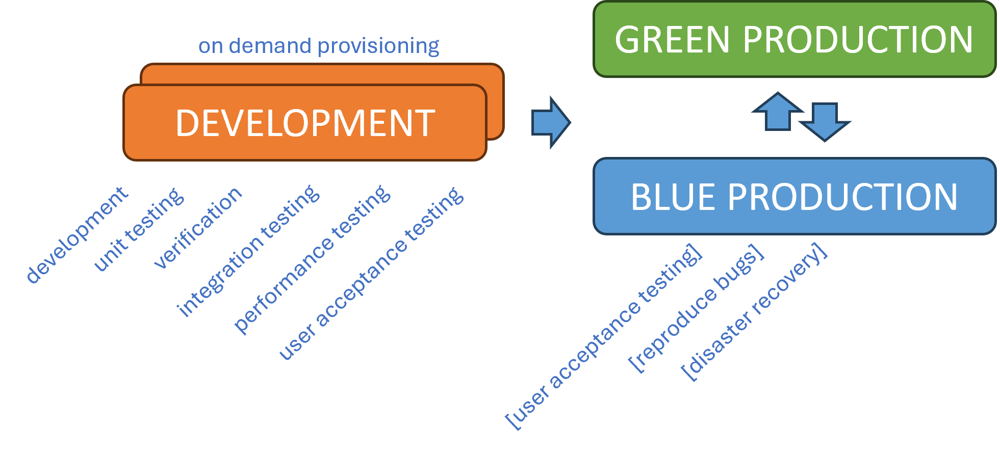

Title: Exploring the future Software Development Lifecycle (SDLC) flow
Date: 2024-06-07
Category: Posts 
Tags: azure-devops, engineering, automation
Slug: engineering-practices-sdlc-improvements
Author: Willy-Peter Schaub
Summary: Looking for Insights and Feedback from other pioneers of continuous SDLC improvements.

We want to "_Unite people, process, and products to empower and enable us to deliver continuous value to delighted end-users_", following [Donovan's definition of DevOps](https://www.donovanbrown.com/post/what-is-devops), and our aim is to "_Create an SDLC with consistent, standardized, secure, simple, and cost-effective processes, practices, and products_". We always try to improve our people (80%), processes (15%), and products (5%). In this post I will highlight one topic we are investigating and I hope you will join us and share your views on whether we are on track, or need some adjustment – **SDLC Flow**.

---

# SDLC / FLOW / TODAY

>  

As illustrated, our current software development lifecycle (SDLC) flow involves four main environments – sometimes fewer, sometimes more, but this is the usual pattern. Development, unit testing, and verification are performed in the **dev/test** environment, integration testing, performance testing, and user acceptance testing are conducted in the **dev/test** environment, additional user acceptance testing and ad-hoc bug analysis are carried out in **Staging**, and we are all familiar with what happens in **Production**.  

### Advantages

- Clear separation of duties.
- Capacity to work on and deliver a lot of value (super tankers).

### Disadvantages

- Multiple environments that need careful operational attention.
- Multiple environments that produce carbon emissions.
- Multiple environments that can diverge from each other in terms of data, setup, 3rd party software, for example .NET, and our solution artifacts.
- Multiple environments that increase **complexity** and **total cost of ownership**.

---

# SDLC / FLOW / FUTURE

>  

We want to move as much of our quality and security scans to the left as far as we can, adopt a mindset of continuous delivery and release on demand, and decrease the number of environments. We want to gradually show features in a new (green) version, while keeping the live production (blue) version. That way we can switch from green to blue and switch back if needed.  

Development, testing, integration testing, performance testing, user acceptance testing, and verifications moves to the left and all activities are run continuously. While the new (green) version is not switched to production, [optional] user acceptance testing and bug analysis can be done. The blue/green environments also create a new possibility to use active-active and passive-active disaster recovery.

A minor detail in the visual above, is that we could have multiple development environments, which we would provision on-demand and delete as needed.

Another topic that is relevant is resolving problems - with this simpler model, we also prefer to fix-forward, not roll-back by default.  

### Advantages

- Focus on delivering value continuously (small changes, aka speed boats).
- Giving business the power to choose when their features are launched.
- Fewer environments to maintain and smaller environmental impact.
- Fewer environments enables lower cost of ownership.

### Disadvantages

- Automation, automation, automation - which I personally see as an advantage, not disadvantage.
- Some hefty prerequisites, as below.

### Prerequisites

- **Continuous delivery** of value - think nimble speed boats not super tankers - and **release on demand**. Requires a culture (PEOPLE) mindset change. 
- Welcome **feature flags**!
- **Shift-left** and **QUALITY** mindset. 
- **Consistency**, **standardization**, and **simplicity** to enable automation.
- **Automated** unit, user interface, integration, and regression testing.
- **Automated** (self-service) provisioning of architecture, infrastructure, and CI/CD blueprints.

---

# Conclusion

How has your SDLC changed and improved over time? Are we making the wrong choices or are we on the right path to continuously enhance our SDLC?

Let us start a conversation and please post your thoughts in the comments below. 

---

# References

- [Applying DevOps to a Software Development Project](https://learn.microsoft.com/en-us/archive/msdn-magazine/2016/august/devops-applying-devops-to-a-software-development-project) / August 2016
- [VSTS - The Road to Continuous Delivery with Visual Studio Team Services](https://learn.microsoft.com/en-us/archive/msdn-magazine/2017/connect/vsts-the-road-to-continuous-delivery-with-visual-studio-team-services) / December 2017
- [Deploying new releases: Feature flags or rings?](https://opensource.com/article/18/2/feature-flags-ring-deployment-model) / February, 2018
- [Any Language, Any Platform with Azure DevOps Projects](https://learn.microsoft.com/en-us/archive/msdn-magazine/2018/may/devops-any-language-any-platform-with-azure-devops-projects) / May 2018

