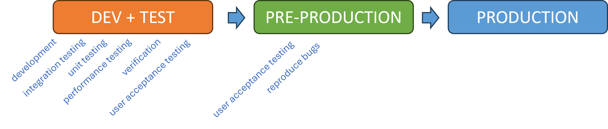
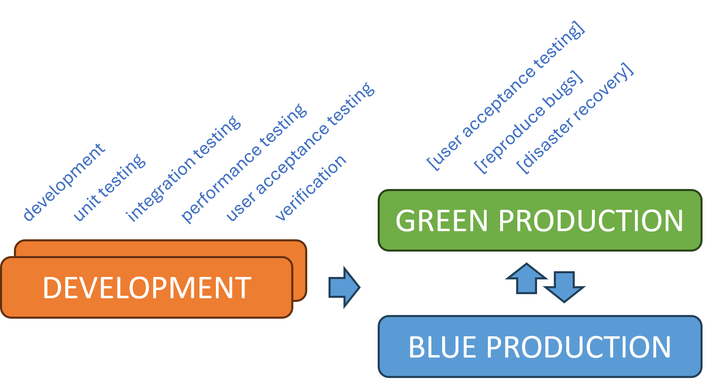

Title: Exploring the future Software Development Lifecycle (SDLC) flow
Date: 2024-06-07
Category: Posts 
Tags: azure-devops, engineering, automation
Slug: engineering-practices-sdlc-improvements
Author: Willy-Peter Schaub
Summary: Looking for Insights and Feedback from other pioneers of continuous SDLC improvements.

TBD.

---

# SDLC / TODAY

>  

TBD.

---

# SDLC / FUTURE

>  

TBD.

---

# Conclusion

What have you learned in your SDLC transformations and improvements? Let us have a discussion and please share your insights in the comments below. 

---

# References

- [Applying DevOps to a Software Development Project](https://learn.microsoft.com/en-us/archive/msdn-magazine/2016/august/devops-applying-devops-to-a-software-development-project) / August 2016
- [VSTS - The Road to Continuous Delivery with Visual Studio Team Services](https://learn.microsoft.com/en-us/archive/msdn-magazine/2017/connect/vsts-the-road-to-continuous-delivery-with-visual-studio-team-services) / December 2017
- [Deploying new releases: Feature flags or rings?](https://opensource.com/article/18/2/feature-flags-ring-deployment-model) / February, 2018
- [Any Language, Any Platform with Azure DevOps Projects](https://learn.microsoft.com/en-us/archive/msdn-magazine/2018/may/devops-any-language-any-platform-with-azure-devops-projects) / May 2018

