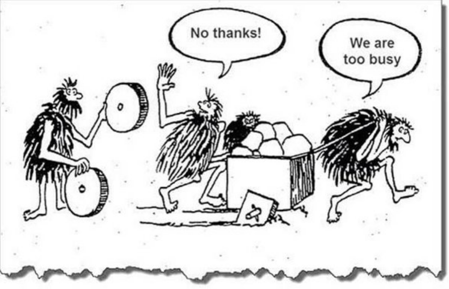
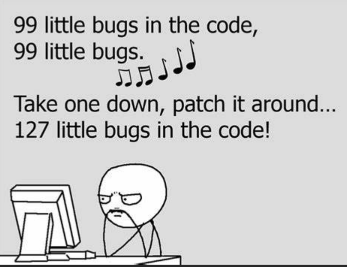

Title: Why Bugs are NOT Technical Debt
Date: 2024-02-01
Category: Posts 
Tags: engineering, code-quality
Slug: engineering-practices-why-bugs-are-not-technical-debt
Author: Martin Lacey
Summary: why software bugs should not be categorically considered technical debt.

# Rethinking the Analogy: Software Bugs and Technical Debt

In the realm of software development, the term "technical debt" has gained significant traction as a metaphor to describe the long-term consequences of prioritizing rapid development over code quality.  However, one area where the analogy may fall short is in associating software bugs directly with technical debt. In this blog post, we'll explore why software bugs should not be categorically considered as technical debt and delve into the nuances that differentiate the two.

# Defining Technical Debt:

Technical debt is often defined as the accumulated cost of suboptimal design and implementation choices made during the software development process. These choices, akin to financial debt, may lead to future challenges, increased maintenance costs, and hindered development velocity. Common examples include shortcuts, lack of documentation, and architectural compromises.  When left unaddressed, technical debt accumulates to the point where new feature and functionality become increasingly difficult or impossible to accomplish.

>  

# The Bug Dilemma:

While it's undeniable that software bugs can contribute to increased maintenance efforts and compromise user experience, categorizing all bugs as technical debt oversimplifies the complexity of software development. Bugs can arise from various sources, including unforeseen interactions, external dependencies, or changing requirements. Unlike technical debt, which stems from conscious choices, bugs are not always a result of shortcuts or suboptimal decisions.

>  

# Nuances in Bug Classification:

To understand the distinction between bugs and technical debt, it's essential to classify bugs based on their origins and impact. Some bugs are indeed a consequence of technical debt � the result of hasty decisions or deferred improvements. However, many bugs are simply a natural part of the software development process, emerging from the inherent complexity of creating and maintaining software systems.

# Evolutionary Nature of Software:
Software is not static; it evolves to meet changing requirements, adapt to new technologies, and address emerging challenges. Bugs, too, are part of this evolutionary process. Treating all bugs as technical debt may discourage innovation and hinder the agility required to respond to evolving user needs.

# Managing Bugs Effectively:
Rather than labeling all bugs as technical debt, it is more constructive to adopt a nuanced approach to bug management. Prioritize bug fixes based on their impact on users, system stability, and alignment with current development priorities. Utilize effective testing strategies, continuous integration, and proactive debugging practices to minimize the occurrence of bugs.

# Conclusion:

While technical debt remains a valuable concept for emphasizing the importance of code quality and design decisions, categorizing all software bugs under this umbrella oversimplifies the dynamic nature of software development. Bugs, inherent to the complex and evolving nature of software, should be managed pragmatically, with a focus on their impact and relevance to current development goals. By adopting a nuanced perspective, software teams can strike a balance between addressing bugs and maintaining a sustainable development pace.