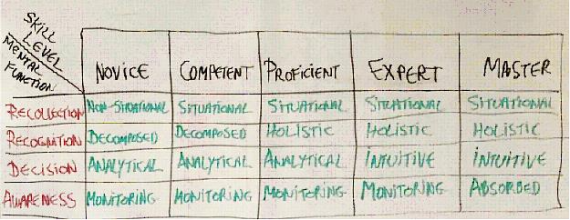

Title: Don’t become an Expert Beginner 
Date: 2021-10-25
Category: Posts
Tags: learning
Slug: dont-become-expert-beginner
Author: Alex Bunardzic
Summary: How to avoid the trap of getting stuck in a Expert Beginner role

Dreyfus model lists five phases of skill acquisition:

1. Novice 
1. Competent 
1. Proficient 
1. Expert 
1. Master 

When paired with what Dreyfus refers to as Mental Functions (Recollection, Recognition, Decision and Awareness), the skill acquisition moves from "following the rules dogmatically without the awareness of the big picture", to "complete grasp of the big picture which manifests in the act of intuitive transcending of rules". So, while a Novice exhibits non-situational recollection, decomposed recognition analytical decision making and monitoring awareness, Master exhibits situational recollection, holistic recognition, intuitive decision making and absorbed awareness. And everything in-between (refer to the table below): 
  

In an optimistic situation, skill levels progress linearly, from Novice to Competent, then from Competent to Proficient, after which we progress from Proficient to Expert, and finally from Expert to Master: 

Leaving the ultimate level (Mastery) out for the purposes of this discussion, let’s look into how things play out when we introduce a finer grained phase into the picture – Advanced Beginner: 
 

While Novices are obviously unsure of what lies ahead in terms of training needed to acquire necessary skills, after spending some time in training and reaching the Advanced Beginner status, trainees now gain much needed confidence. No one likes to feel inadequate, so Novices are extremely motivated to graduate to a higher skill level.

Advanced Beginner is that next level. Practitioners reaching Advanced Beginner stage possess some skills but nevertheless lack the insight into the big picture. Because of that lack of insight, Advanced Beginners are in danger of confusing themselves with Experts. 

As they continue their skills acquisition trajectory, Advanced Beginners can take two paths: 

1. Graduate to the Competent 
1. Graduate to the Expert Beginner 

If they graduate to the Competent stage, they gain the first precious insight into the big picture. At that point, the insight into the big picture (regardless of how incomplete that insight may be) prevents them from confusing themselves with Experts. Competent people are those who know that they don’t know. 
If Advanced Beginners graduate to the Expert Beginner level, they typically assume that now they’ve graduated to the Expert level, period. That assumption is fortified by the absence of insight into the big picture.

  
What is also typical for the Expert Beginner level is that it is reinforced by the optimistic self-assessment which goes something like this: "I know that I’m doing it right because, as an expert, I’m pretty much doing everything right by definition." (i.e., they are still rules-bound).

Expert Beginner is more advanced than the Advanced Beginner for the simple reason that Expert Beginner has more experience being a beginner. But Expert Beginner doesn’t yet have sufficient experience to be able to reach the level of Competent practitioner (due to the lack of the grasp of the big picture). 

So, while Competent practitioner may boast something like "ten years of experience", Expert Beginner can actually boast "one year of experience ten times." Notice the lack of progress in Expert Beginner. 

Progress is not possible without the awareness that there is more hard work awaiting to be done. But if we feel that we’ve reached the level of Expert, what else is there that remains to be done? 

The desire to deviate and to experiment vanishes from the Expert Beginner’s repertoire. And with it, any hope for progress disappears. It’s status quo that stretches indefinitely into the future.