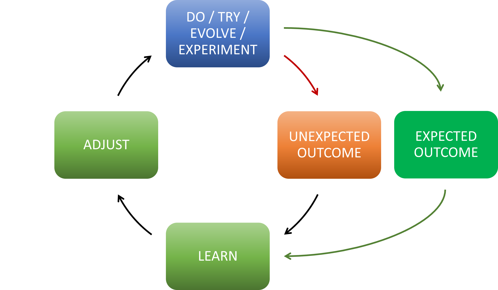
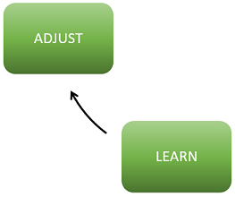

Title: Fail, Learn, Reset, Transform!
Date: 2023-03-31
Category: Posts 
Tags: engineering, learning, innovation
Slug: fail-learn-reset-transform
Author: Willy-Peter Schaub
Summary: “Success is not final, failure is not fatal, it is the courage to continue that counts.” – Winston Churchill

In [Fail, Learn, Reset](/fail-learn-reset.html) I explored how I encourage everyone in my team and our group to accept failure as an opportunity to learn and how we are trying hard to eradicate the **fear of failure** that often accompanies the **imposter syndrome**. In conversations, I realized that the [Fail, Learn, Reset](/fail-learn-reset.html) post was very engineering focused, but that the concept of learning from failures applies to everything.

>
> **FAILURE** comes in many shapes and sizes. Here are a few of many definitions from the Merriam-Webster Dictionary:
>
> - lack of success
> - a falling short
> - a fracturing or giving way under stress
>

Personally, I prefer to think of **FAILURE** as an "unexpected outcome" of doing, trying, evolving, or experimenting.

> 

Which brings me to "transform" in today's blog post title.

---

# It is about how (I / we) can transform

When we look at the continuous circle of doing, trying, evolving, experimenting, reflecting, learning, and adjusting, it is important to realize that the LEARN + ADJUST steps are crucial. 

> 

We need to reflect and transform continuously, otherwise we enter the world of insanity.

>
> "The definition of insanity is doing the same thing over and over and expecting different results." - Albert Einstein
>

Two anti-patterns that drive me crazy:

- **Paralysis** - If you have ever had the displeasure of working with a team that turns every retrospective into a complaining, venting, and blame saga, you know what I mean. Instead of reflecting, learning, and deciding how we / I can change (**transform**) to make the next iteration better, these paralyzed teams drown in self-pity and the hope for change that never comes.
- **Stagnation** - We have done it this way for decades and it has always worked for us. Sure, the postal office worker stamping envelopes by hand is doing a great job, but not in an efficient way. As a result the worker will always be **too busy** to embrace new ways of automating and improving the stamping. giving relief and spare time to **experiment**. 

>
> “Ask not what your country can do for you – ask what you can do for your country." - John F. Kennedy
>

Next time you get to the learn and adjust stages, take a step back, [breathe](https://examinedexistence.com/the-navy-seal-breathing-technique-to-calm-down/), and then ask yourself:

- What have we / I learned?
- What can we / I improve before we re-try?

---

# OMG, not another reorganization!?!

Another great example is when we as a group announce that we are going to reorganize again. The ```paralyzed``` teams will once again spiral into a dark place, while teams with a healthy Agile and DevOps mindset will embrace the opportunity to change.

Yes, we ```tried``` and ```experimented``` with a new structure for a year. We realized that we have not managed to evolve to where we wanted to be. We ```learn``` from the experience, we ```adjust``` (reorganize), and we embrace new ways.

---

See change as an ```opportunity```, not as a threat!

>
> "_What makes humans different? Our ability to adapt to change; the more we do it, the more comfortable we are with this disruption as an opportunity._" - Martin Lacey
>

What are your thoughts?

