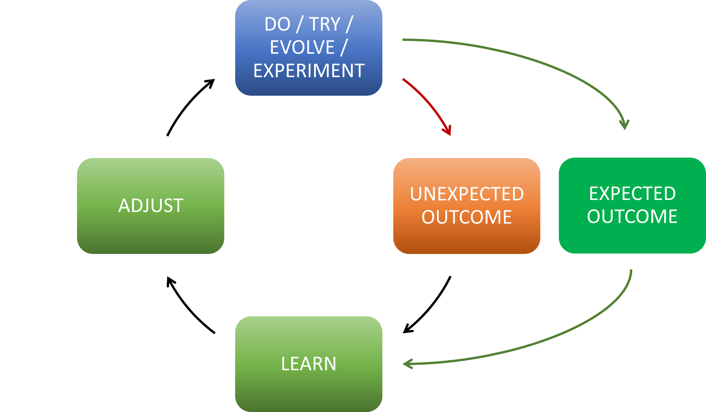

Title: Transform, Fail, Learn, Reset!
Date: 2023-03-31
Category: Posts 
Tags: engineering, learning, innovation
Slug: transform-fail-learn-reset
Author: Willy-Peter Schaub
Summary: “Success is not final, failure is not fatal, it is the courage to continue that counts.” – Winston Churchill

In [Fail, Learn, Reset](/fail-learn-reset.html) I explored how I encourage everyone in my team and our group to accept failure as an opportunity to learn and how we are trying hard to eradicate the **fear of failure** that often accompanies the **imposter syndrome**. In conversations, I realized that the [Fail, Learn, Reset](/fail-learn-reset.html) post was very engineering focused, but that the concept of learning from failures applies to many, many other things.

>
> **FAILURE** comes on many shapes and sizes. Here are a few of many definitions from the Merriam-Webster Dictionary:
>
> - lack of success
> - a falling short
> - a fracturing or giving way under stress
>

Personally, I prefer to refer to **FAILURE** as an "unexpected outcome" of doing, trying, evolving, or experimenting.

> 

Which brings me to "transform" in today's blog post title.

---

# Agile Transformation

<TBD>

---

<CLOSE - SUMMARY >

