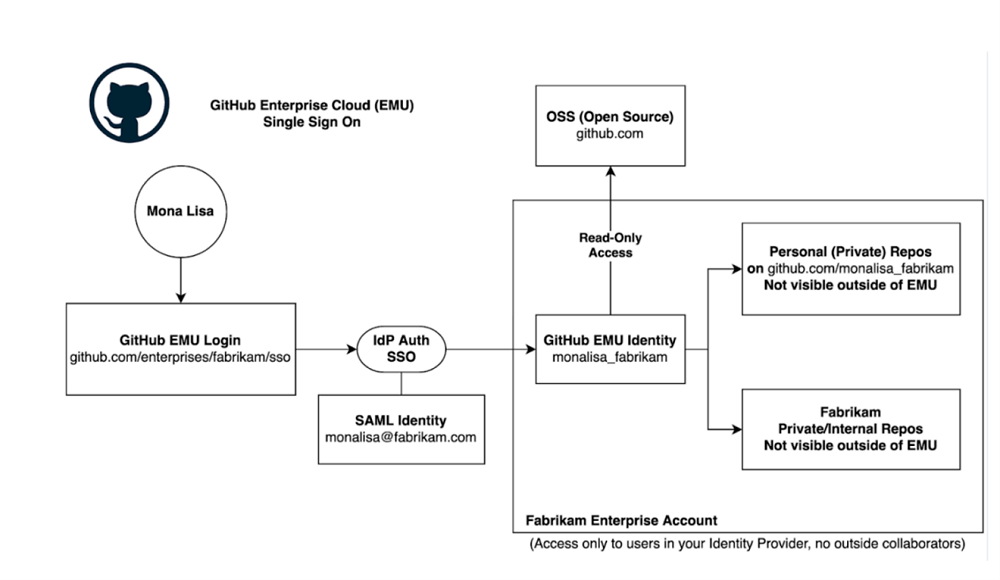
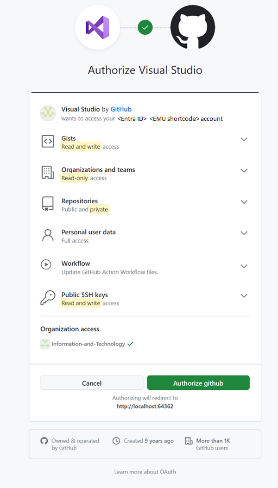
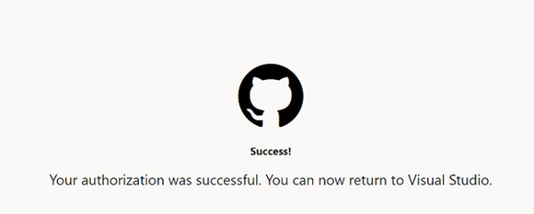
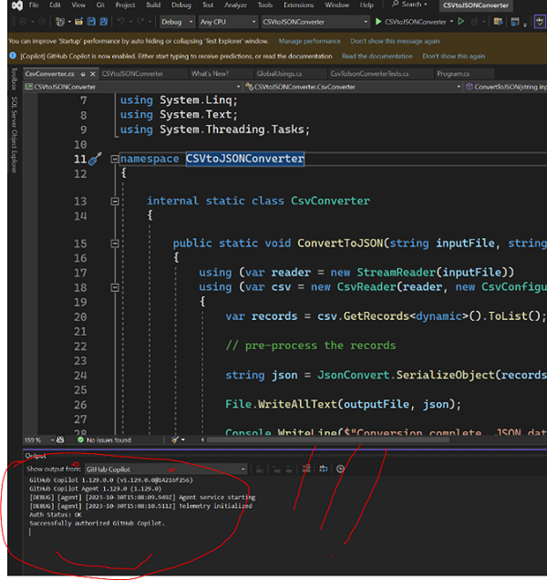
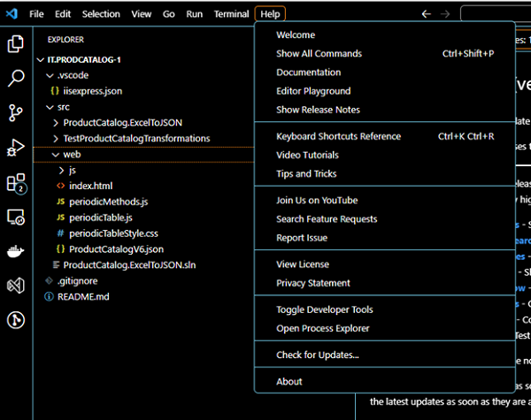
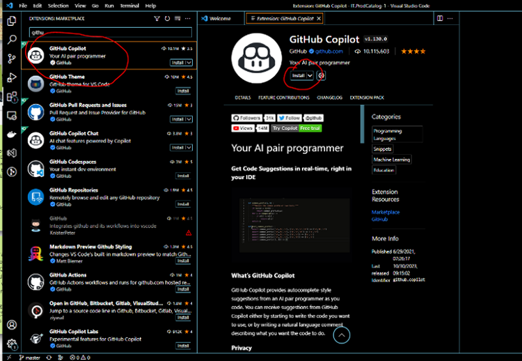
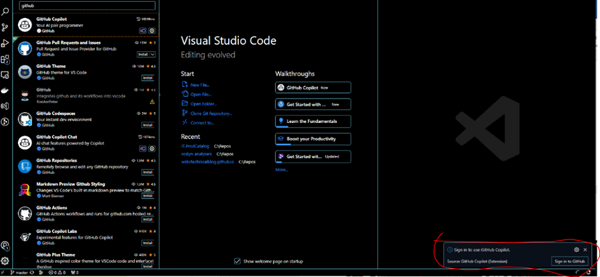
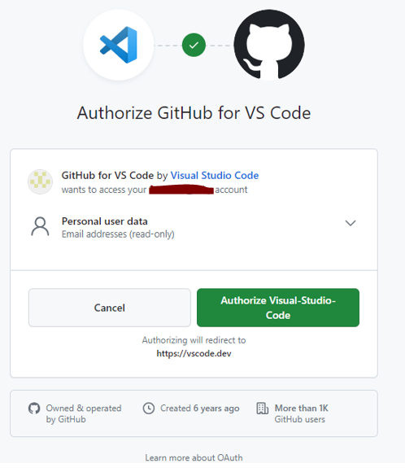
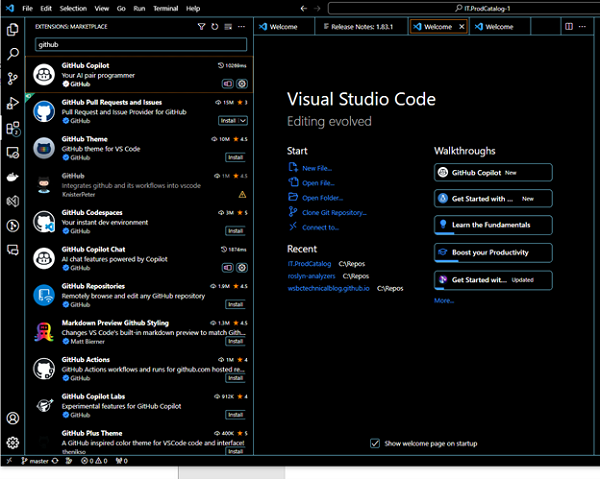
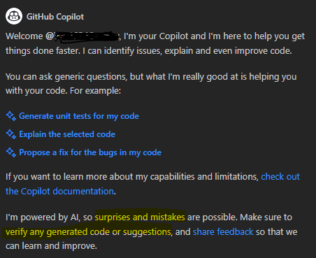

Title: GitHub Copilot for Business Setup
Date: 2023-11-01
Category: Posts 
Tags: ai, github
Slug: github-copilot-for-business-setup
Author: <Willy-Peter Schaub
Summary: Getting started with GitHub Copilot - Step 1: Setup.

To kickstart your journey with the GitHub Copilot for Business product, we first need to configure both the service-side and user-side environments. In this guide, we will walk you through the steps we took and highlight any potential obstacles you may encounter along the way.

## Useful Terminology

Terminology which will make things easier.

| TERMINOLOGY         | DESCRIPTION |
|---------------------|-------------|
| Entra ID            | New name for Azure Active Directory, for example **fabrikam.com**. |
| Personal GitHub Account | Personal GitHub account, for example [wpschaub](https://github.com/wpschaub). |
| EMU Account         | [GitHub Managed Users (EMU)](https://docs.github.com/en/enterprise-cloud@latest/admin/identity-and-access-management/using-enterprise-managed-users-for-iam/about-enterprise-managed-users) account \<ID\>_\<Shortcode/>, for example **wschaub_fabrikam**. |
| EMU Admin           | EMU Administrator, for example **admin_fabikam**. 
| EMU Enterprise Name | EMU Enterprise name, for example **fabrikam**. |
| EMU Enterprise URL  | EMU Enterprise link, for example **fabrikam**. |
| EMU Shortcode       | EMU alias, for example https://github.com/enterprises/fabrikam. |
| GitHub Organization | [Git Hub Organization](https://docs.github.com/en/organizations/collaborating-with-groups-in-organizations/about-organizations), for example **fabrikam_innovation**. |
| GitHub Team         | [GitHub Team](https://docs.github.com/en/organizations/organizing-members-into-teams/about-teams), for example **GitHub Copilot Evaluation**. |

Below is an insightful illustration sourced from [GitHub](HTTPS://GITHUB.COM) that provides a user-friendly overview of Enterprise Managed Users (EMU).

> 

# Service-side Setup

The [GitHub Managed Users (EMU)](https://docs.github.com/en/enterprise-cloud@latest/admin/identity-and-access-management/using-enterprise-managed-users-for-iam/about-enterprise-managed-users) is comprehensive, though it is detailed to the extent that you might overlook a crucial step (as we did). Here are the key steps:

- Setup a [GitHub Managed Users (EMU)](https://docs.github.com/en/enterprise-cloud@latest/admin/identity-and-access-management/using-enterprise-managed-users-for-iam/about-enterprise-managed-users).
  - Chat with your Microsoft / GitHub account manager and request  enterprise.
- Setup the IdP Connection
  - Install [GitHub EMU Application](https://azuremarketplace.microsoft.com/en-us/marketplace/apps/aad.fabrikamenterprisemanageduseroidc?tab=Overview).
- Step 1: Preparations
  - Involve a person with AAD Admin Access
  - Create a [Personal Access Token](https://docs.github.com/en/authentication/keeping-your-account-and-data-secure/managing-your-personal-access-tokens#creating-a-personal-access-token-classic) for the ``EMU Admin`` account
- Step 2: Connect GitHub to AAD using OIDC
  - Have these handy: ``EMU Name``, ``EMU Enterprise URL``, and ``EMU shortcode``!
  - Follow all steps in the [GitHub Docs: Configuring OIDC for Enterprise Managed Users](https://docs.github.com/en/enterprise-cloud@latest/admin/identity-and-access-management/using-enterprise-managed-users-for-iam/configuring-oidc-for-enterprise-managed-users) to setup the connection.
- Step 3: Configure SCIM Provisioning
  - Have these handy: ``EMU Name``, ``EMU Enterprise URL``, ``EMU shortcode``, and your tenant URL, for example ``https://api.github.com/scim/v2/enterprises/fabrikam``!
  - Follow all the steps in [Azure Tutorial: Configure GitHub Enterprise Managed User (OIDC) for automatic user provisioning](https://learn.microsoft.com/en-us/entra/identity/saas-apps/github-enterprise-managed-user-oidc-provisioning-tutorial).
- Step 4: Once connected, connect subscription
  - Have these handy: ``GitHub Organization`` and ``GitHub Team`` names.
  - [Connect an Azure Subscription ID](https://docs.github.com/en/enterprise-cloud@latest/billing/managing-the-plan-for-your-github-account/connecting-an-azure-subscription#connecting-your-azure-subscription-to-your-enterprise-account) to pay for Copilot.
  - [Enable Copilot at the Enterprise Level](https://docs.github.com/en/enterprise-cloud@latest/admin/policies/enforcing-policies-for-your-enterprise/enforcing-policies-for-github-copilot-in-your-enterprise).
  - In your Organization of choice, [enable Copilot for the user/team of choice](https://docs.github.com/en/enterprise-cloud@latest/copilot/configuring-github-copilot/configuring-github-copilot-settings-in-your-organization). In our scenario, we handle GitHub team membership through an Azure Directory (AD) group. Being a member of the AD group automatically grants you membership in the GitHub team, providing access to a GitHub Copilot license.

 Single-signon is alive and well. At this point you should be able to login with your ``EMU Admin`` and your ``corporate`` cedentials.

---

# User-side Setup

This is likely the section everyone is eager to dive into – welcoming your Artificial Intelligence (AI) Copilot and embarking on a journey of exploration to reap numerous benefits. These include heightened productivity, enhanced quality, accelerated experimentation and learning, and bolstered engineering confidence.

## Before you begin!

- First you need to logout of GitHub in your default web browser.  
- Then go to Visual Studio (VS) Code and sign-out. 
- Make sure you IDE is the latest version.

Failure to do so may lead you down the same nightmarish path I experienced last weekend.

## Visual Studio ENterprise / Professional

>
> A special **thank you** to my copilot, [Martin Lacey](https://wsbctechnicalblog.github.io/pages/authors.html)], who completed the setup first, giving us the dos and do nots, as well as the screenshots.
>

- Open Visual Studio Enterprise and go to ``Profile > Add Account``.
- This will open your browser. Use your corporate account, for ``demo_fabrikam``. Your account name will be different, but follow the same format.
- Once you enter your account name (no password) and press ``enter``, you will be directed to the following web page after a short moment.

  > 

- Click on ``Authorize GitHub``.

  > 

- Close Visual Studio and restart it.
- Verify that you are now connected.

  > 

- Now it is time to start exploring!!!

## Visual Studio Code

- Ensure you are running at least version 1.83, dated September 2023, by checking for updates.

  > 

- If not already done, install GitHub CoPilot:
  
  > 

- After installation, log in to GitHub using your EMU Account (GitHub Enterprise Managed Users) such as ``demo_fabrikam``. Alternatively, you can modify your profile to add the GitHub account.

  > 

- Authorize the access.

  > 

- Once authorized, you will see the following view within VS Code.

  > 

- Now you are ready to explore the walkthroughs and get started!  😊

  > 

---

If you sign-out from GitHub on your default browser, as per **before you begin**, you can save yourself a lot of pain! Have fun chatting with your AI Pair Engineer Copilot and watch this space for follow-up posts my my colleagues evaluating their Copilot.

