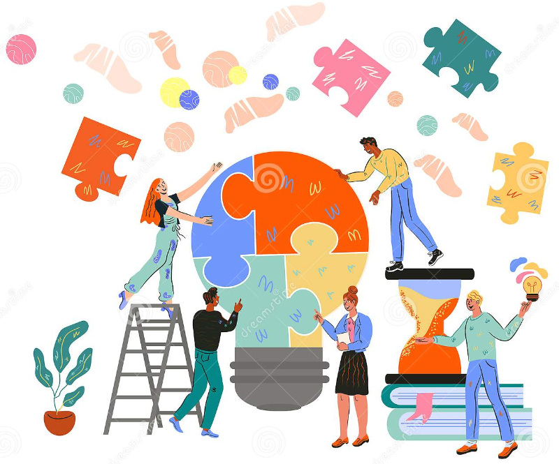

Title: How to increase collaboration
Date: 2021-11-12
Category: Posts
Tags: collaboration, psychological-safety
Slug: guest-leader
Author: Alex Bunardzic
Summary: How to improve the flow of teamwork

> Gerald Weinberg (Weinberg, G., “The Psychology of Computer Programming: Silver Anniversary Edition”, Dorset House, 1998) described the central role of a soda vending machine at a university’s programming helpdesk. The department administration, disturbed by the students congregating around the machine, ordered it removed. Much to their surprise, the line at the help desk suddenly became much longer. It took a while before they worked out that the students congregating around the soda machine were helping each other solve their programming problems, and thus reducing the load on the help desk staff.

Weinberg’s description above is a textbook case of the usefulness of collaboration. One interesting thing on the topic of collaboration is the fact that, while there is plethora of scientific studies on the importance of communication, collaboration for some reason didn’t get that much attention. Taking the closer look into the topic of collaboration is long overdue; in this micro learning episode, I will try to shed some light on it.

## Distributed cognition

In his book [Cognition in the Wild](https://www.amazon.ca/Cognition-Wild-Edwin-Hutchins/dp/0262581469), Edwin Hutchins describes the process of bringing in a large naval ship into the port. A team of merchant marines operates as though a single brain unifies many distributed components. Each crew member is busy forming a slightly different idea of what problem they are solving and how the solution should look. In the process, they may run into problems that require others to lend a helping hand.

Hutchins termed this mode of working “distributed cognition”. When working in a distributed cognition mode, the problem of mental search and synchronization emerges. The skillful crew is capable of quickly resolving differing opinions and deciding whose view to accept.

## Software development is distributed cognition

It is easy to recognize from the above description that software development is the activity of distributed cognition. It is exceptionally rare that software solution gets developed in its entirety by a single engineer. As soon as the development gets done by two or more team members, constraining forces of distributed cognition come into play. The process of mental search and synchronization becomes the central problem.

That problem gets exacerbated when team members are working in isolation, asynchronously. Applying the _scatter-gather_ model of working introduces the problem of effective communication. The aspects of effective/ineffective communications have been heavily studied. The findings seem to be conclusive – effective communication appears to drop off at about 10 meters in distance between the team members (_Allen, T., “Managing the Flow of Technology: Technology Transfer and the Dissemination of Technological Information Within the R&D Organization”, The MIT Press, 1984). Turns out that most people would not bother to walk longer than the length of a school bus to ask a question (Olson, G., Olson, J., “Distance Matters”, HUMAN-COMPUTER INTERACTION, 2000, Volume 15, pp. 139–178_).

The conclusion is clear: collocated teams stand better chance of doing improved collaboration.

However, avoiding distributed teams by collocating the members does not remove the problem of distributed cognition – it only intensifies it. But it’s a good kind of intensification, because it creates small failures that urge the team to fix them right there, on the spot.

With distributed teams, the distributed cognition problems are not usually as intense, and tend to be placed on the back burner. Which only exacerbates the situation – postponing the solutions for the differing opinions only makes it worse with the passage of time.

## Promote Guest Leadership to increase successful collaboration

I remember in one of my previous jobs being invited to the company’s barbecue ceremony organized to celebrate employee contributions. The ceremony was set in such way that bosses and line managers were serving hamburgers and hot dogs to the line employees.

Such activities, despite being fully collocated, are removed as far as possible from collaborative activities.

During a different stint at another company, employees were invited to attend a potluck party. Everyone brought something to share, and the vertical distancing disappeared – there were no job titles on the display. Sharing and commenting on various items quickly created a very collaborative atmosphere where people were stepping forward and wholeheartedly partaking in the event.

There is a semi-technical term that denotes the type of behaviour typically observed in situations where hierarchical, or vertical distancing diminishes. The term is “Guest Leader”.

One of the most effective ways to increase quality collaboration is to create a situation where Guest Leaders emerge. Let’s quickly examine factors that tend to contribute to fostering the Guest Leader behavioral pattern:

- Make sure all participants in the collaborative session have ‘skin in the game’ by clearly understanding the goal(s)
- Make it clear that everyone in the group is invested in the outcome of the collaboration
- Try to create psychological safety by clearly explaining that in the collaboration session we have nothing to lose and only have a chance to gain something of value
- Identify possible Guest Leader champion(s) and get them to ‘warm up the room’ by stepping forward and in that way demonstrating that their participation creates immediate impact
- Create sense of positive urgency – we intensely desire to deliver results in this session today!

Other contributing factors may be:

- Explain that collaboration serves everyone’s self-interests
- Minimize the presence of anointed leaders; make official leaders recede in the background, relegating them to the role of ‘spectators’
- Agree with stakeholders beforehand to be permissive and not dismiss anyone’s contribution; all ideas and comments are valid
- Be explicit in explaining that whoever steps forward and suggests an improvement will not find themselves being stuck with the task; any agreed-upon solutions will be collectively owned
- Encourage rotations; participants should not feel that there are already enough people who are stepping forward and it would be rude to interfere
- Organizer recognizes others
- Organizer inquires but doesn’t contradict
- Organizer challenges, but adopts
- Organizer readily lowers their hierarchical position in the organization

Factors that may interfere with attempts to create Guest Leader atmosphere:

- Announcing that failure is not an option
- Not explaining that proposed solutions don’t imply there will be additional workload
- Not dealing with the desire in some participants to stay safe by not standing out
- Valuing status quo

## Benefits of Guest Leadership

Encouraging participants to become Guest Leaders during collaboration sessions fosters so-called ‘horizontal’ social-professional culture. It flattens the hierarchical structure (top-down chain of command) by shortening the distances between senior and junior members as well as the distance between members at different levels of management hierarchy. That approach invites and cultivates diversity, which is the strongest suit of any complex organization.

When a Guest Leader emerges during a collaboration event, few beneficial patterns become prominent:

- Guest Leader is eager to detect when an intervention is needed (i.e., they are proactive)
- Guest Leader has the propensity to decide “This is something I should take care of now”
- Being aware of their guest status, Guest Leaders tend to understand the temporary nature of their role, and often easily step back into their previous, more passive position, thus freeing the space for the next Guest Leader to step forward

Social dynamics brought forward by the Guest Leadership pattern tend to result in more fruitful collaboration sessions. The team is more vested in the end-goals and leaves the collaboration session energized, ready to tackle new challenges.