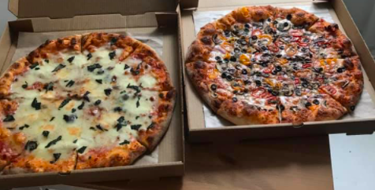

Title: How is ordering a pizza similar to hexagonal architecture?
Date: 2021-09-10
Category: Posts
Tags: agile, quality, engineering, architecture
Slug: hexagonal-architecture-exaple
Author: Alex Bunardzic
Summary: How to build a system that interacts with the outside world without knowing the gory details of the outside world

Any pizza parlour has two capabilities:

1. It is capable of taking orders
2. It is capable of fulfilling orders

To understand how pizza parlour performs those capabilities, it helps if we look at how is pizza parlour structured:

Figuratively speaking, any pizza parlour has two ‘windows’. What are those windows for?

One window is for enabling customers to place orders and then pick up their orders. Another window is for communicating orders to the kitchen staff and also for taking fulfilled orders to be delivered to the customers.

We see that the first window is a port for initiating the transaction. The second window cannot initiate the transaction; it can only relay the already initiated transaction to the ‘back end’ (i.e., to the kitchen staff).

What is that area between the two windows then? It’s what we call the ‘Core Competence’ area. Inside the cloistered Core Competence area resides the ‘secret sauce’ that enables the business operation to compete. In the case of a pizza parlour, we’re talking pizza recipes, inventory and procurement, tooling, training, pricing structure, deals and promotions, advertising, hiring/firing, organizing company picnics, etc.

The bulk of the business happens in-between the two windows. And yet, close either of the two windows, and the business collapses.

Let’s call the first window (the order taking/order pickup window), the Left Window. Because we read from left to right, the initiation of the transaction (i.e., placing the order for a pizza) naturally belongs to the left side of the visualized pizza parlour diagram.

The order fulfilling window is then relegated to the right side of the imaginary diagram. The important thing to keep in mind, as we are trying to map the pizza parlour diagram onto the hexagonal architecture, is that the left side of the diagram and the right side of the diagram are asymmetrical.

## No Pizza Nazi

Unlike the Soup Nazi in that infamous “Seinfeld” episode, our pizza parlour typically thrives on offering options. The comical Soup Nazi offered no options to his customers, and any, even the tiniest transgressions in how customers order a soup were punished by the legendary exclamation: “No soup for you! Come back in one year!”

A successful pizza parlour business strives to offer as many ways to order and consume their pizza as possible. Customers can walk up to the order window and order a pizza, they can phone in to order, they can go online and place an order, or even use a smartphone app to place an order. It doesn’t make any sense to limit the ways customers can order and pay for their order. Convenience is the name of the game.
Also, successful pizza parlour places no constraints on how the order is to be fulfilled. Most likely, an incoming order will be fulfilled by the kitchen staff making a fresh pizza following a recipe. But that’s not the only way the order could be fulfilled. Many other scenarios are possible and are perfectly legitimate.

For example, it is possible that the kitchen happens to be understaffed (after some crew members called in sick). They’re overwhelmed with orders and cannot fulfill them in a timely fashion. The crew may choose to take overflowing orders, run across the street and place those orders in the competitor’s pizza parlour. That way, they get to keep their customers happy.
Customers don’t care, nor do they know how their pizza was made (so long as it is to their liking). It is also possible that a previous customer for some reason returned freshly made pizza and now the same order arrives from a new customer. Well, no reason to throw the returned pizza to the trash and start making a new one. Simply forward the returned untouched pizza to the new customer. And so on, the possibilities seem manifold.

Also, a successful pizza parlour does not place any constraints on who can order a pizza. Someone from the kitchen staff can go outside and return to the front counter (the left window) and order a pizza. Why not?

## Flexibility and adaptability

In the above example we’ve seen that flexibility and adaptability in how the business handles the market demands are very important. That’s the reason hexagonal architecture is proposed as the most optimal model for building automated systems.

If we were to map the pizza parlour operating model to the hexagonal architecture, we would see that the Left Window (the conversation initiating window) is labeled as the Driver in hexagonal architecture. Similar to how a pizza parlour can accept the initiation of the conversation (i.e., placing an order) in various ways (e.g., walk-ins, phone-ins, online orders etc.), The Driver in hexagonal architecture can be implemented as many different ports. The salient point is that the Driver’s intervention is the only possible way to agitate the system.

For example, if a pizza parlour opens up in the morning, and no customer walks in nor do any customers phone in or send an online order, the parlour remains quiet. No activity. No reason to do anything, as it would be wasteful without making a sale.

Without the Driver, the automated system must remain dormant. Only an action initiated by the Driver can set the automated system into action.

What about the Right Window in the pizza parlour? In hexagonal architecture, the right side is referred to either as a Recipient, or as a Repository (there could be more than one Recipient and more than one Repository). Both Recipients and Repositories are passive. They cannot ever act on their own. They only act in response to the action initiated by the Driver on the left.

The important thing to keep in mind when it comes to any flexible and adaptable system is that Drivers, Recipients, and Repositories can be numerous (actually, for all intents and purposes, endless). A well designed, well-engineered system allows the easy adding of brand new Drivers, Recipients, and Repositories, without disrupting the established Drivers, Recipients, and Repositories, as well as avoiding the disruption of any other parts of the system. We’ve already seen how a pizza parlour can easily add new ways of initiating the transaction (for example by receiving a text message to a newly implemented chatbot). Same applies to the right side of the parlour — the back-end staff can easily add ways to fulfill an order, for example by experimenting with some prefabricated ingredients.
Hexagonal architecture is one of the best ways to build a complex automated system that is infinitely flexible and adaptable.

## What about the Core Competence?

The Middle Kingdom (the space between the left and the right side of the system) is what we call Core Competence. That area is what holds the system together, because it contains all the policy rules that govern the business operations.

Hexagonal architecture establishes the left side (the Drivers) and the right side (The Recipients and the Repositories) to segregate the outside world from the inner workings of the Core Competence kingdom. This Core Competence area must not be burdened with the knowledge about various technicalities. A transaction can be initiated in myriad technological ways, but the Core Competence must not be aware of any of those technicalities. Also, an initiated transaction, coming from one of the Drivers, can be fulfilled using myriad of different technical solutions, but the Core Competence must not be aware of any of those technical solutions.

That way, Core Competence layer remains completely decoupled form the outside world. Why is that desirable?

The only way to establish and maintain flexibility and adaptability is to avoid any coupling. As soon as the coupling occurs, the system becomes brittle. We try to make some change to it, and it breaks.

## Configurable dependencies

It is not possible to build a complex system without introducing dependencies. Many parts of the system depend on many other parts of the system. Those dependencies enable the system to function properly.
The trouble begins when those dependencies harden and thus create areas of rigidity. Those areas of rigidity have tendency to proliferate and oftentimes contribute to rendering the system inflexible. Inflexible systems are not adaptable and tend to crumble under the pressure of changing conditions.
One way to avoid painting ourselves into a corner when building complex automated systems is to begin by first building a Walking Skeleton that embodies the above described hexagonal architecture. Meaning, define the left-side port(s) (i.e., the Driver(s)) as well as the right-side ports (i.e., the Recipients and the Repositories). The Driver is the port that is used for initiating the conversation (i.e., putting the system in motion). That port is responsible for using the system and is therefore burdened with the knowledge of dependencies (for example, in a pizza parlour case, the Driver must know the street address of the parlour, or the phone number, or the web address, etc.)

The Recipient(s) and the Repository(s) are the ports used for fulfilling the request coming from the driver. In the case of automated software systems, those ports represent technologies such as network protocols and ports, disc drives, databases, servers, etc.

Both the Driver(s) and the Recipient(s) and the Repository(s) are configurable/swappable. We should be able to add/remove any of them without breaking anything in the system. They are configurable dependencies.

## Build a hexagonal architecture-based system using TDD

The recommended way to build a system based on hexagonal architecture is to do it following the TDD discipline.

Following the TDD discipline means that the first Driver of our system must be a test. A test knows about some dependency (for example, it knows about the end point, or the address, where the system — the ‘order’ window — can be reached).

The test defines the precondition (‘given that I want to send this value(s)’), the trigger event (‘when I send the request to this address’), and the postcondition (‘then I expect the system to give me exactly what I ordered’). The test then runs, it fails (because the walking skeleton is not up and walking yet), and we add only as much working code as is necessary to make the test pass (it will typically mean we hardcode the values we return to the expecting test).

The test now passes, and we go back to refactor our walking skeleton. We iterate while constantly running our tests. With each refactoring change to the code, we eliminate crude solution by replacing it with more sophisticated, more generic solution. Thus, hardcoded values get replaced by ‘primitive obsession’ variables (ints, strings, bools, doubles, etc.) On the next iterations some of those primitive variables get replaced by proper abstractions. Rinse, repeat until we arrive at properly designed, properly engineered working code.

The next Driver (after we conscientiously test-drove our system) could be the Command Line Interface. Following that, we may add a Driver that is more visually oriented (GUI). Then we may also add a Driver that is capable of doing speech recognition. And so on — the system we’ve built is completely flexible and adaptable.