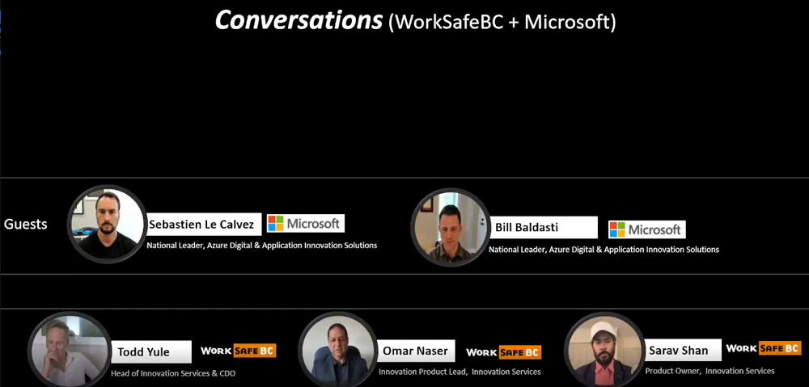

Title: Innovation podcast with WorkSafeBC and Microsoft
Date: 2023-07-31
Category: Posts 
Tags: event, ai
Slug: innovation-podcast-wsbc-msft
Author: Willy-Peter Schaub
Summary: An informal conversation around innovation with Bill, Omar, Sebastian, Sarav, and Todd

[Bill Baldasi (MSFT)](https://www.linkedin.com/in/bbaldasti/), [Omar Naser (WSBC)](https://www.linkedin.com/in/omar-naser-50bb9b266/), [Sarav Shan (WSBC)](), [Sebastian Le Calvez (MSFT)](https://www.linkedin.com/in/slecalvez/), and [Todd Yule (WSBC)](https://www.linkedin.com/in/todd-yule-4679646/)

> 

Click [here](X) to listen to the conversation.
