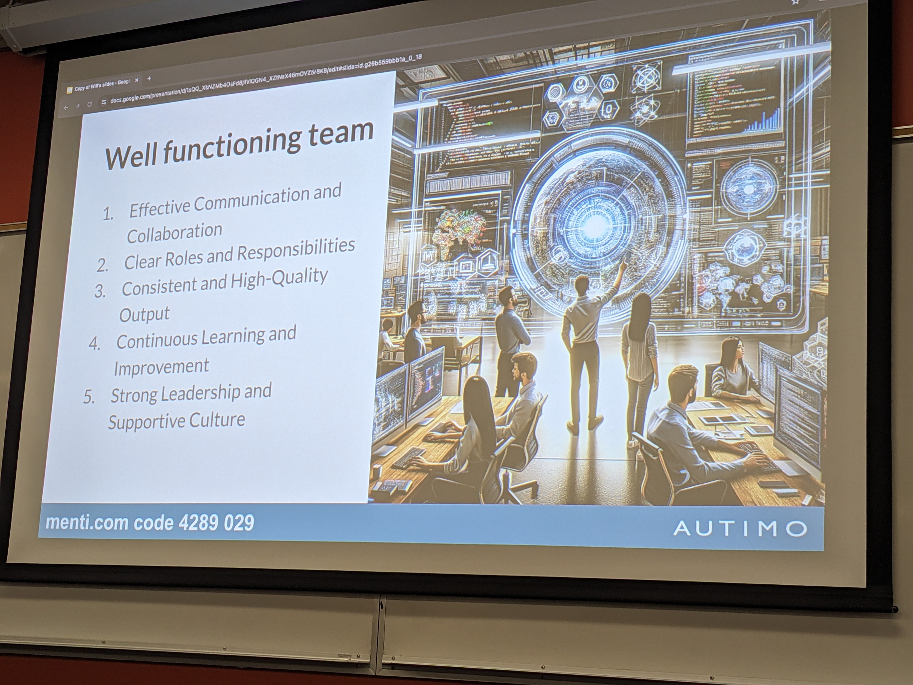

Title: DevOps Vancouver Meetup - March 26, 2024
Date: 2024-03-22
Category: Events
Tags: devops, engineering
Slug: meetup-devops-meetup-2024-03-26
Author: Willy-Peter Schaub
Summary: Recognizing effective DevOps teams and anchors

We recently hosted an amazing in-person [DevOps Vancouver Meetup](https://www.meetup.com/devops-vancouver-bc-canada/events/299881836/) on  March 26, 2024. Dive into [Eduard Maievskyi's Comprehensive Report](https://www.linkedin.com/feed/update/urn:li:activity:7178961872275091456/) and [Autimo's insightful update](https://www.linkedin.com/posts/autimo_amazing-night-of-chats-networking-and-deep-activity-7178863991912325121-8f6g?utm_source=share&utm_medium=member_desktop) for two fantastic event recaps!

---

[Julian Subda](https://www.linkedin.com/in/julian-subda-6269597/) grabbed my attention when he displayed the following image on his slides, reminiscent of the outstanding community session we hosted years ago in Victoria. 

> 

Knowing that we have made a positive impact always serves as a significant morale boost.

When [Will Sheldon](https://www.linkedin.com/in/wills/) presented **Evolving a DevOps team**, one slide and the menti poll results caught my attention.

> 

When I scanned through the characteristics, my immediate thought was of my team, Common Engineering. Upon sharing the slide with them, we collectively agreed, but also acknowledged the need to enhance our collaboration with the rest of our group. I am immensely proud of how our team has evolved into a vibrant, self-organized, self-managed entity, bursting with a thirst for learning and innovation.

Next, the Menti poll results emerged, centered around the question: "_What is currently preventing your team from succeeding?_"

> 

The top three **anchors** we are struggling with our engineers:

- Addressing **technical debt** is crucial, but it's equally important to empower teams to resolve it without accumulating further debt, as I discussed in [Back to Basics: Dealing with Technical Debt](https://wsbctechnicalblog.github.io/back-to-basics-dealing-with-technical-debt.html). Do it right, not fast!
- Fear of change and failure is another anchor that is dragging progress.
- **People** and **Culure**, however, is the Achilles' heel. DevOps is **80%** PEOPLE, **15%** PROCESS, and **5%** PRODUCTS! 

All in all an interesting and fun evening.

---

When will **you join** us at the [DevOps Vandouver Meetup](https://www.meetup.com/DevOps-Vancouver-BC-Canada/) and how can we improve the meetup? Thoughts?