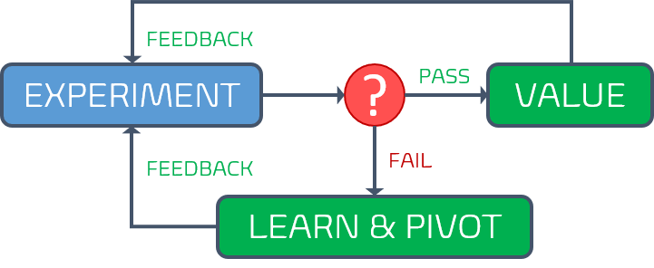

Title: Understanding key metrics for a healthy DevOps mindset
Date: 2022-02-18
Category: Posts 
Tags: learning, metrics, devops
Slug: metrics-importance
Author: Willy-Peter Schaub
Summary: Without real-time evidence, OODA never comes to life.

[John Boyd](https://en.wikipedia.org/wiki/John_Boyd_(military_strategist)) argued that the key to victory is the ability to create situations in which one can make appropriate decisions more quickly than one's opponent. **O**bserve the environment, **O**rient to be in a good position, **D**ecide what to do next, and **A**ct accordingly. His OODA state machine is based on real-time feedback, gathered while observing the environment.

Similarly, hypothesis-driven development (HDD) relies on feedback to be in a position to evaluate the experiment, decide if it is a FAIL or PASS, and learn from it.

 

Both **OODA** and **HDD** become worthless black holes if we remove the **feedback**. 

Your dream to fail-fast, continuously learn and improve evaporates before your very eyes. Stuck in a nebulous cloud, you will embark on a nightmare journey, without clues, insight, or early-warnings. 

---

# Feedback is fuel for your DevOps mindset

To compete in an ever-changing industry, we must find ways to be more effective, deliver quicker, and further delight our customers continuously. This requires us to understand the health of our ecosystem, value we deliver, and detect smoke before we are dealing with a raging fire. 

Use a blend of market research, production telemetry, surveys, unsolicited feedback, customer visits, and when possible the invaluable [Gemba walk](https://kanbanize.com/lean-management/improvement/gemba-walk) to gather and measure everything that is measurable ... and meaningful!

>
> "_The art of fine-tuning what and how you measure data without inundating everyone with reports and notifications is an art and a necessity for a healthy DevOps mindset._" - [Navigating DevOps through Waterfalls](https://www.tactec.ca/ndtw-resources/)
>

As recommended by the [Core DevOps Values](https://www.tactec.ca/devops-core-values) should not get engrossed with our solution, but instead use **Systems Thinking** to "_define metrics for measuring performance, accountability and effectiveness, using application of outcomes and shared learnings_" across our organization.

In other words, take a holistic approach to focus on, measure, and improve your organization (planet), not just a few, or worse, one of your solutions (countries).

---

# Metrics we are observing in our common engineering ecosystem

We now understand that we must view and understand the haystack, before we start looking for the needle. It is time to identify metrics to measure impact and continuous improvement of teams, engineering practices, and our common engineering ecosystem.

>
> **FAILURE EXAMPLE** - When we developed our generic pipeline blueprints, we included logging in the continuous integration pipeline. We have been logging verbose details to Application Insights for each and every Azure Pipeline that triggered since. However, the only time the metrics has been viewed, was for the demo of the telemetry. A **WASTE** of resources and I am convinced that no-one would notice if we turn off the logging.
>

Instead of the "big bang" approach to measure everything measurable, we opted to focus on three buckets of data to measure our common engineering ecosystem - DevOps, Guardrails, and Engineering Practices. We also use weather symbols instead of referring to low, medium, high, and elite performers, as is common practice in the DevOps reports.

| BUCKET | METRIC | WHY? VALUE? |--|  |--|  |--|  |--|  | 
|--------|--------|-------------|-|:------:|-|:-------:|-|:-----:|-|:------:|
| DevOps | Deployment frequency  | Deployments that are more frequent allow earlier introduction of new value. | | < once/6-months | | Once/month – once/6-months | | Once/week - once/month | | On-demand | 
| DevOps | Lead time for changes  | Shorter lead times enable faster feedback and the ability for us to respond to outages more effectively. | | > 6 months | | 1 month – 6 months | | 1-7 days | | < 1 hour | 
| DevOps | Time to restore services | Faster time to mitigate failures gives our users higher availability. | | > 6 months | | 1-7 days | | < 1 day | | < 1 hour | 
| DevOps | Change failure rate | More successful changes cut rework and allow us to focus on new value. | | >30% | | >30% | | 16-30% | | 0-15% | 
| Guardrails | Repo S/R failures | Solid repositories enable consistency and standardization, reducing GIGO and WASTE. | | >=20% failures/month | | <20% failures/month | | <10% failures /month | | 0 failures/month | 
| Guardrails | Pipeline S/R  failures | Solid pipelines enable consistency and standardization, reducing value stream total lead time. | | >=20% failures/month | | <20% failures/month | | <10% failures/month | | 0 failures/month | 
| Engineering Practices | Duplicate code | Code duplication is identified in the industry as one of the reasons teams tend to author bugs. Reducing/eliminating duplicate code removes the opportunity to introduce bugs when adding/modifying/removing code. | | 30%+ of the code in the repo is found to be duplicate | | Between 20% and 29% of the code in the repo is found to be duplicate | | Between 10% and 19% of the code in the repo is found to be duplicate | | Less than 5% of the code in the repo is found to be duplicate | 
| Engineering Practices | Cyclomatic Complexity | Complex code is hard to read, hard to understand, hard to reason about, and hard to modify. Such complexity is identified as one of the main reasons teams tend to introduce bugs when modifying code. Reducing/eliminating cyclomatic complexity removes the opportunity to introduce bugs when adding/modifying/removing code. | | 40+ cyclomatic complexity identified in methods | | Between 20 and 40 cyclomatic complexity identified in methods | | Between 10 and 20 cyclomatic complexity identified in methods | | Less than 10 cyclomatic complexity identified in methods | 
| Engineering Practices | Percentage of surviving mutants | Just because all tests pass doesn’t mean that the implemented code is tested. Mutation testing uncovers areas of code which, even if covered by tests, haven’t been assessed for meeting or failing the expectations. That omission indicates shoddy software design. Minimizing/eliminating surviving mutants is the only way to ensure correct implementation. | | 20+% surviving mutants | | Between 10% and 19% surviving mutants | | Between 5% and 9% surviving mutants | | Less than 5% surviving mutants | 
| Engineering Practices | Maintainability index | Once written, code needs to be maintained. The ease/difficulty of maintaining the code determines the quality of the system. | | 0 to 9 indicates low ability to easily perform maintenance | | 10 to 19 indicates modest ability to perform maintenance | | 20 to 49 indicates moderate ability to perform maintenance | | 50 to 100 indicates good ability to perform maintenance |

>
> **IMPORTANT** The table below was out first baseline recommendation and has likely evolved since we published this blog. Fine-tune your metrics continuously to ensure you focus on actionable outcomes, not vanity data.
>

We are currently capturing and fine-tuning these buckets manually, in parallel to developing automated gathering and display processes. Our view is set at the common engineering ecosystem level, but we allow groups and teams to drill-down to analyse and improve their own health.

>
> **IMPORTANT** Avoid focusing on teams and/or individuals to avoid the misuse of the metrics to influence performance reviews. We succeed or fail as one!
>

What are your views on metrics?

