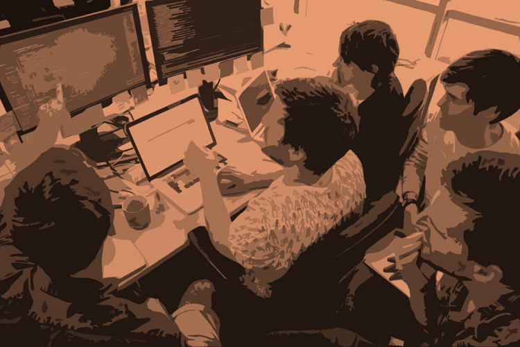
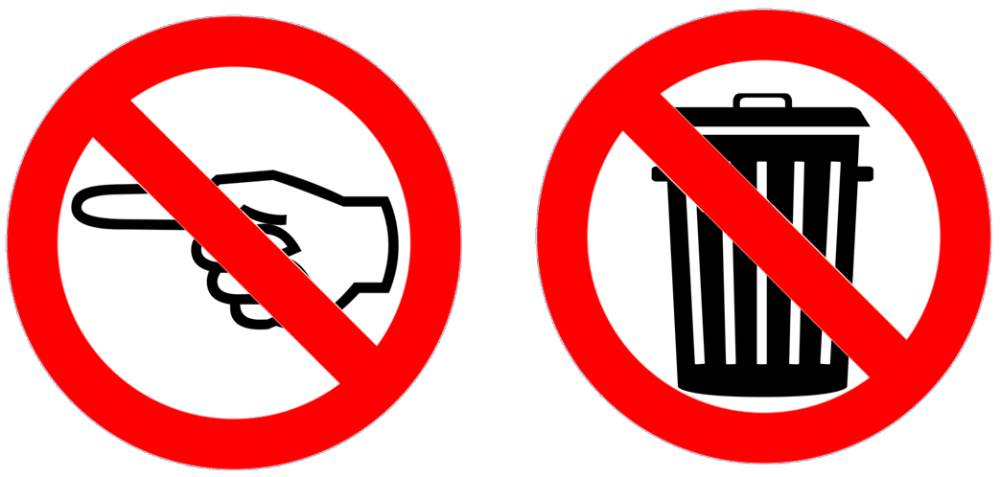

Title: Exploring the concept of mob-ownership
Date: 2021-12-23
Category: Posts 
Tags: learning, quality, eliminate-waste
Slug: mob-ownership
Author: Willy-Peter Schaub
Summary: We succeed or fail as a team (mob), not as individuals!

Mob-programming, which is the art of an entire team working on the same thing, at the same time, in the same space, and at the same keyboard/monitor, has been on our radar for a while. My colleague [AlexB](https://wsbctechnicalblog.github.io/author/alex-bunardzic.html) has been driving the software development approach with vigour, demonstrating a drop in **WASTE** and surge of **shared learning**.

---

# What about Mob-ownership?

You will find several posts on this blog that emphasize my loathing for [**WASTE**](https://wsbctechnicalblog.github.io/tag/eliminate-waste.html), promotion for continuous learning, improvement, and experimentation, ownership of features from ideation to deprecation, and the courage to [**FAIL**](/ooda-one-of-the-devops-genomes.html) as one of the genomes of our healthy DevOps mindset.

The one thing we have not discussed yet, but makes me boil on a regular basis, is the art of toxic “finger pointing.” In other words: “_this is not my problem, it must have been caused by [X], in team (silo) [Y]._” 

It is another form of **WASTE** and is extremely **TOXIC** for things we value, such as collaboration, improvement, learning, and team-work.

I therefore would like to propose **mob-ownership**, which extends the concept of **mob-programming** for people to collaborate to own, analyze, remediate, and learn from one challenge at a time. The challenge could be an experiment, proof-of-concept, program bug, a live site incident, an anomaly in telemetry, or a disagreement in guardrails that protect us from violation company policies or governance.

>
> Change “_this is not my problem, it must have been caused by [X], in silo [Y]_" to "_this is our problem as a team, let us analyse and remediate._"
>

By sharing and collaborating within a joint(mob)-ownership, we not only solve communication problems, enable decision making, avoid toxic politics and harmful context switching, but more importantly accept shared responsibility for every adventure. The “them and us” and associated “finger-pointing” fades away as we grow as a team, fueled by delighted end-users.

Thoughts?

